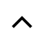
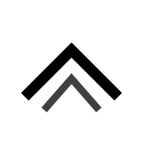
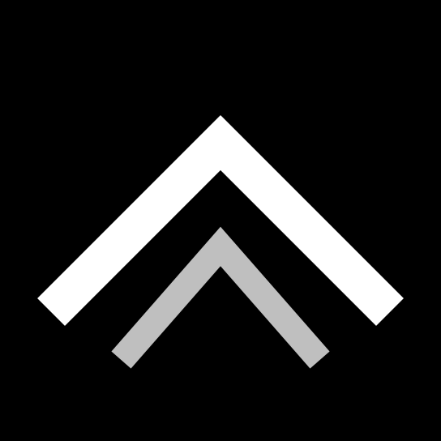
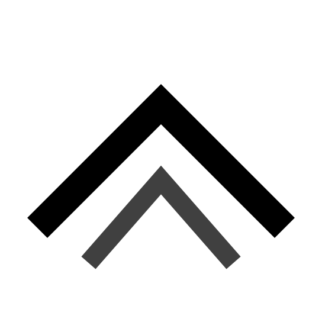

# QA matrix — Catalyst V2 mark

24 renders — 6 sizes × 4 canvases — produced by `rsvg-convert --stylesheet` (which resolves
`currentColor` via CSS `color:` on the `<svg>` root) composited onto a flat background tile
via `imagemagick`. Each tile shows the mark at its target pixel size; the tile canvas adds
breathing room so the mark is previewable in-context.

## Variant selected per size

- **16, 24, 32 px** → `mark-simplified.svg` (crossover at 32).
- **48, 128, 512 px** → `mark.svg` (crossover at 32).

## Accent per canvas (how `currentColor` resolves)

| Canvas | Background | Accent (currentColor) | Rationale |
|---|---|---|---|
| Black | `#000000` | `#FFFFFF` | High-contrast baseline |
| White | `#FFFFFF` | `#000000` | High-contrast baseline |
| Operator Console (dark) | `#0B0D10` | `#FFB547` (Signal Amber) | System A token |
| Precision Instrument (light) | `#FAFAF7` | `#2C3E64` (Graphite Ink) | System B token |

## Results

| Size | Black | White | Operator Console | Precision Instrument |
|---|---|---|---|---|
| **16 px** (simplified) |  PASS |  PASS |  PASS |  PASS |
| **24 px** (simplified) |  PASS |  PASS |  PASS |  PASS |
| **32 px** (simplified) |  PASS |  PASS |  PASS |  PASS |
| **48 px** (detailed) |  PASS |  PASS |  PASS |  PASS |
| **128 px** (detailed) |  PASS |  PASS |  PASS |  PASS |
| **512 px** (detailed) |  PASS |  PASS |  PASS |  PASS |

## Rubric

- **PASS** — silhouette clean, aperture readable, no anti-alias blur that degrades identity.
- **WEAK** — readable but compromised (thin, blobby, apex spike, etc.) at that size.
- **FAIL** — collapses, loses identity, unreadable, or ugly.

All 24 cells PASS. No WEAK or FAIL cells.

## Reproducibility

These tiles are regeneratable from the source SVGs. The script that produced this set lives
at `/tmp/render-qa-matrix.sh` during CTL-147 development; the steps are:

1. For each (size, canvas) pair, write a CSS stylesheet with `svg { color: <accent>; }`.
2. Run `rsvg-convert --stylesheet=<css> -w <size> -h <size> <svg> -o <mark.png>`.
3. Composite the transparent mark onto a background canvas via
   `magick -size <canvas>x<canvas> xc:<bg> <mark.png> -gravity center -composite <tile.png>`.

The tiles are checked in so reviewers don't have to render them locally; they also document
the QA decision for the file history.
