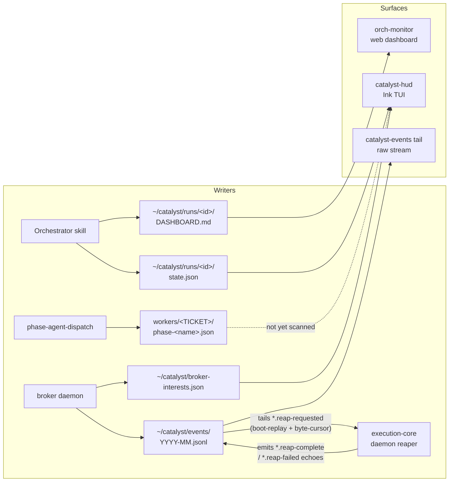

# Architecture

## Three-Layer System

1. **Plugin Source** (`plugins/dev/`, `plugins/meta/`, `plugins/pm/`, etc.)
   - Canonical definitions of agents and skills
   - Edit these when making changes
   - Organized by plugin type

2. **Installation Layer** (`.claude/` + `.catalyst/`)
   - `.claude/`: Symlinks to local plugin directories, Claude Code reads plugins from here
   - `.catalyst/`: Catalyst workflow state (`config.json`, `.workflow-context.json`)

3. **Thoughts System** (external, `~/thoughts/`)
   - Git-backed context management
   - Shared across all worktrees
   - Initialized per-project via `init-project.sh`

## Workflow State Management

Skills track workflow state via `.catalyst/.workflow-context.json`:

- `/research-codebase` saves research -> `/create-plan` auto-references it
- `/create-plan` saves plan -> `/implement-plan` auto-finds it
- `/create-handoff` saves handoff -> `/resume-handoff` auto-finds it

Structure:

```json
{
  "lastUpdated": "2025-10-26T10:30:00Z",
  "currentTicket": "PROJ-123",
  "orchestration": null,
  "mostRecentDocument": {
    "type": "plans",
    "path": "thoughts/shared/plans/2025-10-26-PROJ-123-feature.md",
    "created": "2025-10-26T10:30:00Z",
    "ticket": "PROJ-123"
  },
  "workflow": {
    "research": [],
    "plans": [],
    "handoffs": [],
    "prs": []
  }
}
```

Management: Automatically updated by workflow skills. Tracked per-worktree (not committed to git).

## Global Orchestrator State

Cross-orchestrator visibility lives at `~/catalyst/state.json` — a single JSON file that all
orchestrators and workers write to via `catalyst-state.sh` (lock-protected).

```
~/catalyst/
├── state.json              # Active orchestrators (denormalized summary)
├── catalyst.db             # Durable session store (SQLite, WAL mode)
├── events/                 # Append-only JSONL event stream, rotated monthly
│   └── YYYY-MM.jsonl
├── history/                # Archived orchestrator snapshots
│   └── <id>--<timestamp>.json
├── execution-core/         # Execution-core daemon state
│   └── registry.json       # Central team → repoRoot → eligibleQuery registry
└── wt/                     # Worktrees (existing)
```

- **catalyst.db**: SQLite-backed session store — durable source of truth for agent activity
  (solo and orchestrated). Managed by `catalyst-db.sh` (low-level CRUD, migrations) and
  `catalyst-session.sh` (high-level lifecycle CLI used by instrumented skills). Tables:
  `sessions`, `session_events`, `session_metrics`, `session_tools`, `session_prs`,
  `schema_migrations`. Writers run in WAL mode so monitor-style readers (including
  `orch-monitor`) can operate concurrently. `catalyst-state.sh` continues to write JSON/JSONL
  during the migration period for backward compatibility. Schema lives at
  `plugins/dev/scripts/db-migrations/`. See ADR-008.

- **state.json**: Registry of active orchestrators with progress, worker status, and attention
  items. Queryable with `jq`. Schema: `plugins/dev/templates/global-state.json`.
- **events/**: Every phase transition, PR creation, verification result, and attention item is
  logged as a JSONL entry. Schema: `plugins/dev/templates/global-event.json`. The log has
  multiple writers:
  - **Bash skill layer** (`catalyst-state.sh event`) — writes v1 envelopes: `{ts, event, orchestrator, worker, detail}`
  - **TypeScript webhook receiver** (`lib/webhook-events.ts`) — writes v2 OTel-shaped envelopes:
    `{ts, attributes, body, resource}` for `github.*` and `linear.*` events
  - **catalyst-comms send** — writes v2 envelopes for `comms.message.posted` events
  Both shapes coexist in the same files. `catalyst-events` CLI and skills handle both.
  Consumer interface: `catalyst-events tail` (streaming) and `catalyst-events wait-for`
  (blocking single-event wait). See `website/src/content/docs/observability/catalyst-events.md`.
- **history/**: Full orchestrator snapshots archived on completion, failure, or stale detection.
- **execution-core/registry.json**: For `dispatchMode: execution-core` teams, the central
  `team → repoRoot → eligibleQuery` registry. The Linear-state contract that drives the
  execution-core daemon is **setup-tooling-owned** (design decision D8): `setup-catalyst.sh`
  ensures the contract workflow states, writes the 10-phase → 5-state collapse `stateMap`, and
  upserts each team's registry entry. The execution-core daemon reads the registry directly
  (D4); the per-repo enrollment records CTL-554 wrote under `execution-core/projects/` and the
  `/orchestrate` enroll step they relied on were retired in CTL-582. All access flows through the
  `registry.mjs` `list-projects` / `get-project-config` interface — the D9 cloud seam, so the
  store can later become a Supabase table without touching callers.
- **Heartbeat**: Orchestrators write `lastHeartbeat` every 2-3 min. Stale entries (>10 min) are
  garbage-collected as `abandoned`.

This is a denormalized summary layer — per-orchestrator local state in worktrees remains the
source of truth for crash recovery. See ADR-006 for the full design decision.

**Worker signal projection (in migration, ADR-018).** Per-worker
`workers/<TICKET>.json` files are currently written directly by seven scripts
with no inter-process locking. CTL-483 begins moving these mutations to a
`worker.state_changed` command event consumed by the broker, which projects
the new state to a `<TICKET>.json.projected` shadow file. Phase 1 (this PR)
ships the broker handler, the writer-side emit helper, and dual-write for
`orchestrate-auto-rebase`; `orchestrate-shadow-diff` verifies byte-for-byte
agreement between canonical and shadow files. Phase 2 removes the direct
writes; Phase 3 mirrors to SQLite per the ADR-011 hybrid pattern. See ADR-018.

## Three-Layer Memory Architecture

Catalyst uses a three-layer memory architecture to manage context across multiple projects:

**1. Project Configuration** (`.catalyst/config.json`)

- Contains project-specific settings (ticket prefix, Linear team, etc.)
- HumanLayer automatically maps working directories to profiles via `repoMappings`

**2. Long-term Memory** (HumanLayer thoughts repository)

- Git-backed persistent storage shared across worktrees
- Contains: `shared/research/`, `shared/plans/`, `shared/prs/`, `shared/handoffs/`
- Synced via `humanlayer thoughts sync`

**3. Short-term Memory** (`.catalyst/.workflow-context.json`)

- Local to each worktree (not committed to git)
- Contains pointers to recent documents in long-term memory
- Enables skill chaining (e.g., `/create-plan` auto-finds recent research)

```
.catalyst/config.json          <- Project config (committable)
        |
        v
~/thoughts/repos/acme/       <- Long-term memory (git-backed)
  shared/research/
  shared/plans/
  shared/prs/
  shared/handoffs/
        |
        v
.catalyst/.workflow-context.json  <- Short-term memory (session pointers)
```

## Agent Teams vs Subagents

Claude Code provides two parallelization mechanisms:

**Subagents (Task tool)** — Default for most skills:

- Own context window; results return to caller
- Cannot spawn other subagents (no nesting)
- Lower token cost
- Best for: parallel research gathering, code analysis, file search

**Agent Teams (TeammateTool)** — For complex multi-domain work:

- Each teammate is a full Claude Code session
- Teammates CAN spawn their own subagents (two-level parallelism)
- Direct peer-to-peer messaging
- Higher token cost
- Best for: cross-layer features, complex implementations
- Requires `CLAUDE_CODE_EXPERIMENTAL_AGENT_TEAMS=1`

| Scenario                                          | Use Subagents   | Use Agent Teams |
| ------------------------------------------------- | --------------- | --------------- |
| Parallel research gathering                       | YES             | Overkill        |
| Code analysis / file search                       | YES             | Overkill        |
| Complex multi-file implementation                 | NO (can't nest) | YES             |
| Cross-layer features (frontend + backend + tests) | NO              | YES             |
| Cost-sensitive operations                         | YES             | NO              |

Best practices:

- Lead on Opus, teammates on Sonnet
- Size tasks at 5-6 per teammate
- Each teammate owns distinct files (prevent conflicts)
- Use plan approval gates for risky work

## Agent Communication (catalyst-comms)

Agents coordinate across worktrees via `catalyst-comms`, a file-based JSONL messaging system at
`~/catalyst/comms/channels/<name>.jsonl`. The protocol is **bidirectional** (CTL-249):
orchestrators broadcast to workers (outbound) and can also send messages directed to individual
workers (inbound); workers poll for directed messages at each phase boundary.

```bash
# Orchestrator side (Phase 1 init)
catalyst-comms join "${ORCH_NAME}" --as orchestrator --capabilities "coordinates workers"

# Worker dispatch env
CATALYST_COMMS_CHANNEL="${ORCH_NAME}" exec claude -p "/oneshot ${TICKET_ID}"

# Worker side (oneshot startup)
catalyst-comms join "$CATALYST_COMMS_CHANNEL" --as "$TICKET_ID" --parent orchestrator

# Outbound: orchestrator sends to a specific worker
catalyst-comms send "${ORCH_NAME}" "CTL-101: skip the migration" \
  --as orchestrator --to CTL-101 --type info

# Inbound: worker polls for messages addressed to it (at each phase boundary)
catalyst-comms poll "${ORCH_NAME}" --filter-to "$TICKET_ID" --since "$COMMS_LAST_READ"

# Live tailing (human auditor)
catalyst-comms watch "${ORCH_NAME}"
```

`catalyst-comms send` also emits a `comms.message.posted` event to the unified event log
(v2 OTel envelope), so monitoring tools and `catalyst-events wait-for` can observe comms
traffic from the same log file they use for GitHub/Linear events.

The contract: every worker produces ≥4 messages per run. Signal files remain the authoritative
state — comms is observability and cross-worker coordination. See
`plugins/dev/skills/catalyst-comms/SKILL.md` for the full protocol.

## Phase-Agent Communication

Orchestrators dispatched in `dispatchMode = "phase-agents"` spawn one short-lived `claude --bg`
job per phase, walking the 10-phase pipeline (triage → research → plan → implement → verify →
review → pr → monitor-merge → monitor-deploy → teardown — see `docs/orchestrator-overview.md`). Phase
agents do **not** message each other directly. They communicate by **appending typed events to a
single shared JSONL log** at `~/catalyst/events/YYYY-MM.jsonl`. The orchestrator wakes on those
events via the broker (`filter.wake.<ORCH_NAME>`), advances the ticket through the canonical
sequence in `orchestrate-phase-advance`, and dispatches the next `--bg` job.

### Dispatch-time rebase (front-load conflict surfacing, CTL-667 + CTL-707)

On a **fresh** dispatch of a **build** phase (`research`, `plan`, `implement`, `verify`,
`review`), `phase-agent-dispatch` rebases the ticket's worktree (its cwd) onto current
`origin/<base>` **before** launching the `claude --bg` worker. This front-loads divergence
detection: the worker starts current with merged sibling work, and a conflict surfaces here
instead of riding stale assumptions all the way to `monitor-merge` (CTL-608).

CTL-707 replaced the binary CTL-667 rebase with a **4-layer strategy**:

- **Layer 1 — Periodic background refresh** (`execution-core/worktree-refresh-timer.mjs`):
  the daemon timer keeps every idle running worktree current with `origin/<base>` so dispatch-time
  rebases are trivial. Config: `catalyst.orchestration.worktreeRefresh.{enabled, intervalSeconds, quietSeconds}`.
- **Layer 2 — Dispatch-time conflict classifier** (`lib/worktree-rebase.sh:rebase_onto_base_classified`):
  on a conflict, enumerates conflicted files and categorizes them. Tests-only → additive
  auto-resolve (`git checkout --theirs`); noise (`.catalyst/`, `.trunk/`) → `--ours`; `thoughts/**`
  → stall rc=3; real source → CTL-708 stub (always unavailable) → stall rc=2.
- **Layer 3 — Phase-aware fallback** (`phase-agent-dispatch`): terminal source conflict (rc=2) on
  `research`/`plan` → destroy+recreate worktree from `origin/<base>` and re-dispatch fresh (no
  committed code to lose). Same conflict on `implement`/`verify`/`review` → park to `needs-human`.
  Thoughts conflict (rc=3) → park on all phases.
- **Layer 4 — Telemetry** (`lib/rebase-telemetry.sh`): four canonical events emitted by all layers:

| Event name | Severity | Emitted by |
|------------|----------|------------|
| `phase.<phase>.stale-base-detected.<ticket>` | WARN | Layer 1 (refresh timer) |
| `phase.<phase>.auto-rebased.<ticket>` | INFO | Layer 1 + Layer 2 (clean or additive) |
| `phase.<phase>.rebase-conflict-categorized.<ticket>` | WARN | Layer 2 (before stall decision) |
| `phase.<phase>.rebase-conflict-stalled.<ticket>` | ERROR | Layer 2 (terminal stall) |

**Loki queries** (add `| json` before field filters):
```
{job="catalyst-events"} | json | attributes["event.name"] =~ "phase\\..*\\.auto-rebased\\..*"
{job="catalyst-events"} | json | attributes["event.name"] =~ "phase\\..*\\.rebase-conflict-stalled\\..*"
{job="catalyst-events"} | json | attributes["event.name"] =~ "phase\\..*\\.stale-base-detected\\..*"
```

The rebase is otherwise unchanged from CTL-667:

- **Fresh-only.** A resume dispatch (`--resume-session` set, CTL-658) skips it — the resumed
  session assumes the prior tree.
- **Build-phase-only.** `triage`/`pr`/`remediate` and the `monitor-merge`/`monitor-deploy`/`teardown`
  phases are exempt. The build-phase set is `is_rebase_phase` in `lib/phase-sequence.sh`.
- **Local-only.** It never pushes and never touches the open PR; machine-local noise
  (`.catalyst/config.json`, `.trunk/*`) is stashed across the rebase.
- **Transient fetch failure → proceed un-rebased.** A flaky `git fetch` (rc=1) is non-fatal.

### PR as the durable work record (CTL-783)

During an orchestrated implement phase the draft PR is the **off-disk record of active work**,
visible in GitHub and survives daemon restarts:

| Signal | Meaning |
|--------|---------|
| Branch exists, no PR | Worker not yet past first commit |
| Draft PR open | Implementing (phase-implement in progress) |
| PR ready (not draft) | In review (phase-pr promoted it) |
| PR merged | Done |

**Branch naming**: branches come from Linear's `branchName` field (`ryan/<ticket>-slug`); the
daemon's `create-worktree.sh` never overrides this.

**PR title convention**: `<type>(<scope>): <ticket> ...` (e.g.
`feat(dev): CTL-783 draft-PR-early first-commit open`). Both `draft_pr_ensure` and
`create-pr/SKILL.md` Step 7 route through `draft_pr_title` (in
`plugins/dev/scripts/lib/draft-pr.sh`) which injects the ticket after the conventional prefix
without fabricating type or scope.

**Lifecycle**:

1. `implement-plan/SKILL.md` runs the `implement-plan-draft-pr-early` fence after **each**
   plan-phase commit — `draft_pr_push` + `draft_pr_ensure` (idempotent). First call opens the
   draft PR; later calls just push. Interactive `/implement-plan` runs are gated out by
   `[[ -n "${CATALYST_PHASE:-}" ]]`.
2. `phase-implement/SKILL.md` End block runs the `phase-implement-draft-pr` fence as the
   **idempotent backstop** after all phases complete; this is also the **sole writer** of
   `.draftPr={number,url,isDraft}` into the phase signal file.
3. `phase-pr/SKILL.md` calls `draft_pr_promote` to flip the draft PR to ready instead of
   creating a new PR (avoids the `create-pr` interactive "PR already exists" hang).

**Config**: `orchestration.draftPr.enabled` (default `true`) — set `false` to create the PR
only at the pr phase (End-block backstop still runs; `draft_pr_push` becomes the only push).

**Deferred**: letting the scheduler read `.draftPr` draft-state as a secondary advancement
signal (currently phase advancement is driven by signal `status === "done"` only).

### Runaway-loop guards (CTL-671)

`schedulerTick` is hardened against runaway phase-dispatch/reclaim loops on phantom or
non-resolving tickets — the failure mode where the phantom **CTL-9** (a ticket that does not exist
in Linear) spammed ~24,560 `phase.*` events over three days, 92% of them per-tick
`work-done-probe` reclaim storms. Three additive defenses, smallest blast radius first:

- **Pass 0a — phantom worker-dir validity sweep.** Runs *before* the reclaim sweep. Quarantines a
  `workers/<ticket>/` dir to terminal `stalled` (`stalledReason:"phantom-ticket"`) only when **all
  three** hold: the ticket is definitively **not-found** in Linear, it is **not in the eligible
  set**, and it has **no live bg worker**. The conjunction (plus the 3-valued
  `classifyTicketResolution`, which maps a transient outage to `unknown`, never `not-found`)
  guarantees a Linear outage can never quarantine a healthy, resolvable, in-flight ticket. This is
  the path that actually sustained CTL-9 — cut on the first tick that sees it.
  `classifyTicketResolution`/`isBgJobAlive` are safe no-ops by default in `schedulerTick` and armed
  with the real impls by the daemon's `runTick`, so a bare unit tick never shells out.
- **Dispatch circuit breaker.** The CTL-624 cool-down marker now carries a `consecutiveFailures`
  counter; after `SCHEDULER_CIRCUIT_BREAKER_THRESHOLD` (default 8) consecutive failed dispatches
  with no forward progress the ticket is quarantined to `stalled`
  (`stalledReason:"dispatch-circuit-breaker"`). A successful dispatch clears the marker and resets
  the counter, so a healthy ticket can never trip it. This is the **Linear-independent backstop**.
- **Runaway-rate alert (observability only).** When a single ticket's `phase.*.<ticket>` event rate
  crosses `SCHEDULER_RUNAWAY_THRESHOLD` (default 50) within `SCHEDULER_RUNAWAY_WINDOW_MS` (default
  10 min), the scheduler emits exactly one `phase.dispatch.runaway.<ticket>` event per window
  (once-per-window marker under `orchDir/.runaway-alerts/`). It surfaces a dominating ticket in the
  HUD with an attention glyph but does **not** itself quarantine — enforcement stays with the sweep
  + circuit breaker.

Enforcement reuses the existing mechanism: a `stalled` signal makes `isTicketInFlight` drop the
ticket and the terminal sweep applies `needs-human` via `labelOnce`.

### Unified data-flow

The same event log is the cross-process backbone for every observation surface:



Writers — phase-agent workers, `phase-agent-dispatch`, the broker daemon, the TypeScript webhook
receiver, `catalyst-comms send`, the reap-intent producers
(`lib/emit-reap-intent.sh` / `execution-core/reap-intent.mjs`), and the execution-core daemon
reaper (which re-emits `*.reap-complete` / `*.reap-failed` echoes) — all append to
`~/catalyst/events/YYYY-MM.jsonl`. Readers — `catalyst-events tail`, `catalyst-events wait-for`,
the broker daemon, the execution-core daemon reaper (CTL-649: it tails the log via boot-replay
plus an `fs.watch` byte-cursor to drive `claude stop` / `git worktree remove` / `git branch -D`),
`catalyst-hud`, and the orch-monitor web dashboard — consume that log (plus per-run state files
and broker registry) without coordinating with one another. The broker and the reaper are each
both a reader and a writer of the same file.

### Linear app-actor self-echo guard (`botUserId`)

When the execution-core daemon mirrors phase-agent output to Linear and wakes on human replies,
it must tell its **own** Linear comments and updates (posted as the Catalyst app-actor) apart
from a human's. `catalyst.monitor.linear.botUserId` — the app-actor user UUID, read from the
project's Layer-1 `.catalyst/config.json` at the flat path `catalyst.monitor.linear.botUserId`
— is that discriminator. The daemon's `createCommentInboxWriter` / `createUpdateInboxWriter`
(`daemon.mjs`) and orch-monitor's Linear webhook handler both skip events authored by
`botUserId`, so the agent's mirror comments don't land in the worker `inbox.jsonl` as a false
"human replied" signal and bot-authored issue events don't feed back as write loops. Without it
the system can't distinguish the two, so it is the self-echo / loop-prevention guard for the
Linear channel. See `docs/configuration.md` for how to obtain and set the value.

### `shouldSkipEvent` self-filter

Because the broker both **reads** and **writes** the same JSONL log, it would otherwise re-ingest
the `filter.wake.*` and `broker.daemon.*` events it just emitted, creating a feedback loop
(observed during the 2026-05-12 incident behind CTL-346). To prevent this, the broker classifies
every event through `shouldSkipEvent` (`plugins/dev/scripts/broker/index.mjs:1338`) before
processing it. The filter drops:

- Anything where `resource."service.name" === "catalyst.broker"` (the broker's own emissions)
- Event names starting with `filter.` (wakes, registrations, deregistrations)
- Event names starting with `broker.daemon` (daemon lifecycle)
- `session.heartbeat` (liveness pings — also short-circuited earlier in `processEvent`)

`BROKER_INGEST_OWN_EMISSIONS=1` flips the rule to "accept only `filter.*` events" for debugging.
This self-filter is what makes the single unified log safe to use as both the broker's input and
its output.

## Context Management Principles

1. **Context is precious** — Use specialized agents, not monoliths
2. **Just-in-time loading** — Load context dynamically
3. **Sub-agent architecture** — Parallel research > sequential
4. **Structured persistence** — Save outside conversation (thoughts/)
5. **Read files fully** — No partial reads of key documents
6. **Wait for agents** — Don't proceed until research completes

## Artifact Persistence

Orchestrator runs produce artifacts that must survive worktree and runtime-directory cleanup:
SUMMARY.md, wave briefings, per-worker signal files and phase logs, rollup fragments, comms
channels, and state.json. These are persisted into a **hybrid SQLite + filesystem archive**
keyed by orchestrator id.

### Layout

- **Index (SQLite)** — `~/catalyst/catalyst.db`, three tables added by migration `003_archives.sql`:
  - `orchestrators` — one row per archived orchestrator (status, counts, tickets, archive_path).
  - `archived_workers` — one row per worker, composite PK (`orch_id`, `worker_id`).
  - `archived_artifacts` — one row per blob, UNIQUE (`orch_id`, `path`) for idempotent upserts.
- **Blobs (filesystem)** — `~/catalyst/archives/<orchId>/`:
  - `metadata.json`, `SUMMARY.md`, `rollup-briefing.md` at the root
  - `briefings/wave-*.md`
  - `workers/<ticket>/{signal-final.json, phase-log.jsonl, SUMMARY.md, rollup-fragment.md}`
  - `comms/<channel>.jsonl`

### Write order (filesystem-first invariant)

Every archive write follows the same rule: **blobs land on disk before SQLite rows exist**. Each
file is written via `atomicWrite()` (tmp path + `rename`) and the SQLite INSERTs are wrapped in a
transaction that runs *after* all filesystem writes succeed. The practical consequence:

- If SQLite write fails, files remain on disk and can be picked up by `catalyst-archive sync`.
- If the process crashes mid-sweep, partial `.tmp` files can be deleted; no row ever points at a
  file that doesn't exist.
- Re-running the sweep is safe: all inserts are `ON CONFLICT … DO UPDATE` upserts.

### CLI (`plugins/dev/scripts/orch-monitor/catalyst-archive.ts`)

```
bun catalyst-archive.ts sweep <orchId>         # archive a single orchestrator
bun catalyst-archive.ts sync                   # reconcile FS ↔ SQLite (orphans, missing rows)
bun catalyst-archive.ts prune --older-than 30d # delete archives older than N days
bun catalyst-archive.ts list [--json]          # list archived orchestrators
bun catalyst-archive.ts show <orchId>          # show detail (workers + artifacts)
```

All subcommands accept `--dry-run`. Configuration comes from `.catalyst/config.json` (project
layer) merged with `~/.config/catalyst/config.json` (user layer) via `archive.*` keys.

### Monitor + UI

The orch-monitor server exposes read-only endpoints:

- `GET /api/archive/orchestrators` — paginated list with since/until/ticket/status filters.
- `GET /api/archive/orchestrators/:id` — detail including workers + artifacts.
- `GET /api/archive/orchestrators/:id/files/:relPath+` — streams an archived file. Paths are
  validated with `isSafeArchivePart` / `isSafeArchiveFileRel` and a `realpathSync` check against
  `archive_path` prevents symlink escapes (403 on violation, 400 on bad input, 404 on missing).

The `/history` page includes an "Archived Orchestrators" section rendering these endpoints with
expandable per-orch detail panels.

### Lifecycle integration

- **Orchestrate Phase 7** runs the sweep after the final SUMMARY.md is written and before any
  worktree cleanup. Re-running is idempotent, so a retry is always safe.
- **Teardown skill** (`/catalyst-dev:teardown <orchId>`) deletes runtime + worktree state but
  refuses unless the archive exists and the SQLite row is present (bypass with `--force`).
