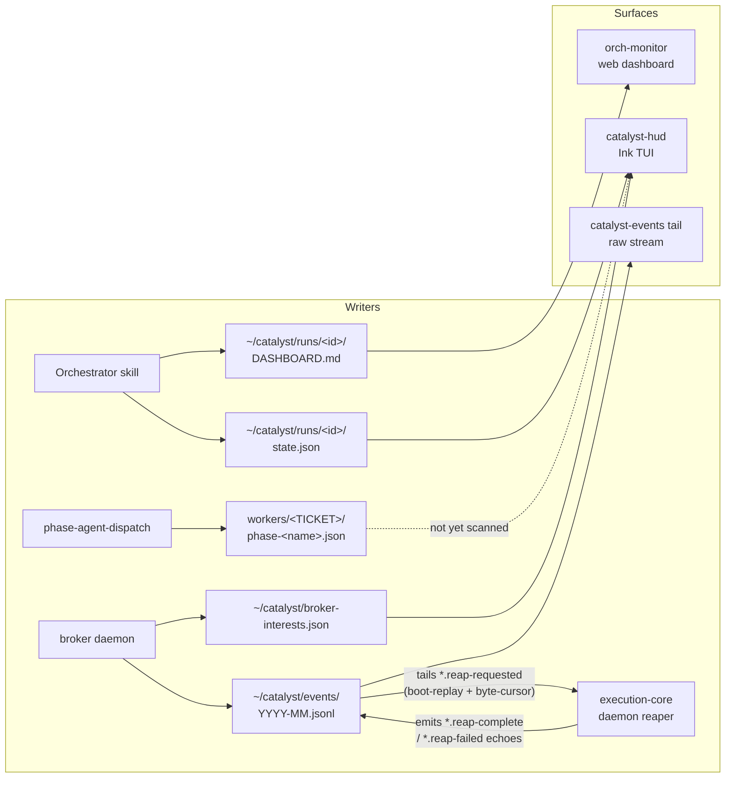

# Architecture

## Three-Layer System

1. **Plugin Source** (`plugins/dev/`, `plugins/meta/`, `plugins/pm/`, `plugins/legacy/`, …) —
   canonical agent/skill definitions; edit these.
2. **Installation Layer** — `.claude/` (symlinks Claude Code reads plugins from) + `.catalyst/`
   (workflow state: `config.json`, `.workflow-context.json`).
3. **Thoughts System** — external git-backed context at `~/thoughts/`, shared across worktrees,
   initialized per-project via `init-project.sh`.

## Memory & Workflow State

Three memory layers manage context across projects:

1. **Project config** (`.catalyst/config.json`, committable) — ticket prefix, Linear team, etc.
   HumanLayer maps cwd → profile via `repoMappings`.
2. **Long-term memory** — HumanLayer thoughts repo (git-backed, synced via
   `humanlayer thoughts sync`): `shared/research/`, `shared/plans/`, `shared/prs/`,
   `shared/handoffs/`.
3. **Short-term memory** (`.catalyst/.workflow-context.json`, per-worktree, not committed) —
   pointers to recent docs enabling skill chaining:
   `/research-codebase`→`/create-plan`→`/implement-plan`, `/create-handoff`→`/resume-handoff`.
   Auto-updated by workflow skills.

```
.catalyst/config.json              <- project config (committable)
   ↓
~/thoughts/repos/<proj>/{research,plans,prs,handoffs}/   <- long-term (git-backed)
   ↓
.catalyst/.workflow-context.json   <- short-term (session pointers)
```

`.workflow-context.json` structure:
`{lastUpdated, currentTicket, orchestration, mostRecentDocument:{type,path,created,ticket}, workflow:{research[],plans[],handoffs[],prs[]}}`.

## Global Orchestrator State

Cross-orchestrator visibility lives at `~/catalyst/state.json` — a single lock-protected JSON file
all orchestrators/workers write via `catalyst-state.sh`. It is a **denormalized summary**;
per-orchestrator local state in worktrees stays the source of truth for crash recovery (ADR-006).

```
~/catalyst/
├── state.json              # active orchestrators (denormalized summary)
├── catalyst.db             # durable SQLite session store (WAL)
├── events/YYYY-MM.jsonl    # append-only JSONL event stream, rotated monthly
├── history/<id>--<ts>.json # archived orchestrator snapshots
├── execution-core/registry.json  # team → repoRoot → eligibleQuery registry
└── wt/                     # worktrees
```

- **catalyst.db** — durable session source of truth (solo + orchestrated). Managed by
  `catalyst-db.sh` (CRUD/migrations) and `catalyst-session.sh` (lifecycle CLI). Tables: `sessions`,
  `session_events`, `session_metrics`, `session_tools`, `session_prs`, `schema_migrations`. WAL mode
  → concurrent readers (incl. `orch-monitor`). Schema: `plugins/dev/scripts/db-migrations/`.
  ADR-008. `catalyst-state.sh` still writes JSON/JSONL during the migration period for backward
  compatibility, so SQLite and the JSONL log coexist.
- **state.json** — active-orchestrator registry (progress, worker status, attention items). Schema:
  `plugins/dev/templates/global-state.json`.
- **events/** — every phase transition, PR creation, verification result, attention item. Schema:
  `plugins/dev/templates/global-event.json`. Multiple writers, two envelope shapes coexisting:
  - **v1** (bash, `catalyst-state.sh event`): `{ts, event, orchestrator, worker, detail}`.
  - **v2 OTel** (`plugins/dev/scripts/orch-monitor/lib/webhook-events.ts` for `github.*`/`linear.*`;
    `catalyst-comms send` for `comms.message.posted`): `{ts, attributes, body, resource}`.
  - Consumers: `catalyst-events tail` (stream), `catalyst-events wait-for` (blocking single-event).
    Both shapes handled. See `website/src/content/docs/observability/catalyst-events.md`.
- **history/** — full snapshots archived on completion/failure/stale.
- **execution-core/registry.json** — for `dispatchMode: execution-core` teams, the central
  `team → repoRoot → eligibleQuery` registry. The Linear-state contract is setup-tooling-owned (D8):
  `setup-catalyst.sh` ensures contract workflow states, writes the phase→5-state `stateMap`, and
  upserts each team's entry. Daemon reads the registry directly (D4). The CTL-554 per-repo
  enrollment under `execution-core/projects/` and the `/orchestrate` enroll step were retired in
  CTL-582. Access flows through `registry.mjs` `list-projects`/`get-project-config` — the D9 cloud
  seam (swappable to a hosted table without touching callers).
- **Heartbeat** — orchestrators write `lastHeartbeat` every 2–3 min; entries stale >10 min are GC'd
  as `abandoned`.

**Cross-host ticket ownership (HRW + liveness, CTL-859 → CTL-1091).** In a multi-host cluster,
ticket ownership is partitioned by Highest-Random-Weight (rendezvous) hashing (`hrw.mjs` `ownedBy`):
each daemon acts only on the tickets it owns, so one ticket is considered by exactly one host. Two
gates evaluate ownership, and — since CTL-1091 — **both hash over a liveness-filtered roster**, so an
offline owner's slice fails over to a live host instead of stranding in Todo forever:

- **Dispatch gates** (new-work `ready` filter in `scheduler.mjs`; triage predicate in `monitor.mjs`)
  hash over the **dispatch roster** = `computeDispatchSurvivingRoster(roster)` (POSITIVE liveness —
  a host must have heartbeated within `HEARTBEAT_GRACE_MS`, so a *never-live* rostered host is shed;
  CTL-1057) with a restore-side **deflap** on top (`liveness-deflap.mjs` `computeDispatchRoster` —
  a dead→live host is held out for `HEARTBEAT_RESTORE_HOLD_MS` so a flapping laptop can't
  grab-then-strand work; scheduler is the sole writer of `.liveness-deflap.json`, monitor reads it).
- **Recovery gates** (`ownsForRecovery`, `reclaimDeadHostWork`) hash over the **surviving roster** =
  `computeSurvivingRoster(roster)` (fail-OPEN `deadHosts` — an unseen host is "not proven dead" and
  is NOT reclaimed, since a never-seen host has no work to reclaim). The asymmetry is deliberate:
  dispatch fails an unseen owner's slice **over**; recovery must not reclaim a host's non-existent work.

Both altitudes preserve the same fail-safes: single-host is a strict no-op, and a total liveness
outage (heartbeat read throws / everyone looks dead) degrades to the **full roster** (each node owns
only its own HRW slice — never double-acts). The Linear-CAS claim (`cluster-claim.mjs` soft-CAS on
`catalyst://fence/<TICKET>`, applied HRW-first/claim-second) remains the transition-race serializer.

**Worker signal projection (in migration, ADR-018, CTL-483).** Per-worker `workers/<TICKET>.json`
files are currently written by ~7 scripts with no inter-process locking. CTL-483 moves these
mutations to a `worker.state_changed` command event consumed by the broker, which projects to a
shadow `<TICKET>.json.projected`. Phase 1: broker handler + emit helper + dual-write for
`orchestrate-auto-rebase` (`orchestrate-shadow-diff` verifies byte-for-byte parity). Phase 2: remove
direct writes (broker sole writer). Phase 3: mirror to SQLite per ADR-011. See ADR-018.

## Agent Teams vs Subagents

| Scenario                                        | Subagents       | Agent Teams |
| ----------------------------------------------- | --------------- | ----------- |
| Parallel research / code analysis / file search | YES             | overkill    |
| Complex multi-file implementation               | NO (can't nest) | YES         |
| Cross-layer features (FE+BE+tests)              | NO              | YES         |
| Cost-sensitive                                  | YES             | NO          |

- **Subagents (Task tool)** — own context window, results return to caller; cannot nest; lower cost.
  Default for research/analysis/search.
- **Agent Teams (TeammateTool, `CLAUDE_CODE_EXPERIMENTAL_AGENT_TEAMS=1`)** — each teammate is a full
  session that CAN spawn its own subagents (two-level parallelism); peer messaging; higher cost. For
  cross-layer/complex work.

Best practices: lead on Opus, teammates on Sonnet; ~5–6 tasks/teammate; each teammate owns distinct
files; plan-approval gates for risky work.

## Agent Communication (catalyst-comms)

File-based JSONL messaging at `~/catalyst/comms/channels/<name>.jsonl`. Bidirectional (CTL-249):
orchestrators broadcast to and directly message individual workers; workers poll for directed
messages at each phase boundary. `catalyst-comms send` also emits a `comms.message.posted` v2 event
to the unified log, so monitoring tools and `catalyst-events wait-for` observe comms from the same
file as GitHub/Linear events.

```bash
catalyst-comms join "$CHANNEL" --as <id> [--as orchestrator|--parent orchestrator]
catalyst-comms send "$CHANNEL" "msg" --as orchestrator --to CTL-101 --type info
catalyst-comms poll "$CHANNEL" --filter-to "$TICKET_ID" --since "$LAST_READ"
catalyst-comms watch "$CHANNEL"   # live tail (human auditor)
```

(Legacy `/oneshot` worker examples now live in the `plugins/legacy` plugin — see Phase-Agent
Communication for the current model.) Contract: every worker produces ≥4 messages/run. Signal files
remain authoritative state; comms is observability + coordination. Full protocol:
`plugins/dev/skills/catalyst-comms/SKILL.md`.

## Phase-Agent Communication

In `dispatchMode = "phase-agents"` (template default; also used internally by the `execution-core`
daemon) the orchestrator spawns one short-lived `claude --bg` job per phase, walking the 10-phase
pipeline (triage → research → plan → implement → verify → review → pr → monitor-merge →
monitor-deploy → teardown — see `docs/orchestrator-overview.md`). Phase agents never message each
other; they **append typed events to the shared log** `~/catalyst/events/YYYY-MM.jsonl`. The
orchestrator wakes on those events via the broker (`filter.wake.<ORCH_NAME>`), advances the ticket
via `orchestrate-phase-advance`, and dispatches the next `--bg` job. Dispatcher:
`plugins/dev/scripts/phase-agent-dispatch` (CTL-448). `oneshot-legacy` (single long-lived
job/ticket) is the runtime fallback when the key is missing.

### Dispatch-time rebase (front-load conflict surfacing, CTL-667 + CTL-707)

On a **fresh** dispatch of a **build** phase (`research`,`plan`,`implement`,`verify`,`review`),
`phase-agent-dispatch` rebases the ticket's worktree onto current `origin/<base>` before launching
the worker, so divergence surfaces early instead of riding stale to `monitor-merge` (CTL-608).
CTL-707 replaced the binary CTL-667 rebase with a 4-layer strategy:

- **L1 — Periodic background refresh** (`execution-core/worktree-refresh-timer.mjs`): keeps idle
  running worktrees current. Config
  `catalyst.orchestration.worktreeRefresh.{enabled,intervalSeconds,quietSeconds}`.
- **L2 — Dispatch-time conflict classifier** (`lib/worktree-rebase.sh:rebase_onto_base_classified`):
  tests-only → auto-resolve (`--theirs`); noise (`.catalyst/`,`.trunk/`) → `--ours`; `thoughts/**` →
  stall rc=3; real source → CTL-708 stub (always unavailable) → stall rc=2.
- **L3 — Phase-aware fallback** (`phase-agent-dispatch`): terminal source conflict (rc=2) on
  `research`/`plan` → destroy+recreate worktree fresh; same on `implement`/`verify`/`review` → park
  `needs-human`; thoughts conflict (rc=3) → park on all phases.
- **L4 — Telemetry** (`lib/rebase-telemetry.sh`):

| Event                                                | Severity | Emitter                  |
| ---------------------------------------------------- | -------- | ------------------------ |
| `phase.<phase>.stale-base-detected.<ticket>`         | WARN     | L1                       |
| `phase.<phase>.auto-rebased.<ticket>`                | INFO     | L1 + L2 (clean/additive) |
| `phase.<phase>.rebase-conflict-categorized.<ticket>` | WARN     | L2 (pre-stall)           |
| `phase.<phase>.rebase-conflict-stalled.<ticket>`     | ERROR    | L2 (terminal)            |

Loki:
`{job="catalyst-events"} | json | attributes["event.name"] =~ "phase\\..*\\.auto-rebased\\..*"`
(swap suffix per event).

Invariants (unchanged from CTL-667): **fresh-only** (resume `--resume-session` skips, CTL-658);
**build-phase-only** (`is_rebase_phase` in `lib/phase-sequence.sh`;
`triage`/`pr`/`remediate`/`monitor-*`/`teardown` exempt); **local-only** (never pushes/touches the
PR; `.catalyst/config.json`,`.trunk/*` stashed across rebase); transient `git fetch` failure (rc=1)
→ proceed un-rebased.

### PR as the durable work record (CTL-783)

During an orchestrated implement phase the draft PR is the off-disk, restart-surviving record of
active work:

| Signal        | Meaning                       |
| ------------- | ----------------------------- |
| Branch, no PR | not past first commit         |
| Draft PR open | implementing                  |
| PR ready      | in review (phase-pr promoted) |
| PR merged     | done                          |

- **Branch naming**: from Linear `branchName` (`ryan/<ticket>-slug`); `create-worktree.sh` never
  overrides.
- **PR title**: `<type>(<scope>): <ticket> …` via `draft_pr_title` in
  `plugins/dev/scripts/lib/draft-pr.sh` (injects ticket after the conventional prefix; both
  `draft_pr_ensure` and `create-pr` Step 7 route through it).
- **Lifecycle**: (1) `implement-plan` runs `implement-plan-draft-pr-early` after each plan-phase
  commit — `draft_pr_push`+`draft_pr_ensure` (idempotent; first opens, later push). Interactive runs
  gated by `[[ -n "${CATALYST_PHASE:-}" ]]`. (2) `phase-implement` End block runs
  `phase-implement-draft-pr` as idempotent backstop and is the **sole writer** of
  `.draftPr={number,url,isDraft}` into the signal file. (3) `phase-pr` calls `draft_pr_promote` to
  flip draft→ready (avoids `create-pr`'s "PR already exists" hang).
- **Config**: `orchestration.draftPr.enabled` (default `true`) — set `false` for no early draft, so
  the PR is created only at the `pr` phase.
- **Deferred**: reading `.draftPr` draft-state as a secondary advancement signal (advancement
  currently driven by signal `status === "done"` only).

### Recovery-pass `pr_not_merged` remediation (CTL-1496)

When `phase-teardown` emits `failed(reason: "pr_not_merged")`, the scheduler's **Pass 0r** sweeps
it as a recovery item. Previously the classifier blindly escalated it to a human. With CTL-1496
(`CATALYST_RECOVERY_PASS=shadow|enforce`), the classifier instead probes live GitHub state
(`pr-block-probe.mjs` → one `gh pr view` + GraphQL `reviewThreads` + `gh pr view --json reviews`):

- **Failing required checks or unresolved bot (Codex) threads, no human `CHANGES_REQUESTED`** →
  `{ decision: "fix", fix_class: "bounded-llm" }` with a `"pr-not-merged"` brief embedding the
  concrete failing-check names and thread ids. The recovery-pass worker fixes the CI, addresses the
  review findings, resolves the threads, and posts `@codex review` via `gh-pr-comment.sh
  --idempotent` to re-trigger the automated reviewer, then merges when `CLEAN`.
- **Human `CHANGES_REQUESTED`** → `escalate` with the specific reviewer ask (PR and thread linked),
  never the opaque `"Failure reason: pr_not_merged"` string.
- **Probe throws** → `defer` (transient GitHub outage — retry next tick).
- **No open PR found** → `escalate`.

The behavior is gated by `CATALYST_RECOVERY_PASS` (off by default); shadow mode logs a
`recovery.would-fix` event without dispatching; enforce dispatches the recovery-pass worker.

### Runaway-loop guards (CTL-671)

`schedulerTick` is hardened against runaway dispatch/reclaim loops on phantom/non-resolving tickets
(phantom CTL-9 once spammed ~24,560 `phase.*` events over 3 days, 92% per-tick `work-done-probe`
reclaim storms). Three additive defenses:

- **Pass 0a — phantom worker-dir validity sweep** (before reclaim): quarantines `workers/<ticket>/`
  to terminal `stalled` (`stalledReason:"phantom-ticket"`) only when all three hold: ticket
  definitively **not-found** in Linear, **not in eligible set**, and **no live bg worker**. The
  conjunction + 3-valued `classifyTicketResolution` (transient outage → `unknown`, never
  `not-found`) means a Linear outage can't quarantine a healthy in-flight ticket.
  `classifyTicketResolution`/`isBgJobAlive` are safe no-ops by default in `schedulerTick`, armed
  with real impls by the daemon's `runTick`.
- **Dispatch circuit breaker** (Linear-independent backstop): the CTL-624 cool-down marker carries
  `consecutiveFailures`; after `SCHEDULER_CIRCUIT_BREAKER_THRESHOLD` (default 8) consecutive failed
  dispatches with no progress → quarantine `stalled` (`stalledReason:"dispatch-circuit-breaker"`). A
  successful dispatch clears it.
- **Runaway-rate alert (observability only)**: when a single ticket's `phase.*.<ticket>` rate
  crosses `SCHEDULER_RUNAWAY_THRESHOLD` (default 50) within `SCHEDULER_RUNAWAY_WINDOW_MS` (default
  10 min), emit one `phase.dispatch.runaway.<ticket>` per window (marker under
  `orchDir/.runaway-alerts/`). Surfaces in HUD; does not quarantine.

Enforcement reuses the sweep + breaker: a `stalled` signal makes `isTicketInFlight` drop the ticket;
the terminal sweep applies `needs-human` via `labelOnce`.

### Stuck-but-alive daemon watchdog (CTL-1502)

Both existing daemon-supervision paths — the launchd `KeepAlive`/`StartInterval` agents and
`catalyst-monitor forward-start` — are **pid-liveness only** (`kill -0`), so a wedged process that
holds its pid passes every check. The stuck-but-alive watchdog closes that emit→act gap for the
otel-forward stack daemon: it reads *stuck predicates pid-liveness cannot see* and, in `enforce`
mode, restarts the stuck daemon exactly once per breach episode.

- **Two disk-only predicates (OR'd), both O(1) `statSync`/small-JSON reads that never touch the
  daemon or the bytes they measure.** **P1 DLQ-size** — the DLQ file's `statSync().size` at or above
  `dlqMaxBytes` (default 1 GiB); read by size, not `readFileSync`, so it stays honest past 2 GB where
  a whole-file read throws and the in-payload `dlqDepth` silently freezes. **P2 forwarding-lag** — the
  checkpoint's `lastForwardedTs` frozen for ≥ `stalenessMs` *while the event log has fresher writes*
  (real backlog), so a legitimately idle forwarder never trips. `lastForwardedTs` is the honest
  progress signal because it advances only on real forwarding, unlike the checkpoint file's mtime
  (rewritten unconditionally every 10 s — the same trap as the unconditional heartbeat).
- **Out-of-band alert path** (the watched daemon's own egress may be the wedged thing): the alert
  rides the exec-core daemon's pino `.log` (Alloy-shipped, independent of otel-forward) plus a local
  marker `~/catalyst/watchdog/<daemon>.alert.json` the HUD reads. A best-effort
  `catalyst.alert.raised|cleared {kind:"daemon_stuck"}` event to the log (for dashboards) is
  explicitly *not* load-bearing — it rides the very egress that may be broken.
- **State machine** (a structural clone of the fleet-health probe, hysteresis + cooldown): a
  sustained breach (≥ `sustainedTicks`) restarts once; a **post-restart verify window** re-checks for
  `verifyTicks` ticks — if the predicate clears, it emits `cleared` and re-arms; if it stays tripped,
  it **escalates** (a latched, non-clearing raised alert + a `severity:high` recovery finding) with
  no second restart until the `cooldownMs` (default 15 min, deliberately > the 600 s launchd
  `StartInterval` so the two supervision layers never race) expires and a healthy tick re-arms.
- **Modes** `off/shadow/enforce` (default **`shadow`** — detect + log `would-restart`, mutate
  nothing). Ships shadow-first; an operator flips it to `enforce` via
  `catalyst.orchestration.daemonWatchdog.mode` or `EXECUTION_CORE_DAEMON_WATCHDOG_MODE`. Every reader
  returns a non-crossing sentinel on throw so the guardrail can never wedge the daemon tick. First
  ship registers exactly one target (otel-forward) behind a descriptor registry, so a second watched
  daemon is a one-line addition.

### Two-axis worker state & the recordWorkerTransition chokepoint (CTL-764)

Every worker ticket has **two orthogonal axes** — never blurred:

- **Axis 1 — Pipeline stage** (WHERE the ticket is in the pipeline): written through the single
  `applyPhaseStatus` chokepoint → Linear workflow Status, audited by `linear.state.write.<TICKET>`.
- **Axis 2 — Worker disposition** (HOW the worker is doing): a single-valued workspace-scoped
  `worker-status` Linear label group with four mutually exclusive values:

  | Value         | Detection seam                                      | Cleared by                        |
  | ------------- | --------------------------------------------------- | --------------------------------- |
  | `queued`      | converger (admission gate, tick-converged)          | pickup / Done                     |
  | `blocked`     | converger (dependency not terminal, tick-converged) | dep becomes terminal / Done       |
  | `needs-input` | daemon `handleCommentWake` (worker paused, CTL-768) | human reply                       |
  | `needs-human` | `labelOnce` (sticky — NOT tick-converged)           | `clearStalledLabel` on resolution |

**Precedence** (only one label at a time): `needs-human > needs-input > blocked > queued > none`.
`needs-human` is **sticky** — it is never included in `TICK_CONVERGED_DISPOSITIONS` and only cleared
at explicit resolution (Done or terminal-sweep-clear), not on steady-state ticks.

**Resolution-gated clearing** — tick-converged labels (`queued`/`blocked`/`needs-input`) are
re-derived on every tick and applied/removed on diff; `needs-human` is removed only by
`clearStalledLabel`'s `onRemoved` callback which fires only on confirmed Linear label removal.

Worker transitions are recorded at the scheduler's transition sites, coordinated around a single
**inline `recordTransition` chokepoint** inside `schedulerTick`. That chokepoint owns sink (3): it
emits exactly one canonical `worker.transition.<TICKET>` event per genuine change to the unified
event log, and the only-on-change guard (`lastDispositionEmit`) prevents double-emit on steady-state
ticks. Its emitter defaults to `null` so a bare unit tick stays silent; **production threads the
real emitter (`defaultAppendWorkerTransitionEvent`) via `runTick`** — without that wiring every
`recordTransition` early-returns and the event stream is dark. That event feeds sink (4), OTLP via
`otel-forward` (dims as attributes — `body.payload` is stripped off-machine). The remaining sinks
are written at their own scheduler sites around the same transition (not fanned out from inside the
chokepoint): (1) Linear Status via the `applyPhaseStatus` chokepoint (Axis 1), (2) the
`worker-status` label via the admission converger (`convergeHeldLabel`) / `labelOnce` (Axis 2), and
(5) the optional broker `ticket_state_transitions` table (CTL-764 Phase 10). The standalone
`recordWorkerTransition` module (`record-worker-transition.mjs`) is the extracted, unit-tested
reference implementation of this same five-sink fan-out contract; the scheduler's live path uses the
inline `recordTransition` today.

### Unified data-flow

The same event log is the cross-process backbone for every observation surface:



Writers (phase-agent workers, `phase-agent-dispatch`, broker daemon, webhook receiver,
`catalyst-comms send`, reap-intent producers
`lib/emit-reap-intent.sh`/`execution-core/reap-intent.mjs`, and the daemon reaper re-emitting
`*.reap-complete`/`*.reap-failed`) all append to `~/catalyst/events/YYYY-MM.jsonl`. Readers
(`catalyst-events tail`/`wait-for`, broker daemon, the daemon reaper [CTL-649: boot-replay +
`fs.watch` byte-cursor driving `claude stop`/`git worktree remove`/`git branch -D`], `catalyst-hud`,
orch-monitor) consume that log plus per-run state and broker registry without coordinating. The
broker and the reaper are each both reader and writer of the same file.

### Linear app-actor self-echo guard (`botUserId`)

The execution-core daemon mirrors phase-agent output to Linear and wakes on human replies, so it
must tell its **own** app-actor comments/updates from a human's. `catalyst.monitor.linear.botUserId`
(app-actor user UUID, read flat from Layer-1 `.catalyst/config.json`) is that discriminator. The
daemon's `createCommentInboxWriter`/`createUpdateInboxWriter` (`execution-core/daemon.mjs`) and
orch-monitor's Linear webhook handler skip events authored by `botUserId`, so mirror comments don't
land in worker `inbox.jsonl` as false "human replied" signals and bot events don't feed back as
write loops. See `docs/configuration.md` to obtain/set the value.

### `shouldSkipEvent` self-filter

The broker both reads and writes the same JSONL log, so it would re-ingest the
`filter.wake.*`/`broker.daemon.*` events it emits, creating a feedback loop (CTL-346, 2026-05-12
incident). Every event passes `shouldSkipEvent` (`plugins/dev/scripts/broker/router.mjs:1873`)
before processing. It drops:

- `resource."service.name" === "catalyst.broker"` (own emissions)
- names starting `filter.` (wakes, (de)registrations)
- names starting `broker.daemon` (daemon lifecycle)
- `session.heartbeat` (also short-circuited earlier in `processEvent`)

`BROKER_INGEST_OWN_EMISSIONS=1` flips to "accept only `filter.*`" for debugging. This filter is what
makes the single unified log safe as both broker input and output.

### Lifecycle-event namespace contract (CTL-1142)

Four protected name-spaces, enforced as a verified invariant. Only
`service.name = "catalyst.broker"` may emit in the first three; the fourth governs valid phase-slot
strings.

| Space                                                                   | Rule                                                                                                                           |
| ----------------------------------------------------------------------- | ------------------------------------------------------------------------------------------------------------------------------ |
| `filter.*`                                                              | Broker interest-management only (else filter-wake loop).                                                                       |
| `broker.daemon.*`                                                       | Broker heartbeats/startup/shutdown only.                                                                                       |
| `session.heartbeat`                                                     | Exact match; broker liveness pings only (CTL-401).                                                                             |
| `phase.<name>.(complete\|failed\|turn-cap-exhausted\|skipped).<ticket>` | Routing namespace matched by `PHASE_EVENT_PATTERN`; `<name>` must be in `KNOWN_PHASES` or `INTENTIONAL_PHASE_SLOT_EXCEPTIONS`. |

**`KNOWN_PHASES`** (canonical 10, in order): `triage`, `research`, `plan`, `implement`, `verify`,
`review`, `pr`, `monitor-merge`, `monitor-deploy`, `teardown`.

**`<name>` slot exceptions** (in `recovery.mjs`, NOT pipeline phases): `dispatch`
(`phase.dispatch.failed.<ticket>` — the only exception with a terminal-status suffix that matches
the pattern; real phase rides `payload.target_phase`); `scheduler` (internal observability:
`yield-file-skip`, `cooldown-gc`, …); `advance` (phase-advance gate `held`). The latter two never
match the terminal-status set.

**Enforcement surfaces:**

- `plugins/dev/scripts/broker/namespace-contract.mjs` — single source of truth:
  `FORBIDDEN_PREFIXES`, `PROTECTED_EXACT_NAMES`, `KNOWN_PHASES`,
  `INTENTIONAL_PHASE_SLOT_EXCEPTIONS`, `PHASE_EVENT_PATTERN`, `isBrokerProtectedName`,
  `phaseSlotOf`, `isAllowedPhaseSlot`. `router.mjs`'s `shouldSkipEvent` imports from here.
- `plugins/dev/scripts/broker/namespace-parity.test.mjs` — exec-core producer parity (static names +
  `recovery.mjs` source-scan).
- `plugins/dev/scripts/orch-monitor/__tests__/namespace-parity.test.ts` — orch-monitor producer
  parity (GitHub/Linear/service-health names + prefix-family invariant).

See `thoughts/shared/plans/2026-06-16-ctl-1142.md` §3.8.

## Context Management Principles

1. Context is precious — specialized agents, not monoliths.
2. Just-in-time loading.
3. Parallel sub-agents > sequential.
4. Persist outside the conversation (thoughts/).
5. Read key documents fully (no partial reads).
6. Wait for agents before proceeding.

## Artifact Persistence (hybrid SQLite + filesystem, ADR-011)

Orchestrator runs produce artifacts that must survive worktree/runtime cleanup (SUMMARY.md, wave
briefings, per-worker signal files + phase logs, rollup fragments, comms channels, state.json),
archived keyed by orchestrator id.

- **Index (SQLite)** — `~/catalyst/catalyst.db`, migration `003_archives.sql`: `orchestrators` (one
  row/orch), `archived_workers` (PK `orch_id,worker_id`), `archived_artifacts` (UNIQUE
  `orch_id,path`).
- **Blobs (filesystem)** — `~/catalyst/archives/<orchId>/`: root
  `metadata.json`/`SUMMARY.md`/`rollup-briefing.md`; `briefings/wave-*.md`;
  `workers/<ticket>/{signal-final.json,phase-log.jsonl,SUMMARY.md,rollup-fragment.md}`;
  `comms/<channel>.jsonl`.

**Filesystem-first invariant**: blobs land on disk (via `atomicWrite()` = tmp + `rename`) before any
SQLite row; INSERTs run in a transaction after all FS writes succeed. So a failed SQLite write
leaves recoverable files (picked up by `sync`); a mid-sweep crash leaves only deletable `.tmp`
files; re-running is safe (all inserts are `ON CONFLICT … DO UPDATE`).

**CLI** (`plugins/dev/scripts/orch-monitor/catalyst-archive.ts`, all accept `--dry-run`):

```
sweep <orchId>          # archive one orchestrator
sync                    # reconcile FS ↔ SQLite (orphans, missing rows)
prune --older-than 30d  # delete archives older than N days
list [--json] | show <orchId>
```

Config from `.catalyst/config.json` merged with `~/.config/catalyst/config.json` via `archive.*`
keys.

**Monitor + UI** — orch-monitor read-only endpoints: `GET /api/archive/orchestrators` (paginated,
since/until/ticket/status filters); `GET /api/archive/orchestrators/:id` (detail w/
workers+artifacts); `GET /api/archive/orchestrators/:id/files/:relPath+` (streams a file; paths
validated via `isSafeArchivePart`/`isSafeArchiveFileRel` + `realpathSync` against `archive_path` to
block symlink escapes — 403/400/404). The `/history` page renders an "Archived Orchestrators"
section over these.

**Lifecycle** — Orchestrate Phase 7 runs the sweep after the final SUMMARY.md and before worktree
cleanup (idempotent). The teardown skill (`/catalyst-dev:teardown <orchId>`) deletes runtime +
worktree state but refuses unless the archive exists and the SQLite row is present (`--force`
bypasses).
