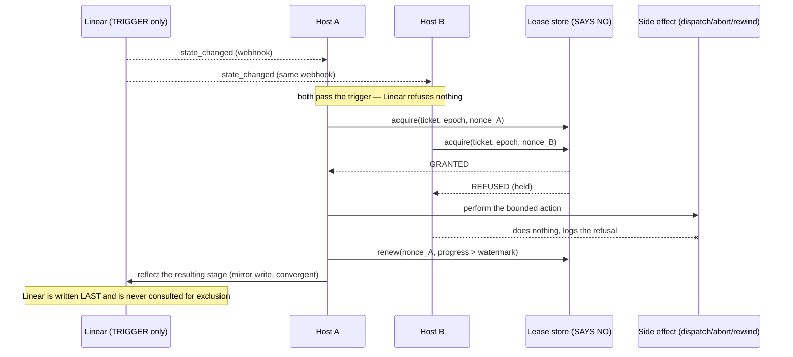

# The Event–Automation Contract

## 1. What this is

The binding contract between **events** and **actions** in the Catalyst fleet: which events the
coordination plane needs, what exactly one bounded automation does when each lands, and — for every
one of them — which component **refuses the second delivery**. A phase is a goal-loop: it is given a
goal and a bounded context, it works until the goal is met, and it posts one thing, its outcome.
That posting _is_ the event. It does not advance the ticket, does not write Linear, does not
dispatch the next phase. Everything that happens next is a separate subscriber. This document is the
list of those subscribers. Ratified as **ADR-029**; the measured evidence behind every claim is in
`thoughts/shared/research/2026-08-13-event-automation-catalog.md`.

## 2. Reading this document — "Who says no?"

Every automation row answers one question in plain language: **when the same trigger is delivered
twice, which component refuses the second attempt?**

This is not a hypothetical. The event log is read through a byte cursor, and a process that crashes
between acting and advancing its cursor **re-reads the same event on restart** — the reaper does
exactly this on every boot (`execution-core/reaper.mjs:938-989 bootReplay`). Redelivery is normal
operation, not an incident. So every subscriber must be safe when its trigger arrives twice, and the
thing that makes it safe has to be a component that can _say no_.

Not everything can. The distinction is mechanical:

| Can refuse                                                              | Cannot refuse                                                      |
| ----------------------------------------------------------------------- | ------------------------------------------------------------------ |
| `set -o noclobber` + `>` — the create fails with `EEXIST`               | a plain file write — the second write silently wins                |
| `git pull --ff-only` — git rejects a non-fast-forward                   | `git reset --hard` — always "succeeds", converges by luck          |
| `gh pr merge --match-head-commit <sha>` — GitHub rejects a stale merge  | `gh pr merge` — merges whatever is at HEAD now                     |
| a conditional write / compare-and-set (`UPDATE … WHERE nonce = ?`)      | an append-only log — by construction it accepts every append       |
| Linear's `attachmentCreate` soft-CAS read-back on `(owner, generation)` | Linear's workflow-state field — last writer wins, no preconditions |

Three phrases recur in the tables and mean specific things:

- **⚠ HOST-LOCAL** — the refusing component exists, but only on one machine (a marker file, an
  in-memory `Set`). It is correct for a single host and is a correctness hole the moment a second
  worker node receives the same webhook.
- **a guard we wrote** — an `if` statement in our own code. It is advisory. It refuses a duplicate
  only when both attempts run in the same process, in a known order. Per ADR-0027 §I3, naming a
  guard here is the same as naming nothing.
- **convergent** — the action has no second effect worth refusing (removing an already-removed
  worktree, fetching an already-current checkout). Correctly, nothing needs to say no.

The phrase **"exclusion store"** is deliberately not used anywhere in this document. It obscured the
question. Ask "who says no?" instead.

## 2a. Notation — what `<P>` and `<T>` mean

Event names in this document are written as **templates**. Angle-bracket segments are placeholders
substituted at emit time; everything else is literal. `phase.<P>.complete.<T>` is not an event name
— it is the shape of a family of them.

| placeholder           | stands for                     | substituted with                                                                 | example     |
| --------------------- | ------------------------------ | -------------------------------------------------------------------------------- | ----------- |
| `<P>`                 | **phase**                      | one of the 10 pipeline phases, or the ancillary `remediate` (see `KNOWN_PHASES`) | `plan`      |
| `<T>`                 | **ticket** (Linear identifier) | `TEAM-NNN`                                                                       | `CTC-324`   |
| `<status>`            | terminal status                | `complete` \| `failed` \| `abandoned` \| `turn-cap-exhausted` \| `skipped`       | `complete`  |
| `<pr>`                | GitHub PR number               | an integer, no `#`                                                               | `231`       |
| `<sha>`               | git commit sha                 | full 40-char sha                                                                 | `72b85dde…` |
| `<gen>` / `<declGen>` | generation counter             | the phase signal's monotonic generation — the re-dispatch discriminator          | `1`         |
| `<check_suite_id>`    | GitHub check-suite id          | an integer                                                                       | `48219…`    |
| `<target>`            | the phase being dispatched TO  | a phase name; rides `payload.target_phase`, **not** the event name               | `research`  |

**Legacy spellings.** Earlier sections and sibling docs use `<TICKET>` for `<T>`, `<phase>`/`<name>`
for `<P>`, and `<suite_id>` for `<check_suite_id>`. They mean the same thing; `<P>`/`<T>` are the
form to use in new writing.

**`<P>` is not always a real phase.** Three names occupy the phase slot without being pipeline
phases — `dispatch`, `scheduler`, and `advance` (`namespace-contract.mjs`
`INTENTIONAL_PHASE_SLOT_EXCEPTIONS`). `phase.advance.applied.<T>` is an _audit_ record about the
FSM, not a phase named "advance". Only `dispatch` produces a name matching the routing pattern, and
its real phase rides `payload.target_phase`.

### A real event, annotated

Taken verbatim from `mini:~/catalyst/events/2026-08.jsonl` — this is the substitution of
`phase.<P>.complete.<T>` with `<P>` = `plan` and `<T>` = `CTC-324`:

```jsonc
{
  "attributes": {
    "event.name": "phase.plan.complete.CTC-324", // <-- the template, substituted
    "event.entity": "phase", //     <P> and <T> also appear as
    "event.action": "complete", //     separate attributes, so a
    "linear.issue.identifier": "CTC-324", //     consumer never parses the name
    "catalyst.worker.ticket": "CTC-324",
    "event.stream_class": "coordination", // coordination vs telemetry (§4)
    "catalyst.executor": "sdk",
    "phase.attempt": 1,
    "phase.revive_count": 0,
  },
  "severityText": "INFO",
  "resource": { "service.name": "catalyst.phase-agent" }, // WHO declared it
  "body": {
    "message": "Phase plan complete on CTC-324",
    "payload": {
      "phase": "plan",
      "ticket": "CTC-324",
      "status": "complete",
      "duration_seconds": 456,
    },
  },
}
```

⛔ **Match on the parsed name, never a substring grep of the log.** A bare `grep` for a name also
matches commit messages and Linear descriptions that merely quote it — measured: 46 raw matches for
`phase.advance.applied`, of which **all 46 were false positives**. Parse the JSON.

⛔ **And read the name from both envelope shapes:**

```js
const name = event.attributes?.["event.name"] ?? event.event; // v2 ?? v1
```

An `attributes`-only reader misses every v1 event — **19,914 of them in 2026-08 on mini**, including
the whole `reap-requested` family, which is the fleet's most active actuator (§4.1). This is the
single easiest way to produce a confident, wrong zero.

`body.payload` is **stripped off-machine** by `otel-forward`, so anything a remote consumer needs
must be promoted to an attribute — and v1 events have no attributes at all, so they carry nothing
off-host but their name and timestamp.

## 3. The principles

**The five rules**, verbatim (`ctl-ctc-tenant-model-onboarding.md:2443-2452`, Turn 12, 2026-08-12):

1. emit don't orchestrate
2. one subscriber one job
3. the deterministic path must be genuinely deterministic
4. exceptions leave the automation loudly
5. silence is a defect

> "Side effects belong to whoever subscribes to an event, never to the actor that caused it."
>
> "**DUPLICATION IS THE TELL** — when the same '…and also do X' shows up in more than one prompt, X
> wants to be a subscriber."

**The two lease traps.** Both recorded 2026-08-12, both load-bearing:

1. **A LEASE IS NOT A HEARTBEAT.** "Still alive" is precisely the inference being removed. Renew on
   **visible progress** — a commit count, a turn count, a phase artifact — so a wedged agent loses
   its claim while its process is perfectly healthy. Renew on time and you have rebuilt `kill -0`
   with extra steps.
2. **A LEASE NEEDS SOMETHING THAT CAN REFUSE.** An append-only log cannot reject a write, so "the
   claim is just an event" reproduces the bug in a new place.

**THE LOG DECLARES; IT CANNOT EXCLUDE.** Those two roles are kept separate in every row below: the
log carries the declaration, and a different component says no.

**Governing invariants** —
`catalyst-cloud/docs/adr/0027-reliability-initiative-invariants-and-acceptance.md` (accepted
2026-08-12; **a different repository's numbering** — this repo's `docs/adrs.md` ADR-027 is "Browser
automation stays local", unrelated; always cite the cloud ADR by repo + path):

| #       | Invariant                                                                                           |
| ------- | --------------------------------------------------------------------------------------------------- |
| **I2**  | Liveness and completion are ASSERTED by the holder, never inferred by an observer.                  |
| **I3**  | Every side effect is gated by something that CAN refuse — if not at the write, then at its trigger. |
| **I4**  | Exclusion lives where refusal is possible. A store that cannot reject a write cannot host a lock.   |
| **I5**  | Every state transition is attributable and authored by us.                                          |
| **I6**  | Completion derives from delivery reality, not a state string.                                       |
| **I10** | Every failure detector must detect something no other detector can. Else DELETE it.                 |
| **I11** | A mechanism that has never produced an output does not exist. Shadow is a stage with an EXIT DATE.  |

> ⛔ **A rule in circulation that is FABRICATED.** "Did I already do this? Ask the world, not the
> log." It was coined by an agent on 2026-08-12 and cited back as if it were Ryan's. It **inverts
> I2** — an observer that re-derives truth by probing files, processes and APIs is performing
> exactly the inference this contract deletes. Never apply it; flag the citation wherever it
> appears.

**The architectural ruling that shapes everything below** (Ryan, 2026-08-13):

> "linear as the trigger not the lock sounds correct to me"

The Linear stage change **starts** an automation. The **lease** is what refuses a duplicate. Linear
is never asked to refuse anything, and no design may propose it as the refusal point. The direct
consequence — worked through, not around — is §6.3: two hosts receiving the same stage-change
webhook both pass the trigger, so the lease is acquired **after** the trigger and **before** any
side effect, and exactly one wins.

## 4. The event catalog — the coordination set

The full census is 117 rows over 304 distinct event names, of which **63 have no subscriber at all**
(`thoughts/shared/research/2026-08-13-event-automation-catalog.md` §3). This section lists only the
**coordination set**: events some component acts on, or must act on in the target design. Everything
else is telemetry — its loss costs visibility, never correctness.

Volume context: two telemetry names (`catalyst.linear.read` 833,499 and `recovery.tick` 557,069) are
**56% of all traffic**; seven names are 71%. Exactly one of those seven is coordination. The log is
overwhelmingly a telemetry firehose with a thin coordination lane threaded through it.

### 4.1 Phase declarations — the holder speaks

Emitted by `phase-agent-emit-complete:315` (name) / `:402-427` (append), called from every
`plugins/dev/skills/phase-*/SKILL.md` terminal block.

Every name below is a **template** — see §2a. `<P>` is the phase, `<T>` is the ticket. The example
column shows a real name observed in `mini:~/catalyst/events/2026-08.jsonl`, not an invented one.

| event (template)                             | example (real, from the log)           | meaning                                                                                                                                                                                                                                                                    | drives anything today?                                                                                                                                                                                                              |
| -------------------------------------------- | -------------------------------------- | -------------------------------------------------------------------------------------------------------------------------------------------------------------------------------------------------------------------------------------------------------------------------- | ----------------------------------------------------------------------------------------------------------------------------------------------------------------------------------------------------------------------------------- |
| `phase.<P>.complete.<T>`                     | `phase.plan.complete.CTC-324`          | a goal-loop met its goal and declared it                                                                                                                                                                                                                                   | **No.** Routed to `broker/router.mjs tryPhaseLifecycleRoute` (wake) — inert, zero interests exist under execution-core. Advancement is the scheduler's tick-scan over signal files, not this event.                                 |
| `phase.<P>.failed.<T>`                       | `phase.implement.failed.CTC-277`       | unrecoverable error — or infrastructure declaring failure _for_ a silent worker (`phase-agent-dispatch:590,:911`)                                                                                                                                                          | same — inert                                                                                                                                                                                                                        |
| `phase.<P>.abandoned.<T>`                    | ⚠ **none on mini in 2026-08**         | **clean SDK exit with no declaration** (CTL-1790)                                                                                                                                                                                                                          | the I2 terminal. `namespace-contract.mjs:85` records it "must NEVER be routed like complete/skipped, which advance the phase". Shipped 2026-08-12; no production instance yet — do not alarm on the zero until a ticket has cycled. |
| `phase.<P>.turn-cap-exhausted.<T>`           | ⚠ **none on mini in 2026-08**         | worker self-stopped at its goal-evaluated turn cap (CTL-484)                                                                                                                                                                                                               | continuation worker on a fresh budget. Zero observed — an I11 question, not a documented fact.                                                                                                                                      |
| `phase.monitor-deploy.skipped.<T>`           | `phase.monitor-deploy.skipped.CTC-351` | no deploy event before timeout                                                                                                                                                                                                                                             | frees the slot                                                                                                                                                                                                                      |
| `phase.advance.applied.<T>`                  | `phase.advance.applied.CTL-1774`       | an advance was performed after `dispatchAndVerify` confirmed a live successor (`recovery.mjs:1289`)                                                                                                                                                                        | **NONE by design today** — 31 emitted on mini in 2026-08. §5 row 18 gives it its first consumer.                                                                                                                                    |
| `phase.advance.held.<T>`                     | `phase.advance.held.CTC-272`           | the advancement gate refused                                                                                                                                                                                                                                               | NONE by design (`namespace-contract.mjs:56-68`) — pure audit                                                                                                                                                                        |
| `phase.<slot>.reap-requested` — **no `<T>`** | `phase.terminal.reap-requested`        | a scheduler/watchdog decision that a bg job must die. 8 slots measured on mini: `terminal` 14,568 · `reconcile` 1,567 · `abort` 265 · `revive` 174 · `reclaim` 162 · `supersede` 18 (+ `orphans.` 1,585 and `procOrphans.` 1,564, which are not in the `phase.` namespace) | **`execution-core/reaper.mjs:323 handle()` → `:342-375`** — the one genuinely event-driven actuator in exec-core                                                                                                                    |
| `phase.<slot>.reap-complete/.reap-failed`    | `phase.terminal.reap-complete`         | the reaper echoing its own outcome                                                                                                                                                                                                                                         | `reaper.mjs:938-989 bootReplay` keys replay-skip on the echo. A **lost** echo re-reaps on next boot.                                                                                                                                |

### ⚠ Observed while sampling: the reap echoes are almost all failures

Measured on mini, 2026-08, all `reap-complete` / `reap-failed` echoes — **330 events, 5 distinct
names**:

| name                              | count |
| --------------------------------- | ----: |
| `phase.abort.reap-failed`         |   320 |
| `phase.terminal.reap-complete`    |     4 |
| `phase.reconcile.reap-complete`   |     3 |
| `phase.abort.reap-complete`       |     2 |
| `phase.predecessor.reap-complete` |     1 |

**The abort path reports failure 320 times and success twice**, against 14,568 `terminal`
reap-requests that produce only 4 completes. Two readings are possible and this sample cannot
separate them: the reaper is genuinely failing to abort, or the echo is emitted on a benign
already-gone condition. Either way it is unexamined — nothing consumes `reap-failed`, so a 99%
failure rate on an actuator path has been accumulating silently. Recorded as an observation with its
numbers, **not** as a diagnosis; it needs its own ticket.

### ⛔ Two envelope shapes coexist, and the reap family is the impoverished one

**Do not assume every event has attributes.** Measured on mini, 2026-08, over all `reap-requested`
events: **19,914 are v1 and 12 are v2.** A v1 event is literally two keys —

```json
{ "ts": "2026-08-01T00:04:42Z", "event": "phase.reconcile.reap-requested" }
```

— no `attributes`, no `resource`, no `body`, **and no ticket anywhere**. Verified: **zero**
`reap-requested` names carry a ticket suffix.

Three consequences, all load-bearing:

1. **A consumer matching only on `attributes["event.name"]` silently sees none of them.** That is
   19,914 events — including the single most active actuator in the fleet — invisible to an
   attribute-only subscriber. Any filter must read `attributes["event.name"] ?? event`.
2. **`<T>` is genuinely absent here**, so the reaper cannot learn the ticket from the event. It
   doesn't try: the event is a **contentless wake**, and the reaper then makes its own authoritative
   read of the worker directories. That is "let the event wake the scan" working correctly in
   production — and it is why this row is the reference implementation.
3. The declaration families (`phase.<P>.complete.<T>` and siblings) **are** v2 and do carry
   `event.entity`, `event.action`, and `linear.issue.identifier` as attributes, so for those a
   subscriber matches on attributes and never splits the name. The rule is per-family, not global.

### 4.1a ⛔ Where does the ticket live? Three conventions, one log

The `<T>` in `phase.<P>.complete.<T>` is **in the event name**. The ticket in
`linear.issue.state_changed` is **not** — it rides `attributes["linear.issue.identifier"]`. Both are
our choices, and they disagree.

**Correcting a natural assumption:** `linear.issue.state_changed` is **not** Linear's format passed
through. Linear sends `{action:"update", type:"Issue", data:{…}, updatedFrom:{…}}` and has no such
event name. We synthesise it — `linear-webhook-events.ts:181` derives `state_changed` by testing
`updatedFromKeys.includes("stateId")`, with siblings at `:182-183` for priority and assignee. So we
are not preserving a provider shape we do not control; we picked this shape, and we picked a
different one for phases.

**The cost, measured on mini, 2026-08:**

| metric                                 |     count |
| -------------------------------------- | --------: |
| distinct event names, raw              | **1,467** |
| distinct names with `<T>` collapsed    |   **242** |
| names that are purely ticket-inflation | **1,225** |

**84% of this log's name cardinality is ticket identifiers.** Five families embed them — `phase`
1,066 · `worker` 110 · `fence` 57 · `linear` 51 · `ticket` 25 — so the inconsistency is not
Catalyst-vs-provider, it is _inside_ the Linear family too: `linear.issue.state_changed` is clean
while `linear.state.write.<T>` is inflated.

Three conventions therefore coexist, and a consumer must handle all three:

| convention          | example                         | ticket found via                      |
| ------------------- | ------------------------------- | ------------------------------------- |
| **in the name**     | `phase.plan.complete.CTC-324`   | regex on the name                     |
| **in an attribute** | `linear.issue.state_changed`    | `linear.issue.identifier`             |
| **absent entirely** | `phase.terminal.reap-requested` | nowhere — the consumer re-reads state |

**Target: the ticket is a field, never a name segment.** A name should be low-cardinality so it can
be a metric dimension and a stable subscription key; an identifier belongs in an attribute. The
attribute already exists on every v2 event, so for those families this is a subtraction, not an
addition.

⚠ **It is load-bearing today, not cosmetic.** `PHASE_EVENT_PATTERN`
(`broker/namespace-contract.mjs:85`) matches `phase.<name>.<status>.<TICKET>` and the broker's phase
routing depends on that suffix — as does `filter.wake.<ORCH_NAME>`. The mitigating fact is that this
routing is **inert** (zero interests exist under execution-core, §6.4), so the migration cost is far
lower than the coupling suggests. Sequence it with the subscription work rather than alone.

### 4.1b ⛔ The redundancy is near-total — and the 531-event exception is live data loss

§4.1a's census read the name as `attributes["event.name"] ?? event`. That is a **two-key read, and
there are three envelope shapes.** The third is `defaultEmit` at
`execution-core/stale-pr-rescue-timer.mjs:444-447`, which writes
`JSON.stringify({ name, ...payload, ts })` — key `name`, **no `attributes` object at all.**

Re-measured on mini (`2026-08.jsonl`, 1,117,131 lines) reading
`attributes["event.name"] ?? event ?? name`. Positive control on the same pass: `recovery.tick` =
**326,940**, so a zero below is absence, not a broken instrument.

| envelope | name key                   |         count | producer shape                                     |
| -------- | -------------------------- | ------------: | -------------------------------------------------- |
| v2       | `attributes["event.name"]` | **1,091,586** | `buildCanonicalEnvelope` / `build_canonical_line`  |
| v1       | `event`                    |    **25,013** | bash `catalyst-state.sh event` — `{ts,event}` only |
| v3       | `name`                     |       **532** | flat `{name,...payload,ts}` — **no attributes**    |

The corrected cardinality is materially the same as §4.1a's — the v3 shape adds 9 names — so **that
table stands.** What changes is the redundancy claim.

| metric                                 | §4.1a (2-key) | corrected (3-key) |
| -------------------------------------- | ------------: | ----------------: |
| distinct event names, raw              |         1,467 |         **1,476** |
| distinct names with `<T>` collapsed    |           242 |           **247** |
| names that are purely ticket-inflation |         1,225 |         **1,229** |

**Where the ticket actually lives, per family:**

| family     | ticket-bearing events | ticket ALSO in an attribute | ticket **only** in the name |
| ---------- | --------------------: | --------------------------: | --------------------------: |
| `fence.*`  |            **11,063** |                      11,063 |                           0 |
| `phase.*`  |             **3,484** |                       2,953 |                     **531** |
| `worker.*` |             **1,168** |                       1,168 |                           0 |
| `linear.*` |               **558** |                         558 |                           0 |
| `ticket.*` |                **73** |                          73 |                           0 |
| **total**  |            **16,346** |                  **15,815** |                     **531** |

**96.8% of the strip is a pure subtraction.** §4.1a's per-family `phase` count of 2,953 was the
attribute-carrying _subset_, not the family total.

⛔ **The 531 are being destroyed off-machine today, before any migration.** They are
`phase.rescue.escalated.<T>` (523), `.dispatched.<T>` (5), `.dispatch-failed.<T>` (3).
⚠ **Mechanism corrected 2026-08-13 (CTL-1817, PR #3325 round-1 review).** An earlier revision of
this paragraph said a v3 event "forwards with an empty body and an empty attribute set", reasoning
from the OTLP mapper (`otel-forward/lib/destinations/otlp.ts`), which builds the body from
`ev.body?.message ?? ev.attributes?.["event.name"] ?? ""` and the attributes from
`ev.attributes ?? {}` — neither of which a v3 event satisfies. **That is not what happens: a v3 event
never reaches the mapper.** Two gates discard it first, and both were silent:

1. `otel-forward/lib/tail.ts` `shouldForward` accepts only `attributes` | a string `event` | pino
   (numeric `level` + string `msg`). A v3 line matches none, so it is filtered out **at the tailer**
   and never read into the pipeline at all.
2. `otel-forward/index.ts` `processLine` then drops anything that still has no `attributes`.

So the 531 do not arrive off-machine degraded — **they never leave the host.** The loss is total, and
it was invisible because an unrecognized line is indistinguishable from no line, which is why a month
of it looked like silence rather than like corruption. This is a standing bug the migration merely
surfaced, not a migration cost to be weighed — and it is worse than the original text claimed.

The lesson generalizes past this one shape: **reasoning from the mapper alone skips the two filters
in front of it.** A detector placed there cannot observe what the filters already threw away — which
is exactly the mistake the first fix made, and why detection now sits at the gates
(`noteUnrecognizedLine`, `skippedNoAttributes`).

**Four producers put an identifier in the name and nowhere else.** All four must gain an attribute
**before** any suffix is stripped, or the migration destroys information:

| producer                     | file:line                           | identifier     | live 2026-08       |
| ---------------------------- | ----------------------------------- | -------------- | ------------------ |
| `defaultEmit` (rescue)       | `stale-pr-rescue-timer.mjs:444-447` | ticket         | **531**            |
| `defaultEmit` (orphan-PR)    | `orphan-pr-sweep-timer.mjs:147`     | PR number      | 1                  |
| `defaultAppendOperatorEvent` | `recovery.mjs:1512-1514`            | ticket         | 0 (source-present) |
| `thoughts-sync-gate`         | `lib/thoughts-sync-gate.sh:102-106` | phase + ticket | 0 (source-present) |

`defaultAppendOperatorEvent` sets `attributes: { "event.name": name }` and nothing else, so
`escalation.label-unconfirmed.<T>` (`recovery.mjs:2717`) is name-only by construction. It is a
generic seam shared with `beliefs.*` and `intent.ineffective` — the fix is a ticket/label parameter
on the seam, not a special case at the call site. `thoughts-sync-gate.sh:104-106` passes only
`--ts --severity --service --event-name`, so both identifiers exist exclusively in the name.

**Three inflation vectors the five-family census structurally could not see**, because they do not
match `[A-Za-z]+-\d+`:

| vector       | name                                | file:line                             | already in an attribute                                  |
| ------------ | ----------------------------------- | ------------------------------------- | -------------------------------------------------------- |
| **team key** | `monitor.reconcile.<action>.<TEAM>` | `reconcile-health-event.mjs:79`       | `event.label` + `catalyst.team` (`:82-83`)               |
| **team key** | `monitor.replica.<action>.<TEAM>`   | `replica-health-event.mjs:26`         | `event.label` + `catalyst.team` (`:29`)                  |
| **date**     | `briefing.followup.complete.<DATE>` | `briefing-followup/writeback.sh:244`  | `event.label` (`:272`)                                   |
| **mid-name** | `phase.<TICKET>.auto-rebased.clean` | `worktree-refresh-timer.mjs:116,:120` | ⛔ never fires — `daemon.mjs:2000-2006` passes no `emit` |

Live team-key names on mini: `monitor.reconcile.failing.{ADV,SLI,CTC,CRM}`, one event each. The date
vector is the worse defect of the two: it mints **one new name per day, forever**. The mid-name
ticket is the one a suffix-stripping migration would silently survive — it must be fixed as part of
the standard, not after it.

### 4.1c The target grammar — closed vocabulary in the name, identifiers in attributes

**`<entity>.<subject>.<action>[.<qualifier>]` — every segment drawn from a closed set, never
interpolated from data.**

| slot                   | rule                                                                                                                                                       |
| ---------------------- | ---------------------------------------------------------------------------------------------------------------------------------------------------------- |
| `<entity>`             | closed: `phase` `worker` `fence` `linear` `ticket` `monitor` `github` `filter` `broker` `session` `recovery` `escalation` `thoughts` `workflow` `briefing` |
| `<subject>`/`<action>` | closed, lowercase-hyphen. **Never** a ticket, team, host, PR number, date, session id, or orch id                                                          |
| identifier             | **never a name segment.** Always an attribute                                                                                                              |

**The identifier attribute contract** — every row but one is already emitted today, which is why
this is a subtraction:

| identifier           | attribute                                    | already emitted at                                                                                                         |
| -------------------- | -------------------------------------------- | -------------------------------------------------------------------------------------------------------------------------- |
| Linear ticket        | `linear.issue.identifier` (+ `event.label`)  | `fence-event.mjs:78-79`, `recovery.mjs:497-500`, `worker-transition-event.mjs:68-71`, `linear-state-write-event.mjs:80-84` |
| team key             | `catalyst.team` (+ `event.label`)            | `reconcile-health-event.mjs:82-83`                                                                                         |
| orchestrator/session | `catalyst.orchestrator.id` (+ `event.label`) | `router.mjs:329` — ⛔ sets the id but **not** `event.label`                                                                |
| PR number            | `vcs.pr.number` + `vcs.repository.name`      | ⛔ not stamped anywhere — `orphan-pr-sweep-timer.mjs:195` is name-only                                                     |
| date                 | `event.label`                                | `briefing-followup/writeback.sh:272`                                                                                       |

**Before → after:**

| today                                   | target                        | identifier rides          |
| --------------------------------------- | ----------------------------- | ------------------------- |
| `phase.plan.complete.CTC-324`           | `phase.plan.complete`         | `linear.issue.identifier` |
| `fence.claimed.CTL-1808`                | `fence.claimed`               | `linear.issue.identifier` |
| `worker.transition.CTL-1808`            | `worker.transition`           | `linear.issue.identifier` |
| `linear.state.write.CTL-1808`           | `linear.state.write`          | `linear.issue.identifier` |
| `ticket.completion.declared.CTL-9`      | `ticket.completion.declared`  | `linear.issue.identifier` |
| `monitor.reconcile.failing.CRM`         | `monitor.reconcile.failing`   | `catalyst.team`           |
| `briefing.followup.complete.2026-08-13` | `briefing.followup.complete`  | `event.label`             |
| `phase.orphan-pr.detected.3`            | `phase.orphan-pr.detected`    | `vcs.pr.number`           |
| `filter.wake.<ORCH_ID>`                 | `filter.wake`                 | `event.label`             |
| `phase.<TICKET>.auto-rebased.clean`     | `phase.worktree.auto-rebased` | `linear.issue.identifier` |

**The reading rule every consumer adopts (and the one thing that makes the flip incremental):**

```
name   = attributes["event.name"] ?? event ?? name          // three keys, always
ticket = attributes["linear.issue.identifier"]
      ?? attributes["event.label"]
      ?? <legacy: trailing name segment>                     // fallback, dated
```

Never a regex on the name to obtain an identifier. `references/event-schema.md:777` already
documents this shape for `filter.wake` (`event.name == "filter.wake" and event.label == "${id}"`) —
the target was designed and the emitter simply never stamped `event.label`.

### 4.1d The decision — **yes, but only Steps 0–1 are committed**

**The governing property, stated first, because it is what killed the last migration of this
shape.** ADR-018 Phase 1 died at 1-of-7 writers and left the tree carrying a shadow mechanism with
one consumer, a verification CLI. **Every prefix of this plan must leave the system strictly better
than today.** Step 0 and Step 1 satisfy that trivially — they are bug fixes and drift-deletion with
zero wire changes and zero routing risk. Everything after them is a 1–6-line PR that is
independently safe and independently abandonable.

**The argument that is not cardinality.** `event.name` is Loki _structured metadata_, not a stream
label — 1,476 names cost zero index cardinality and zero Prometheus series. If the case rested on
name count, the honest answer would be "don't bother." It does not. It rests on three measured
facts:

1. **Live data loss** — 531 events/month **discarded before they leave the host**, at
   `tail.ts`'s `shouldForward` filter and `index.ts`'s no-attributes drop (see §4.1b; NOT forwarded
   degenerately at `otlp.ts` — that was the original, corrected reading). Fixed by Step 0 alone.
2. **Proven grammar drift** — the phase grammar exists in **four** hand-copies, and one of them has
   _already_ silently diverged in production:

   | copy                         | file:line                             | status                                                                                                                                     |
   | ---------------------------- | ------------------------------------- | ------------------------------------------------------------------------------------------------------------------------------------------ |
   | `PHASE_EVENT_PATTERN`        | `broker/namespace-contract.mjs:85-86` | canonical                                                                                                                                  |
   | `WORKER_PHASE_EVENT_PATTERN` | `broker/projection.mjs:325-327`       | ⛔ **drifted** — its own comment: "`skipped` was missing here since CTL-512 — this copy had drifted from the contract it claims to mirror" |
   | `WORKFLOW_SUBSTEP_PATTERN`   | `broker/router.mjs:2100-2101`         | separate family, same ticket-suffix grammar re-typed                                                                                       |
   | `MONITOR_MERGE_COMPLETE_RE`  | `broker/plugin-refresh.mjs:457`       | fourth copy; found by only one of three audit lenses                                                                                       |

   That comment is in-repo proof the duplication is a live defect **independent of the migration**.
   Folding all four onto `namespace-contract` exports is worth doing even if nothing else ships.

3. **Unbounded growth** — dates and tickets mint names forever, and every _future_ name-keyed
   surface inherits the defect at higher cost than closing the vocabulary now.

**The coupling, and why it is cheaper than §4.1a's warning implies.** `PHASE_EVENT_PATTERN`'s third
capture group is `$`-anchored, so the ticket suffix is **mandatory for the match to occur at all**
(`namespace-contract.mjs:86`); `phaseSlotOf` returns `null` without it (`:99-101`).
`tryPhaseLifecycleRoute` then reads the ticket **only** from that capture (`router.mjs:2064`) and
matches `reg.ticket !== ticket` (`:2070`) — but the same envelope has carried the ticket in
`attributes` for 15,815 of 16,346 events all along. **The regex reads the name by historical
accident, not by necessity.**

| fact                                                                                     | file:line                                                                                                           |
| ---------------------------------------------------------------------------------------- | ------------------------------------------------------------------------------------------------------------------- |
| Phase routing is gated on a table that is empty under execution-core                     | `router.mjs:2831` `if (!interests.size) return;`                                                                    |
| Zero `filter.*` events in all of 2026-08 (control: 326,940 `recovery.tick` on same pass) | measured                                                                                                            |
| The routing IS live on legacy-wave, which does register                                  | `orchestrate-register-interests.sh:146,:170,:191,:224`                                                              |
| Producers of the routable phase name — the complete set, must move in lockstep           | `recovery.mjs:482`, `sdk-run-phase-agent.mjs:616`, `phase-agent-emit-complete:315`, `lib/phase-emit-complete.sh:69` |
| 59 `phase-agent-emit-complete` invocations across 10 SKILL.md files need **zero** edits  | they pass `--phase`/`--ticket`, never a name                                                                        |

The real cost is not the 38 producer sites — they funnel into a handful of builders. It is the ~10
consumers that reconstruct or parse the name (`event-scan.mjs:67,:244,:265,:291`,
`recovery.mjs:4394,:4403`, `orch-monitor/lib/journey.mjs:35`,
`orch-monitor/cli/lib/format.ts:523,:527,:541`, `orch-monitor/lib/otel-queries.ts:1471`) and the ~10
SKILL.md `wait-for` filters pinned to the exact `filter.wake.<id>` string.

**Exit dates live in code, not in a review meeting.** `LEGACY_SUFFIX_DEADLINES` is frozen in
`namespace-contract.mjs` and read by `catalyst doctor`: **INFO** before the date, **FAIL** after it.
A dated table in a spec is what ADR-018 had. The deadline **forces the review**; deletion of the
name-suffix fallback additionally requires its instrumented counter to read **zero** over a full
retention window — because replay tooling over pre-migration months is exactly the false negative a
calendar-only delete produces (tickets silently resolve to `null`, and a null ticket looks like a
clean scan). **Deadline-forced, evidence-approved.**

**The trigger that upgrades this from "worth it" to "urgent":** anyone proposing a name-keyed
metric, alert, dashboard group-by, or routing surface. They should find the vocabulary already
closed. Until then, Steps 0–1 are committed and the producer flips are opportunistic.

### 4.1e Immutable history and out-of-repo dashboards

**The log is append-only and is never rewritten.** Every past month keeps the old grammar forever,
so "migrated" can only ever mean _producers emit the new form and consumers accept both._

| surface                                      | what the flip does to it                                                      | required mitigation                                                                                                             |
| -------------------------------------------- | ----------------------------------------------------------------------------- | ------------------------------------------------------------------------------------------------------------------------------- |
| `~/catalyst/events/*.jsonl`, past months     | inflated names on disk permanently                                            | tolerant readers accept both forms; the fallback is precisely what must **not** be deleted on a calendar alone                  |
| Loki, within the retention window            | both forms coexist for the window's duration                                  | queries use alternation (`phase\.teardown\.complete(\..+)?`) until the window rolls past the flip date                          |
| `catalyst-otel/collector-config.yaml`        | log-derived metric connectors keyed on name patterns (`:632-689`, `:690-763`) | audited and updated **before** the phase flip; a connector that stops matching produces a _flat_ series, not an error           |
| `catalyst-otel/provisioning/alerting/*.yaml` | ⛔ **upsert-only; a malformed rule crash-loops the SHARED Grafana**           | validate every change against a throwaway Grafana first (AGENTS.md house rule). Needs a named owner before the phase flip       |
| `catalyst-otel/dashboards/*`                 | name-keyed panels silently go flat                                            | `grep` over `dashboards/ provisioning/ docs/data-dictionary.md`, with a positive control that returns non-zero on the same pass |

⚠ **The failure mode here is silence, not error.** An alert whose selector matches only the old
name does not error when the new name arrives — **it goes quiet, and quiet reads as healthy.** That
is the "stale copy reports healthy" pattern this fleet has hit four times. Every alert and connector
touched must be shown to **fire on a synthetic new-form event** before the flip; "it did not error"
is not evidence.

**What is out of scope, and why.** The reap family is v1 `{ts,event}` with **no ticket anywhere** —
25,013 events on mini, zero of them ticket-suffixed. There is no suffix to strip. It is in scope for
any _consumer_ rewrite (an attributes-only reader cannot see it at all — hence the three-key read
above), and its v2 upgrade is a separate, optional piece of scope with real observability payoff and
no relevance to name stripping. Likewise the ingest families are already correct:
`webhook-handler.ts:172-418` and `linear-webhook-handler.ts:166-273` interpolate only the
**action**, and `linear-webhook-events.ts:178-187` returns fixed strings.

### 4.2 GitHub ingest — provider reality

Emitted by `orch-monitor/lib/webhook-events.ts` / `webhook-handler.ts:328`.

| event                                      | meaning                                                  | drives anything today?                                                                                                     |
| ------------------------------------------ | -------------------------------------------------------- | -------------------------------------------------------------------------------------------------------------------------- |
| `github.pr.merged` (674)                   | a PR merged                                              | plugin-refresh + stack-reload (`router.mjs:2698,:2724`), `setFilterStateMerged`, ticket-lifecycle wake                     |
| `github.push` (main) (3,310)               | push to the default branch                               | same pair                                                                                                                  |
| `github.check_suite.completed` (23,151)    | CI suite finished                                        | classified failing/passing then **only a wake** — inert with zero interests                                                |
| `github.pr_review_comment.created` (5,675) | **a Codex review finding lands**                         | composes a wake `reason` string and nothing else. **In practice: nothing happens.** The single largest missing automation. |
| `github.pr_review_thread.resolved` (2,279) | a thread was resolved                                    | wake + reason                                                                                                              |
| `github.pr.opened` (828)                   | PR opened                                                | `_autoPrLifecycleFromTicket:1965` creates `pr_lifecycle` interests                                                         |
| `github.pr.closed` (113)                   | closed unmerged                                          | `setFilterStateClosed` clears the open-orphan row board-health trusts                                                      |
| `github.pr.synchronize` (2,095)            | head moved on an open PR                                 | SHA→PR cache put (`webhook-handler.ts:68-69`) — row 9's `ci-fix` key depends on this recovery                              |
| `github.issue_comment.created` (1,292)     | includes the Codex **clean-pass** 👍 / "no major issues" | **NONE** — and this is the reaction-shaped clean pass a `reviews{}`-only poll misses                                       |

### 4.3 Linear ingest — human and foreign-agent intent

| event                                               | emitter                                                                                                                                                                 | meaning                                                                                                    | drives anything today?                                                                                                                                                                                                                                                                                                         |
| --------------------------------------------------- | ----------------------------------------------------------------------------------------------------------------------------------------------------------------------- | ---------------------------------------------------------------------------------------------------------- | ------------------------------------------------------------------------------------------------------------------------------------------------------------------------------------------------------------------------------------------------------------------------------------------------------------------------------ |
| `linear.issue.state_changed` (367 on mini/2026-08)  | `linear-webhook-events.ts:181 issueTopic()` — returns this topic iff `updatedFrom` carries `stateId`; appended at `linear-webhook-handler.ts:399-410` (the only writer) | someone moved a card                                                                                       | **Partly.** `monitor.mjs:495-728` four-way split: →triageStatus dispatches triage (`:605`), →Ready dispatches triage (`:634`), →`DRAG_OUT_STATES` {Backlog,Canceled,Duplicate} removes + aborts (`:166,:702`). **Every pipeline state — Research/Plan/Implement/Validate/PR/Done — falls to an explicit NO-OP at `:715-727`.** |
| `linear.comment.created` (1,891)                    | webhook-handler                                                                                                                                                         | any workspace comment                                                                                      | **`daemon.mjs:1352 handleCommentWake`** — clears `needs-human` (write-gated) and re-dispatches the parked worker. One of only two real exec-core subscribers, and the best existing example of the target shape.                                                                                                               |
| `linear.state.write.<T>` (~600/mo)                  | `execution-core/linear-state-write-event.mjs:39-100`, emitted from `scheduler.mjs:4763` at six write sites                                                              | **our own** outbound state write; payload carries `{phase, transition_key, from_state, to_state, applied}` | **ZERO consumers.** Repo-wide search outside its own producer modules returns one hit, a comment at `linear-write.mjs:62`. Positive control: the same search style finds real consumers of `linear.issue.state_changed` at `monitor.mjs:176` and `router.mjs:1860`.                                                            |
| `linear.issue.{updated,created,assignee_changed,…}` | webhook-handler                                                                                                                                                         | field-level change                                                                                         | `router.mjs:2804 foldLinearIssueDescriptor` → SQLite `ticket_state` upsert                                                                                                                                                                                                                                                     |

### 4.4 The claim lane

| event                             | emitter                            | meaning                                                   | drives anything today?                                                                                                             |
| --------------------------------- | ---------------------------------- | --------------------------------------------------------- | ---------------------------------------------------------------------------------------------------------------------------------- |
| `fence.claimed.<T>` (28,143)      | `execution-core/cluster-claim.mjs` | a host claimed (or heartbeat-re-emitted) a ticket fence   | `router.mjs:2682 projectFenceEvent` upserts the owner/generation columns `fenceGuard` reads                                        |
| `fence.released.<T>` (0 observed) | `cluster-claim.mjs`                | fence released                                            | same projection, clears it. **A lost release leaves a stale owner until a higher generation lands; there is no fence reconciler.** |
| _(the lease itself)_              | **does not exist**                 | the holder's renewable claim, renewed on visible progress | ⛔ not built. `cluster-claim.mjs` is the nearest thing and gates **dispatch**, not the advance.                                    |

> ⛔ **The claim projection adjudicates on GENERATION ALONE.** `router.mjs:1813-1817` drops an
> incoming `fence.claimed` as a stale downgrade by comparing generation **with no owner argument** —
> structurally the same defect as `isFenceCurrent` (`cluster-claim.mjs:322`). Two racers that each
> derive `g+1` locally (`cluster-claim.mjs:290`) are indistinguishable there. `claimTicket`'s own
> read-back _does_ compare both `owner_host` and `generation` and is a real adjudication; the
> projection and `isFenceCurrent` are not. Tracked as CTL-1779.

## 5. The automation table

One row per subscriber. Rows **1–12** are carried over verbatim in intent from
`thoughts/shared/research/2026-08-13-event-automation-catalog.md` §4 (numbering preserved so the
carry-over is checkable); rows **13–18** are the Linear stage-transition subscribers Ryan identified
as missing.

> ### ⭐ Rows 1 and 5 are NOT a duplicate
>
> Both trigger on `github.pr.merged`. That is **two subscribers to one event, one job each** — rule
> 2, "one subscriber one job". Row 1 keeps every enrolled durable checkout current; row 5 tears down
> _that ticket's_ worktree. They have **independent failure domains**: a failed worktree removal
> must not block the checkout refresh, and a checkout that cannot fast-forward must not strand a
> merged ticket's worktree. Collapsing them into one automation would couple two unrelated failures
> and put an "…and also do X" back into a single actor, which is precisely the anti-pattern the tell
> warns about. The codebase already models it this way — `github.pr.merged` currently fans to
> `router.mjs:2698` (plugin refresh), `router.mjs:2724` (stack reload), `:1516`
> (`setFilterStateMerged`) and the reaper's tail, all independently.

| #      | trigger                                                                                            | bounded action (the WHOLE automation)                                                                                                                                                                                                                                                                                                                                        | who says no?                                                                                                                                                                                                                                                                                 | replay-safe?                                            | goes loud if it silently stops                                                                                                                                                                                                                          |
| ------ | -------------------------------------------------------------------------------------------------- | ---------------------------------------------------------------------------------------------------------------------------------------------------------------------------------------------------------------------------------------------------------------------------------------------------------------------------------------------------------------------------- | -------------------------------------------------------------------------------------------------------------------------------------------------------------------------------------------------------------------------------------------------------------------------------------------- | ------------------------------------------------------- | ------------------------------------------------------------------------------------------------------------------------------------------------------------------------------------------------------------------------------------------------------- |
| **1**  | `github.pr.merged` / `github.push` on default branch                                               | **Fast-forward every enrolled durable checkout.** Deterministic path only: clean, on default branch, upstream resolvable → `git pull --ff-only`. Anything else (detached, repurposed primary, operation in progress, unpushed commits, linked worktree) → refuse, report exactly what was found, emit an anomaly. Never guesses, never reports a success it did not achieve. | **git** — `--ff-only` refuses a non-fast-forward. Refusal taxonomy in `execution-core/checkout-sync.mjs` (CTL-1808, 279 lines, **currently zero importers**). ⚠ HOST-LOCAL, correctly — nothing to exclude across hosts.                                                                    | yes — a no-op on a current checkout                     | a "checkouts behind origin" gauge. Today's surface is `plugin.checkout.refresh_failed` at **6,640 with no reader** — that is what silent looks like.                                                                                                    |
| **2**  | `github.pr_review_comment.created`                                                                 | **One bounded worker for that one THREAD.** Context is the thread, the diff hunk, nothing else. Fix, reply, resolve, stop. Does not merge, does not re-review, does not touch other threads.                                                                                                                                                                                 | ⛔ **NOTHING TODAY.** Key is the **thread id**, not the comment id (one thread carries many comments; a later comment is input to the holder, not a new claim). Needs a conditional write + a **per-PR round cap**, because the reviewer re-reviews on every push and the fix _is_ a push.   | only once the lease exists                              | thread-age histogram + resolved rate — ⚠ unbuilt. Today **5,675 review comments produced zero automated action and nothing said so.**                                                                                                                  |
| **3**  | `phase.<P>.complete.<T>`                                                                           | **Advance the ticket to the next phase and dispatch it.** Owned by the subscriber. The declaring worker does not advance, does not write Linear, does not dispatch.                                                                                                                                                                                                          | **The lease** — the advance is gated at its trigger (I3). Today: the `O_EXCL` advance claim (`phase-agent-dispatch:734-740`) re-keyed on declaration identity, ⚠ HOST-LOCAL. Not the fence, which cannot discriminate two racers.                                                           | yes with a lease; **no** without — replay re-advances   | `phase.advance.applied.<T>` — **31 on mini in 2026-08** (an earlier "0" was the laptop mirror's CTL-1812 hole).                                                                                                                                         |
| **4**  | `phase.<P>.abandoned.<T>` — **only when `reason != "preempted-by-intent"`**                        | **Record abandonment, release the lease, re-admit the ticket at the SAME phase. Never advance.** ⛔ **The reason guard is load-bearing, not decoration:** the §7b preempt protocol exits through this same terminal, so an unguarded subscriber re-dispatches the phase the human just preempted — racing step 6 and re-admitting a ticket moved to Backlog/Canceled/Duplicate, which are defined to admit nothing. A preempt exit is routed by the §6.3 `(class, to_state)` row **alone**.                                                                                                                                                                                                                                                                             | the lease release (a conditional write against the held nonce); today a fresh `<phase>.claim.<gen+1>` `O_EXCL` create                                                                                                                                                                        | yes                                                     | the abandoned-rate metric. CTL-1790 shipped the terminal (`sdk-run-phase-agent.mjs:521`, called `:1269`); its only observed output in the log is on synthetic ticket `CTL-1`.                                                                           |
| **5**  | `github.pr.merged` (for a ticket's PR)                                                             | **Teardown** — reap the bg job, salvage-then-remove the worktree, delete the branch, release the lease. One job. _(See the box above: independent of row 1.)_                                                                                                                                                                                                                | the reaper's per-event de-dupe (`reaper.mjs:189-190`) — real, but ⚠ HOST-LOCAL and in-memory. Target: the lease release is the conditional write.                                                                                                                                           | yes — removal is convergent                             | a "worktrees for merged PRs" gauge that must be zero. Today `pr.merged.cleanup-failed` fires **1,480 times with no subscriber**.                                                                                                                        |
| **6**  | **lease expiry** (the store's own alarm)                                                           | **Reclaim** — the ticket becomes claimable again. No probe, no `kill -0`, no heartbeat-age arithmetic.                                                                                                                                                                                                                                                                       | **the lease store — this IS the store.** Must be a conditional-write authority; Linear's `attachmentCreate` is an unconditional last-writer-wins upsert with no conditional-write primitive in the schema.                                                                                   | yes by construction — expiry is a fact with a timestamp | claimable-but-unclaimed depth.                                                                                                                                                                                                                          |
| **7**  | **lease renewal carrying evidence of progress**                                                    | **Extend the lease** iff the renewal asserts visible progress (commit count / turn count / phase artifact). A renewal with nothing to assert is **REFUSED** and the lease lapses.                                                                                                                                                                                            | the conditional write on `(nonce, progress > last_progress)`                                                                                                                                                                                                                                 | yes                                                     | This is the surviving progress watchdog and **must not be deleted** — a lease proves someone HOLDS the work, not that they are DOING anything. A hung agent renews happily (CTL-729; the 2026-06-09 six-wedged-slots incident).                         |
| **8**  | `linear.comment.created` (human reply on a parked ticket)                                          | **Clear `needs-human` and re-dispatch the parked worker.**                                                                                                                                                                                                                                                                                                                   | write-gated `removeLabel` — only counts as genuine when a real write occurred (`daemon.mjs`), plus `clearDispositionEmit`. Close to right, but the label lives in Linear, which cannot refuse concurrent writers.                                                                            | partially — the write-gate makes a duplicate a no-op    | parked-ticket age ⚠ unowned. A **lost** comment event leaves a ticket parked forever → needs the Linear-side reconciler (§6.4).                                                                                                                        |
| **9**  | `github.check_suite.completed`, failing conclusion                                                 | **One bounded fixer for that PR's CI**, scoped to the named failing checks.                                                                                                                                                                                                                                                                                                  | lease `ci-fix:<pr>:<check_suite_id>` **plus a per-PR attempt budget** — each fixer push mints a **new** suite id, hence a new key, hence a new fixer. A store that refuses the second _concurrent_ claimant happily grants the Nth _sequential_ one; the key alone is not a loop terminator. | only with the store                                     | failing-required-check age on open PRs — ⚠ does not exist today.                                                                                                                                                                                       |
| **10** | `github.pr_review_thread.resolved` ∧ all threads resolved ∧ checks green                           | **Merge** — plus **one bounded read of merge-readiness on the triggering edge**, because the clean pass can be a 👍 **reaction** and GitHub emits no webhook for a reaction. That read is I6 (delivery reality), not I2 (inference).                                                                                                                                         | **GitHub itself** — `--match-head-commit` refuses a stale merge (CTL-1782). **The one row where the refusing component already exists and is external.**                                                                                                                                     | yes                                                     | mergeable-but-unmerged age — ⚠ does not exist today.                                                                                                                                                                                                   |
| **11** | `phase.<P>.failed.<T>`                                                                             | **Escalate with a structured explanation** (problem + call-to-action), or route to a delegate first.                                                                                                                                                                                                                                                                         | the label-guard's no-overwrite check (`prior.explanation && prior.explanation.degraded !== true`) — ⚠ a guard we wrote, not a store                                                                                                                                                         | no — replay re-escalates                                | `escalation.explanation-absent`, which has produced **0 outputs**.                                                                                                                                                                                      |
| **12** | `catalyst.ingestion.stale` / `catalyst.alert.raised(system_down)`                                  | **Page. Nothing else.**                                                                                                                                                                                                                                                                                                                                                      | n/a — alerting is deliberately emit-only and Loki-decoupled                                                                                                                                                                                                                                  | yes (level-triggered downstream)                        | Absence-shaped alerting is **owned by Gatus active probes + the catalyst-survivability `system_down` rule**, not by a Loki rule; `catalyst-otel/provisioning/alerting/read-path-alerts.yaml:786-793` rules the Grafana `count==0` shape out explicitly. |
| **13** | `linear.issue.state_changed` → to_state ∈ **INTENT-admit** {Todo, Ready}                           | **Admit the ticket to the eligible set.** Nothing else — dispatch is the scheduler's, gated by its own claim.                                                                                                                                                                                                                                                                | `cluster-claim.mjs` soft-CAS on `catalyst://fence/<T>` — its `claimTicket` read-back compares **both** `owner_host` and `generation`, the only cross-host refusal that exists today                                                                                                          | yes — admission is convergent                           | eligible-depth vs. claimed-depth divergence.                                                                                                                                                                                                            |
| **14** | `linear.issue.state_changed` → to_state ∈ **INTENT-kill** {Backlog, Canceled, Duplicate}           | **Honour the kill** — remove from the eligible set, abort **only the `bg_job_id` recorded at claim time**, salvage-then-remove the worktree, release the lease.                                                                                                                                                                                                              | reaper per-event de-dupe ⚠ HOST-LOCAL → target: the lease. **The job-id binding is what makes replay safe** — today `monitor.mjs:702` aborts by _ticket_, so a replayed kill after a redispatch murders the new worker.                                                                     | yes **only** once bound to the job id                   | killed-but-still-running worker count.                                                                                                                                                                                                                  |
| **15** | `linear.issue.state_changed` → to_state ∈ **PROGRESS**, strictly behind the ticket's current phase | **Rewind** — abort the current worker, delete phase signals strictly after the target, dispatch the target phase with the human's latest comment as brief.                                                                                                                                                                                                                   | ledger key `rewind:<T>:<target>:<gen>` → target: a monotonic `rewind_epoch` CAS, so a **replayed** rewind carries a stale epoch and is refused                                                                                                                                               | yes with the epoch; no without                          | rewind rate, and any rewind that lands twice.                                                                                                                                                                                                           |
| **16** | `linear.issue.state_changed` matching **our own reflection record** (≤60s)                         | **No-op.** This is our own echo.                                                                                                                                                                                                                                                                                                                                             | the echo record itself (see §6.5); the app-actor id set is defence-in-depth only                                                                                                                                                                                                             | yes                                                     | echo-suppression rate — a sudden drop to zero means the record stopped being written.                                                                                                                                                                   |
| **17** | `linear.issue.state_changed` → to_state **not in the declared partition**                          | **Freeze and go loud** — take no action, emit `linear.state.unclassified`, label `needs-human/unknown-state`.                                                                                                                                                                                                                                                                | n/a — never guess                                                                                                                                                                                                                                                                            | yes                                                     | the event itself. Replaces today's silent no-op at `monitor.mjs:715-727`.                                                                                                                                                                               |
| **18** | `phase.advance.applied.<T>` (the FSM performed an advance)                                         | **Reflect the new phase's mapped state into Linear** — the mirror projection, and nothing else. Suppressed when the mapped state equals the current one (§7).                                                                                                                                                                                                                | none needed — the write is convergent, and Linear is the **mirror**, not the lock. A duplicate reflection is a no-op by construction.                                                                                                                                                        | yes                                                     | reflection-lag: tickets whose Linear state does not match their phase for > one reconcile interval.                                                                                                                                                     |

**Two rules fall out of this table.**

- **Rows 2, 3, 5, 9, 11, 14, 15 have no cross-host refusal today.** They are blocked on the lease
  work, not on event-substrate work. Row 18 is the one Linear-writing row and needs no refusal at
  all, which is the ruling made structural.
- **The event log appears in exactly zero "who says no?" cells.** That is deliberate, and it is
  trap 2. The log declares; something else excludes.

**Row 18 is a move, not new code.** `applyPhaseStatus` is called inline today from the scheduler's
advancement sweep (`scheduler.mjs:7315`, `:7456`, `:7993`) — and the source comment there already
reads _"CTL-558: write the dispatched phase's mapped Linear status. Idempotent … never aborts the
tick."_ Linear is **already** written last, as a projection. Row 18 names the fact and gives
`phase.advance.applied` its first consumer.

## 6. The stage-transition lookup table

Two keying schemes, because the pipeline and the humans do not speak the same language.

- **Machine edges** are keyed on `(declaration, phase)` — the holder's own assertion, delivered on
  the local append-only log. This is I2, and it is the transport that is measured lossless.
- **Human / foreign-agent intent** is keyed on `(class, to_state)` from the
  `linear.issue.state_changed` webhook. Measured ~100% delivered for human authors.

### 6.1 Machine edges — trigger `phase.<P>.<status>.<T>`

**TODAY** names what refuses now; **TARGET** is the cross-host lease. The advance-ledger's key is
lease-shaped, so the swap changes no row.

| #       | declaration                                                     | phase          | dispatch next                                                                               | Linear reflection                                                                         | who says no?                                                                                                                                      |
| ------- | --------------------------------------------------------------- | -------------- | ------------------------------------------------------------------------------------------- | ----------------------------------------------------------------------------------------- | ------------------------------------------------------------------------------------------------------------------------------------------------- |
| **D1**  | `complete`                                                      | triage         | research                                                                                    | Triage→**Research**                                                                       | TODAY: advance-ledger `O_EXCL` on `advance.triage-research.<declGen>` + the CTL-755 admission gate · TARGET: lease `advance()` CAS                |
| **D2**  | `complete`                                                      | research       | plan                                                                                        | →**Plan**                                                                                 | same                                                                                                                                              |
| **D3**  | `complete`                                                      | plan           | implement                                                                                   | →**Implement**                                                                            | same                                                                                                                                              |
| **D4**  | `complete`                                                      | implement      | verify                                                                                      | →**Validate**                                                                             | same                                                                                                                                              |
| **D5**  | `complete`, verdict=pass                                        | verify         | review                                                                                      | **none** — Validate→Validate, _stated, not discovered_; write suppressed at the call site | same                                                                                                                                              |
| **D6**  | `complete`, verdict=fail, cycles<3                              | verify         | remediate                                                                                   | →**Remediate**                                                                            | ledger keyed with the cycle ordinal                                                                                                               |
| **D7**  | `complete`, verdict=fail, cycles≥3                              | verify         | **none — escalate** with a structured explanation                                           | none                                                                                      | `maybeEscalateRemediateExhausted` + the label-guard no-overwrite check · TARGET: the cycle cap as a lease field, so the **store** refuses the 4th |
| **D8**  | `complete`                                                      | remediate      | verify (cycle reset — **bump the counter before deleting signals**)                         | →**Validate**                                                                             | ledger + cycle ordinal                                                                                                                            |
| **D9**  | `complete`, no unfixed HIGH finding                             | review         | pr                                                                                          | →**PR**                                                                                   | ledger                                                                                                                                            |
| **D10** | `complete`, unfixed HIGH finding                                | review         | remediate (carrying the findings; cycle++)                                                  | →**Remediate**                                                                            | ledger + cycle                                                                                                                                    |
| **D11** | `complete`                                                      | pr             | monitor-merge                                                                               | **none** — PR→PR, suppressed                                                              | ledger                                                                                                                                            |
| **D12** | `complete`                                                      | monitor-merge  | monitor-deploy                                                                              | **none**                                                                                  | ledger — **the CTL-56 row: refuses advances 2..n**                                                                                                |
| **D13** | `complete` **or** `skipped`                                     | monitor-deploy | teardown                                                                                    | **none**                                                                                  | ledger                                                                                                                                            |
| **D14** | `complete`                                                      | teardown       | **TERMINAL**                                                                                | PR→**Done**                                                                               | TODAY: the `terminalDoneOnce` marker + CTL-863 fence (`scheduler.mjs:8095`) ⚠ HOST-LOCAL · TARGET: lease release CAS                             |
| **D15** | `failed` (any phase)                                            | any            | none — `routeStuckTicketToDelegate` → delegate, else `needs-human` + problem/call-to-action | none                                                                                      | the label-guard no-overwrite check ⚠ a guard · TARGET: lease                                                                                     |
| **D16** | `failed(reason=pr_not_merged)`                                  | teardown       | the recovery-pass classifier (`pr-block-probe.mjs`, CTL-1496)                               | none                                                                                      | the recovery-fix backoff store                                                                                                                    |
| **D17** | `abandoned` (clean exit, no declaration — CTL-1790), `reason != "preempted-by-intent"` | any            | **re-dispatch the SAME phase**, generation+1. **Never advance.**                            | none                                                                                      | a fresh `<phase>.claim.<gen+1>` `O_EXCL` create                                                                                                   |
| **D17p** | `abandoned` with `reason == "preempted-by-intent"` (§7b step 5) | any            | **do NOT re-dispatch.** Release the lease and stop; the §6.3 `(class, to_state)` row for the human's destination is the sole admission decision. **Never advance.** | none | the destination row's own refusal — for Backlog/Canceled/Duplicate that is "nothing admits it" |
| **D18** | `turn-cap-exhausted`                                            | any            | continuation worker, same phase                                                             | none                                                                                      | TARGET: renewal CAS on `(nonce, progress > watermark)` — **lease trap 1: renew on visible progress, never on time**                               |
| **D19** | `needs-input`                                                   | any            | park                                                                                        | none                                                                                      | write-gated `removeLabel` on the human reply (daemon comment-wake)                                                                                |
| **D20** | **lease expiry** (the store's own alarm — does not exist today) | any            | the ticket becomes claimable; re-dispatch the same phase. No probe, no `kill -0`.           | none                                                                                      | **the store itself**                                                                                                                              |

**Defaults, so the table is a total function.** A declaration from a phase _behind_ the ticket's
current phase → **discard**, emitting `phase.advance.held` with reason `stale-declaration` (a dead
nonce cannot acquire). A declaration on a **terminal** ticket → discard; this subsumes the CTL-758
backward-write guard (`linear-write.mjs:103-119`) as a table property rather than a special case. An
**unknown** declaration status → freeze and go loud; never guess.

The scheduler's tick-scan **remains** as the convergence backstop, emitting
`phase.advance.reconciled` — never `applied` — so that `reconciled / (applied + reconciled)` is the
bus's own loss metric.

### 6.2 PR-stage in-stage subscribers — no stage change occurs

The `pr` / `monitor-merge` / `monitor-deploy` / `teardown` phases all sit at Linear state **PR**
(§7). Everything that happens during that window is triggered by GitHub, not by a stage change.

| #      | trigger                                                                                                                    | action (the whole automation)                                                                | who says no?                                                                                                                              |
| ------ | -------------------------------------------------------------------------------------------------------------------------- | -------------------------------------------------------------------------------------------- | ----------------------------------------------------------------------------------------------------------------------------------------- |
| **P1** | `github.check_suite.completed`, failing                                                                                    | one bounded CI-fixer scoped to the named checks                                              | lease `ci-fix:<pr>:<suite_id>` **+ a per-PR attempt budget** — each push mints a new suite id, so the key alone never terminates the loop |
| **P2** | `github.pr_review_comment.created`                                                                                         | one bounded worker for **that thread**: fix, reply, resolve, stop                            | lease keyed on the thread id + a per-PR round cap (round-2+ P2/P3 findings become a follow-up ticket, per house policy)                   |
| **P3** | all threads resolved ∧ checks green (+ one bounded read for the 👍-reaction clean pass — no webhook exists for a reaction) | merge                                                                                        | **GitHub itself** — `--match-head-commit` refuses a stale merge (CTL-1782). External, real, shipped.                                      |
| **P4** | `github.pr.merged`                                                                                                         | **teardown** — reap the bg job, salvage-then-remove the worktree, delete the branch, release | reaper per-event de-dupe (`reaper.mjs:189-190`) ⚠ HOST-LOCAL · TARGET: lease                                                             |
| **P5** | `github.pr.merged`                                                                                                         | **keep checkouts current** (§5 row 1)                                                        | idempotent fetch — convergent                                                                                                             |
| **P6** | `github.pr.closed` unmerged                                                                                                | label `needs-human/review`, release, no auto-dispatch                                        | the label-guard                                                                                                                           |

**P4 and P5 are the §5 row-1/row-5 pair, restated at the PR altitude.** Two subscribers, one event,
one job each.

### 6.3 Human / foreign-agent intent — trigger `linear.issue.state_changed`

Every intent gets **HONOUR**, **REWIND**, or **REFUSE-AND-EXPLAIN**. Never silence — rule 5.

State classification is **declared configuration**, not inferred, and matches the measured write-set
split (the pipeline wrote zero INTENT states in a full month):

- **INTENT** = {Backlog, Todo, Triage, Canceled, Duplicate, Ready} — a human telling the system what
  to do. Inbound changes here are **commands**.
- **PROGRESS** = {Research, Plan, Implement, Validate, Remediate, PR} — the pipeline's own mirror.
  Inbound changes here are either **our echo** or a **human rewind**.
- **SHARED** = {Done}.
- Anything else → H12, freeze and go loud.
- `Ready` is **archived** (§7a.1 R3) and leaves the INTENT set once the archive lands; until then H1
  treats it as Todo-equivalent, **loudly**.

> ### ⭐ 2026-08-13 — PREEMPT is the uniform answer for every in-flight row (§7a.7 R1)
>
> This table used to give each in-flight row its own abort logic, and left the hardest one (H10, a
> human sets Done on a live worker) as an open decision. **Ryan's R1 collapses all of them into one
> protocol:** any human/foreign state move on a ticket with a live worker **preempts** that worker —
> alerted, wraps up, pushes WIP, posts a closure comment saying what it did and where it left it,
> emits `phase.<P>.abandoned.<T>{reason:"preempted-by-intent"}`, exits.
>
> **The departing worker does not decide what happens next; the NEW STATE does.** So every row below
> whose `in flight?` column reads **yes** now has the same first act — PREEMPT — and the row itself
> describes only what the **destination** does once the worker is gone. The rows are no longer
> thirteen abort policies; they are one abort policy and thirteen destinations.
>
> The exit terminal needs **no namespace change**: `abandoned` is already routed by
> `PHASE_EVENT_PATTERN` (`namespace-contract.mjs:81-86`, CTL-1790) and D17 already forbids it from
> advancing. ⚠ Do not name this `preempted` — CTL-705's **slot** preemption already owns
> `phase.<P>.preempted.<T>` / `phase.<P>.resumed-after-preemption.<T>` (`recovery.mjs:1184-1216`,
> `scheduler.mjs:7014`) with different actor semantics and a **resumable** worker.

| #       | to_state                                                          | in flight? | answer                          | action                                                                                                                                                  | who says no?                                                                                 |
| ------- | ----------------------------------------------------------------- | ---------- | ------------------------------- | ------------------------------------------------------------------------------------------------------------------------------------------------------- | -------------------------------------------------------------------------------------------- |
| **H1**  | Todo / Ready\*                                                    | no         | HONOUR                          | admit to the eligible set                                                                                                                               | `cluster-claim.mjs` soft-CAS, owner+generation read-back — the only cross-host refusal today |
| **H2**  | Todo                                                              | yes        | **PREEMPT** → REWIND-to-start   | §7a.7, then drop signals and re-admit **on the worker's pushed WIP** (`origin/<ticket>`, CTL-1640)                                                      | the preempt latch `O_EXCL`, then ledger/lease + reaper dedupe                                |
| **H3**  | Triage                                                            | no         | HONOUR                          | one-shot triage dispatch (`monitor.mjs:605`)                                                                                                            | `triage.claim.1` `O_EXCL`                                                                    |
| **H4**  | Backlog / Canceled / Duplicate                                    | yes        | **PREEMPT** → nothing re-admits | §7a.7, then remove from eligible, salvage-then-remove the worktree, release. Ryan: _"there's probably really no consumer that picks it up"_             | the preempt latch, then reaper dedupe ⚠ HOST-LOCAL · TARGET: lease                          |
| **H5**  | Backlog / Canceled / Duplicate                                    | no         | HONOUR                          | idempotent removal                                                                                                                                      | convergent — nothing to refuse, correctly                                                    |
| **H6**  | a pipeline stage **behind** the current phase (e.g. PR→Implement) | yes        | **PREEMPT** → REWIND            | §7a.7, then delete signals strictly after the target and dispatch it with the human's latest comment as brief                                           | the preempt latch, then ledger key `rewind:<T>:<target>:<gen>` · TARGET: `rewind_epoch` CAS  |
| **H7**  | a pipeline stage **ahead**, idle ticket ("start here")            | no         | **HONOUR-as-seed**              | write predecessor signals as `status:"skipped"`, `assertedBy:"operator"` (registry + parity suite; classifies as never-`declared`), dispatch the target | ledger; the operator marker keeps CTL-1789 evidence honest                                   |
| **H8**  | a pipeline stage **ahead**, live ticket                           | yes        | **PREEMPT** → then the target   | §7a.7, then the destination row fires. Ahead-of-`pr` destinations are now **subscriber territory** (§7a.4), so "PR" no longer needs a refusal           | the preempt latch, then the reconciler                                                       |
| **H9**  | Done, no lease/worker                                             | either     | HONOUR                          | remove from eligible; terminal                                                                                                                          | convergent                                                                                   |
| **H10** | Done, worker live                                                 | yes        | **PREEMPT** → done-writer's I6  | ⭐ **§9.1 CLOSED by R1.** §7a.7, then the **done-writer** gate decides (§7a.5): an open linked PR → **refuse + `recovery.done-applied-with-open-pr`**   | the preempt latch, then the live `gh pr view` MERGED read — I6, not a guard we wrote         |
| **H11** | any PROGRESS state matching our own reflection record (≤60s)      | —          | **our echo — NO-OP**            | —                                                                                                                                                       | the echo record (§6.5); the app-actor id set as a second layer only                          |
| **H12** | any state not in the declared partition                           | —          | **freeze + go loud**            | no action; emit `linear.state.unclassified`; label `needs-human/unknown-state`                                                                          | never guess                                                                                  |
| **H13** | (human comment on a `needs-input` ticket)                         | yes        | HONOUR                          | clear the label, redispatch (daemon comment-wake, CTL-768)                                                                                              | write-gated removal + `clearDispositionEmit`                                                 |

\*`Ready` is **archived** (R3). Measured: **21** `issue_history.to_state` rows workspace-wide — CTL
14 (all 2026-05-25) + ADV 7 (all 2026-05-27) — and **zero** issues currently occupy it (positive
control on the same query: `PR` = 15 live), so the archive strands nothing. Until it lands, H1
treats it as Todo-equivalent, **loudly**.

**Every `yes` row's first act is the same, and it is not in the row.** PREEMPT (§7a.7) runs before
any destination logic: latch `O_EXCL`, inbox + SDK interrupt, ack within `ackGraceMs` 120 s, wrap up
within `wrapUpBudgetMs` 600 s, push WIP, closure comment, `phase.<P>.abandoned.<T>`. Only then does
the row fire. A **wedged** worker is killed **by its claim-time `bg_job_id`, never by ticket**, and
the closure comment is then **infrastructure-authored and attributed as such** — infrastructure
never speaks as the worker (I2). Failure modes in full: §7a.7.

**Cancel / reopen, explicitly.** Cancel is H4/H5 — Canceled and Duplicate are INTENT-kill, honoured
whether or not a worker is live, and the abort is bound to the recorded job id. Reopen is the same
table read in the other direction: Canceled→Todo is H1 (idle) or H2 (live, rewind-to-start);
Done→Todo is H2; Done→a PROGRESS stage is H6 (rewind) when the ticket is idle, because a Done ticket
by definition holds no lease. There is no separate reopen rule.

### 6.4 The trigger is not a state machine — name the reconciler

Ryan's own constraint: _"a trigger is not a state machine. If Linear is only the trigger, then
losing the webhook must not lose the work."_

**Measured, and it is severe for exactly the stages an automation would key on.** The replica
records **323** CTL state transitions for 2026-08-01→13; mini's event log carries **116** CTL
`state_changed` events for the same window. The skew is not uniform: Done 62→53 and PR 50→18, but
Research 37→1, Triage 35→2, Validate 39→1, Plan 39→2, Implement 42→7. Ticket-scoped proof on
CTL-1774 (a full clean pipeline run, 2026-08-12): the replica shows 8 transitions; the event log
carries **four** `linear.issue.*` events for that ticket in its entire life — created,
`state_changed(Todo)`, `assignee_changed`, `state_changed(Done)`. The six intermediate
daemon-written transitions produced no inbound event of any kind, and they were not misclassified as
`linear.issue.updated` (there are none for that ticket). CTL-1680 has the identical shape.

So the intermediate-stage trigger is **~2–5% delivered**, and Done and PR are the only reliably
delivered ones. This is the direct justification for keying machine edges on the local declaration
(§6.1) rather than on the Linear echo.

**Which reconcilers exist:**

| loss                                                                              | reconciler                                                                                                                                                                                                                             | exists?                                                                                                                                                                                                                                         |
| --------------------------------------------------------------------------------- | -------------------------------------------------------------------------------------------------------------------------------------------------------------------------------------------------------------------------------------- | ----------------------------------------------------------------------------------------------------------------------------------------------------------------------------------------------------------------------------------------------- |
| PROGRESS mirror drifts from phase                                                 | `execution-core/linear-reconcile-timer.mjs:103-138 makeApplyCorrection` + `linear-reconcile.mjs` + `linear-reconcile-cli.mjs` — re-derives the correct state from local phase signals and calls `applyPhaseStatus`/`applyTerminalDone` | **YES**, and it is load-bearing rather than optional                                                                                                                                                                                            |
| a machine edge's declaration is lost                                              | the scheduler's advancement tick-scan over `workers/<T>/phase-*.json` — the reason the pipeline advances today despite ~95% webhook loss                                                                                               | **YES** — demoted to a backstop and instrumented with `phase.advance.reconciled`                                                                                                                                                                |
| **an INTENT command is lost** (a kill that never arrives leaves a worker burning) | a bounded replica-side sweep: "tickets in an INTENT state holding a live claim, and tickets claim-held whose board state is INTENT"                                                                                                    | ⛔ **NO. Must ship with §6.3.** `linear-reconcile-timer.mjs` covers only the projection direction (local phase → Linear), never intent ingestion.                                                                                               |
| **"in a build stage with no live lease holder"**                                  | —                                                                                                                                                                                                                                      | ⛔ **NO — there is no lease.** The nearest analogues are the scheduler's Pass 0a phantom-worker sweep and the CTL-624 cool-down/circuit-breaker markers, and both reason about worker **directories**, not about a claim anything could refuse. |

**Loss behaviour, both halves.** PROGRESS loss converges via D17/D20 (no scan needed once the lease
exists; the tick-scan is the backstop until then). **INTENT loss does not converge on its own** — a
lost kill leaves a worker burning until a human notices.

### 6.5 The trigger→lease→act→mirror sequence, and the two-host race

Because Linear cannot refuse, both hosts receiving the same stage-change webhook **both pass the
trigger**. That is expected and fine. The lease is acquired after the trigger and before any side
effect, and exactly one wins.



Read the diagram against the ruling: Linear appears at the top as the trigger and at the bottom as
the mirror, and **never in the middle**. A design that moves it into the middle is disqualified.

**The self-echo discriminator.** The bottom arrow is what creates the loop risk once intermediate
delivery is fixed. Two facts, both verified in source:

1. **The current guard already discriminates on "our own echo", not on "is a bot".**
   `readLinearBotUserIds` (`daemon.mjs:264-288`) builds a `Set` of exactly three of **our own**
   app-actor UUIDs — Layer-2 `catalyst.linear.bot.worker.botUserId`, Layer-2
   `catalyst.linear.bot.orchestrator.botUserId`, and legacy Layer-1
   `catalyst.monitor.linear.botUserId`. `orch-monitor`'s mirror `loadLinearBotUserIds`
   (`webhook-config.ts:400-426`) builds the identical set. There is **no** generic is-this-a-bot
   test anywhere in either path; `actorId` comes straight from `payload.actor.id`
   (`linear-webhook-events.ts:204`). A third-party agent's app actor (Codex, observed authoring a
   comment) is not in the set and is not filtered. **The cross-agent-messaging-over-Linear-comments
   direction is therefore compatible with the guard as written — no re-expression is needed.**
2. **It nevertheless must be demoted to defence-in-depth**, because it fails **open** on an unknown
   actor id, and a workspace migration or credential rotation changes those ids silently. The
   load-bearing discriminator becomes an **echo record**: after each reflection write, record
   `last_reflected_state` / `last_reflected_at` (on the lease row later; in the worker signal
   directory now). An inbound `state_changed` matching that record inside a 60s window is our echo
   (H11/§5 row 16).

Note the guard's scope: `linear-webhook-handler.ts:386-397` suppresses on `kind === "issue"`, which
**includes** `state_changed` and **excludes** comments — which is exactly why bot comments still
reach the log and are filtered later, and exactly what the comments-as-messaging direction needs.

> **INCONCLUSIVE, and stated as such.** Whether that guard actually _fires_ on our own state writes
> could not be separated from Linear never delivering an OAuth app's own mutations back to that app.
> Facts: the exec-core daemon on mini runs with an OAuth app-actor token, so every
> `applyPhaseStatus` write is app-actor-authored; across all **1,295** `linear.issue.*` events in
> mini's 2026-08 log, **zero** carry an app-actor id, while **36** `linear.comment.created` events
> do (35 worker + 1 orchestrator) — matching the guard's issue-only scope exactly. Positive control
> on the suppression log line: grepping mini's `monitor.log{,.1-.5}` for the **sibling**
> `logger.info` in the same function (`:435`, "ignored: …") returns **2** hits, so the instrument
> works; grepping for "suppressed bot-authored" returns **0**. But the retained window starts
> 2026-08-12 20:07 and a structured parse shows zero `linear.state.write.*` events after that
> timestamp (the fleet was paused), so there were no daemon writes to suppress inside the window the
> control covers. Either mechanism produces the same observable outcome, which **is** measured: the
> daemon's own pipeline state writes do not appear on the event log at all.
>
> The real loop risk is **writer heterogeneity**, not the guard: the daemon writes as the app actor,
> but the shell/skill path (`linear-transition.sh` via `linearis` with a personal `lin_api_` key)
> writes as a **human** and would sail straight through the guard.

## 7. The many-to-one collapse

**Stated plainly: the phase→Linear-state map is many-to-one, and a `(from_state, to_state)` tuple
therefore cannot identify a phase edge.** Four of the ten pipeline advances produce no observable
Linear state change at all.

The chain is four hops through one bash chokepoint. Phase→key is declared as data in
`plugins/dev/scripts/lib/workflow.default.json` (each step's `linearKey`), derived into
`PHASE_LINEAR_KEY` by `lib/workflow-descriptor.mjs:44-46`, re-exported by `lib/phase-fsm.mjs:25-32`,
and accessed via `linearKeyForPhase()` (`phase-fsm.mjs:84-89`, which **throws** on an unknown phase
rather than silently no-opping). Key→write is
`execution-core/linear-write.mjs:163-167 applyPhaseStatus`. Key→state-name is
`plugins/dev/scripts/linear-transition.sh:112-144` (note: **not** under `lib/`), precedence
`--state` > per-project stateMap > `catalyst.linear.stateMap` > registry `triageStatus` > built-in
default.

| #     | phase                 | stateMap key | CTL state    | collapse                                                                                                                                                                                             |
| ----- | --------------------- | ------------ | ------------ | ---------------------------------------------------------------------------------------------------------------------------------------------------------------------------------------------------- |
| 1     | triage                | **null**     | **(none)**   | `applyPhaseStatus` returns `skipped:"no-status-key"`. A separate writer, `applyTriageStatus` (`linear-write.mjs:353-403`), hard-codes key `triage` → "Triage" and is called only from `monitor.mjs`. |
| 2     | research              | research     | Research     | 1:1                                                                                                                                                                                                  |
| 3     | plan                  | planning     | Plan         | 1:1                                                                                                                                                                                                  |
| 4     | implement             | inProgress   | Implement    | 1:1                                                                                                                                                                                                  |
| 5     | verify                | verifying    | **Validate** | **COLLAPSE A**                                                                                                                                                                                       |
| 6     | review                | reviewing    | **Validate** | **COLLAPSE A**                                                                                                                                                                                       |
| 7     | pr                    | inReview     | **PR**       | **COLLAPSE B** — becomes the TERMINAL phase (§7a.3)                                                                                                                                                  |
| 8     | monitor-merge         | inReview     | **PR**       | **COLLAPSE B** — ⛔ deleted as a phase (§7a, R5)                                                                                                                                                     |
| 9     | monitor-deploy        | inReview     | **PR**       | **COLLAPSE B** — ⛔ deleted as a phase (§7a, R6)                                                                                                                                                     |
| 10    | teardown              | inReview     | **PR**       | **COLLAPSE B** — ⛔ deleted as a phase (§7a, R7)                                                                                                                                                     |
| **A** | remediate (ancillary) | remediating  | Remediate    | 1:1                                                                                                                                                                                                  |
| **T** | (terminal success)    | done         | Done         | written separately, gated on `signals[TERMINAL_PHASE] === "done"` (`scheduler.mjs:8092`)                                                                                                             |

> ### ⭐ COLLAPSE B is what makes the tail deletion FREE (2026-08-13, §7a)
>
> Rows 7–10 are one Linear state, so **removing rows 8, 9 and 10 as phases costs ZERO board
> visibility** — the ticket sits in `PR` from the `pr` phase until `Done` either way. Their work
> becomes subscribers (§7a.4); the board does not notice. Ryan proposed adding `Review` and `Merge`
> states and then **reversed** in favour of keeping the collapse (§7a.1 R4) — and the reversal is
> what buys the subtraction: under a widened board, each deleted phase would have been a visible
> regression. **The lossy projection §7 defends on board-design grounds turns out to be the enabling
> property for deleting the tail.** COLLAPSE A (verify/review → Validate) is untouched.

**Measured on mini, 2026-08** (structured JSON parse of `attributes["event.name"]` matching prefix
`linear.state.write.`, comparing `from_state` vs `to_state` — never substring-grepped):

- `review`: **48 of 49** writes were Validate→Validate no-ops.
- `monitor-merge`: **44 of 47** were PR→PR no-ops.
- `monitor-deploy`: 46 of 66 PR→PR no-ops, 19 more refused by the backward-write guard.
- `teardown`: 47 no-ops (28 PR→PR, 19 Done→Done), 12 guard-refused, 10 genuine PR→Done.
- The 1:1 phases moved as expected: verify Implement→Validate 48, pr Validate→PR 46, plan
  Research→Plan 45, implement Plan→Implement 45, research Triage→Research 41, remediate
  Validate→Remediate 13.

**185 no-op writes in one month**, each a bash subprocess round-trip that changes nothing.

**Two traps in the current telemetry, both load-bearing for anyone keying off it:**

1. **`applied: true` does not mean the state moved.** `linear-transition.sh:217-220` emits
   `action="skipped"` and exits 0 for an already-in-target write, and `linear-write.mjs:144`
   computes `applied = code === 0 && action !== "update-failed"`. **The only reliable no-op
   discriminator in the emitted event is `from_state === to_state`.**
2. **`phase-fsm.mjs:68-69`'s comment is stale.** It says the terminal Done is written "on
   monitor-deploy completion"; CTL-703 moved `TERMINAL_PHASE` to **teardown**
   (`workflow.default.json:7 "terminalStep": "teardown"`). `scheduler.mjs:8085-8087` flags the
   correction in-code; the fsm comment was never updated.

### The resolution

**Key machine edges on the declaration, not on the tuple.** `(declaration, phase)` — §6.1 — is
unique by construction, so there is nothing to disambiguate. The four invisible edges (D5, D11, D12,
D13) become **stated** empty-reflection rows rather than a discovery someone makes at 2 a.m. The
daemon _already emits_ the exact phase-keyed discriminator this needs and nothing reads it:
`linear.state.write.<T>` carries `{phase, transition_key, from_state, to_state, applied, source}`
(`linear-state-write-event.mjs:75-99`), and `phase.advance.applied.<T>` carries
`{from, to, evidence, evidence_reason, asserted_by}`.

**The collapse is kept.** It is a deliberate lossy projection of a value that is authoritative
elsewhere — the board shows a human where the ticket is, at board granularity; the pipeline knows
where it is, at pipeline granularity. Adding `Review` and `Deploy` states would re-couple board
granularity to the pipeline and touch every saved view across 9 registered teams. If sub-phase
visibility inside Validate/PR is wanted, the cheap options are a single-valued `phase:<name>` Linear
label group (ADR-026's mechanism) or a link to the orch-monitor journey view — see §9.3.

**A correction to a premise that circulated with this finding.** "Triage / Research / Plan / Todo
appear in the map but are not in live use" is **false**; the current-snapshot zero is a throughput
artifact (tickets pass through in minutes), not absence. Transitions _into_ each state on CTL over
the last 14 days: Done 78, PR 60, Implement 52, **Plan 42**, Validate 41, **Research 40**, **Triage
37**, **Todo 11**, Remediate 5, Canceled 3, Backlog 3. The right instrument is
`issue_history.to_state` in the replica (9,907 populated rows), not `DISTINCT issues.state` — the
replica has **no** `workflow_states` table (verified: `.tables` lists 19, none of them states).
All-time `to_state` also reveals two states the stateMap does not name: **Ready** (14 transitions,
all 2026-05-25) and **Duplicate** (4 live issues, present in `monitor.mjs:166 DRAG_OUT_STATES` and
`linear-transition.sh:52` but with no stateMap key). The actual CTL state set is 13; the stateMap
names 12.

## 7a. The pipeline tail becomes subscribers (2026-08-13 decisions)

Ryan ruled on the pipeline tail on 2026-08-13. The rulings are recorded here as **data, not
proposals**. They supersede §6.1 rows **D11–D14**, absorb §6.2 rows **P1–P6** as the implementation
rather than as a companion to a phase, and close §9.1, the first half of §9.2, §9.4 and §9.6.

### 7a.1 The seven rulings

| #      | ruling                                                                                                                                                                                                                                                                                                                  | consequence in this document                                                                    |
| ------ | ----------------------------------------------------------------------------------------------------------------------------------------------------------------------------------------------------------------------------------------------------------------------------------------------------------------------- | ----------------------------------------------------------------------------------------------- |
| **R1** | **Any human/foreign state move on a ticket with a live worker PREEMPTS that worker** — generalized from "a human sets Done". The worker is alerted, wraps up, posts a closure comment with what it did and where it left it, and stops. **The departing worker does not decide what happens next; the NEW STATE does.** | one uniform protocol (§7a.7) replaces the per-row abort logic in §6.3; §9.1 closes              |
| **R2** | **No `phase:<name>` Linear label group.** Rejected outright.                                                                                                                                                                                                                                                            | §9.3's first option is dead; the orch-monitor journey view is the only sub-phase surface        |
| **R3** | **Archive the `Ready` state.** Real but low-traffic.                                                                                                                                                                                                                                                                    | §9.2's first half closes; H1's `Ready` asterisk is removed                                      |
| **R4** | **Keep ADR-029's many-to-one collapse.** Ryan first proposed adding `Review` and `Merge` Linear states, then **reversed** on the ADR-029 rationale — widening re-couples board granularity to the pipeline across 9 registered teams' saved views. **No new Linear states.**                                            | §7 stands; §9.4 closes as _stay many-to-one_                                                    |
| **R5** | **`monitor-merge` stops being a phase agent** → an event listener on merged-to-main. _"That's a really key event to trigger off of for a lot of different things."_                                                                                                                                                     | §6.2 P1–P6 become the implementation                                                            |
| **R6** | **`monitor-deploy` stops being a phase agent** → an async subscriber. Conditional, verbatim: _"not everything will have a cloud deploy … We'd have to figure out and plan for cases in which there is no deployment step."_                                                                                             | §7a.6                                                                                           |
| **R7** | **`teardown` is durable-host-only** → an optional step.                                                                                                                                                                                                                                                                 | ⛔ **not optional as written** — teardown is the sole originating authority for Done. See §7a.5 |

**Measured, for R3.** `Ready` has **21** `issue_history.to_state` rows workspace-wide — **CTL 14**
(all 2026-05-25) and **ADV 7** (all 2026-05-27). §7's "14 transitions" is the CTL-scoped count and
is not wrong; the workspace-scoped count is 21, and archiving the state touches a **second team**.
**Zero issues currently sit in `Ready`** (positive control on the same query: `PR` = 15 live), so no
ticket is stranded by the archive.

### 7a.2 The structural fact that makes R5/R6/R7 cheap — verified first-hand, not inherited

All four tail phases map to **one** Linear state, so deleting three of them costs **zero** board
granularity: the ticket sits in `PR` from the `pr` phase until `Done` either way.

| descriptor row                                                                           | `linearKey` | CTL state |
| ---------------------------------------------------------------------------------------- | ----------- | --------- |
| `workflow.default.json:65` `{"id":"pr","rank":7,…,"next":"monitor-merge"}`               | `inReview`  | **PR**    |
| `workflow.default.json:66` `{"id":"monitor-merge","rank":8,…}`                           | `inReview`  | **PR**    |
| `workflow.default.json:67` `{"id":"monitor-deploy","rank":9,"preemptable":false,…}`      | `inReview`  | **PR**    |
| `workflow.default.json:68` `{"id":"teardown","rank":10,"preemptable":false,"next":null}` | `inReview`  | **PR**    |

Resolution chain, unchanged from §7: `linear-write.mjs:163-167 applyPhaseStatus` →
`linearKeyForPhase()` (`phase-fsm.mjs:84-89`) → `PHASE_LINEAR_KEY` (`workflow-descriptor.mjs:44-46`)
→ `linear-transition.sh:112-144` resolves `inReview` against `.catalyst.linear.stateMap` → `"PR"`.
`phase-fsm.mjs:68-69` already says it in prose.

**R4 is what makes R5/R6/R7 free.** Had the board been widened with `Review`/`Merge` states — R4's
rejected alternative — every deleted phase would have been a visible board regression. The collapse
ADR-029 kept is precisely the property that makes deleting the tail cost nothing.

### 7a.3 The phase list — before → after

| #   | before (10)    | after (7)         | note                                                                                                                                                                                                               |
| --- | -------------- | ----------------- | ------------------------------------------------------------------------------------------------------------------------------------------------------------------------------------------------------------------ |
| 1   | triage         | triage            | unchanged (`preemptable:false`, `workflow.default.json:10`)                                                                                                                                                        |
| 2   | research       | research          | unchanged                                                                                                                                                                                                          |
| 3   | plan           | plan              | unchanged                                                                                                                                                                                                          |
| 4   | implement      | implement         | unchanged                                                                                                                                                                                                          |
| 5   | verify         | verify            | unchanged (⇄ `remediate`, ancillary, `workflow.default.json:70`)                                                                                                                                                   |
| 6   | review         | review            | unchanged                                                                                                                                                                                                          |
| 7   | pr             | **pr — TERMINAL** | `next: null`. **`draft_pr_push_verify` moves here** — the one tail job that structurally needs a worktree (`phase-monitor-merge/SKILL.md:166-177`). Emits `phase.pr.complete.<T>`; nothing is dispatched after it. |
| 8   | monitor-merge  | — **deleted**     | R5 → merge-resolver + merge-gate subscribers (§7a.4)                                                                                                                                                               |
| 9   | monitor-deploy | — **deleted**     | R6 → deploy-watcher, registered per repo (§7a.6)                                                                                                                                                                   |
| 10  | teardown       | — **deleted**     | R7 → done-writer + the already-shipped reaper (§7a.5)                                                                                                                                                              |

**Descriptor edits:** delete `workflow.default.json:66-68`; set `:65` `"next": null`; move
`"terminalStep"` (`:8`) from `teardown` to `pr`. `KNOWN_PHASES` (`namespace-contract.mjs:36-47`)
goes 10 → 7, enforced in the same PR across all three parity surfaces
(`broker/namespace-parity.test.mjs`, `orch-monitor/__tests__/namespace-parity.test.ts`,
`execution-core/assertion-evidence-parity.test.mjs`).

⛔ **`terminalStep` is not a rename.** `scheduler.mjs:8092` gates the Done write on
`signals[TERMINAL_PHASE] === "done"`. Repointing `TERMINAL_PHASE` at `pr` without §7a.5 would make
Done fire when the PR **opens**. Done must be re-homed **before** the descriptor moves, not with it.

⚠ **`NON_PREEMPTABLE_PHASES` shrinks 3 → 1.** It is derived from `preemptable:false`
(`workflow-descriptor.mjs:59-61`) and today holds `{triage, monitor-deploy, teardown}`. Deleting two
of them leaves `{triage}`. Consumers: `scheduler.mjs:7014` (slot preemption),
`fsm-descriptor.mjs:25`, and a contract test that deep-equals the orch-monitor endpoint's
`nonPreemptable` array (`orch-monitor/__tests__/governance-fsm-descriptor.contract.test.ts:97-100`)
— all three must move together.

### 7a.4 The re-homing table

Every responsibility that lives in the three deleted skills, and where it goes. **Nothing on this
list is dropped**; the ones with no owner today are marked ⛔ and are the reason the collapse ships
_with_ its subscribers, not before them.

| responsibility                                                                                                                                                                                                                         | subscriber                                                                                                                                                                                                   | trigger                                                                                                                                      | who says no?                                                                                                                                        | what goes loud                                                                                                                                                                  |
| -------------------------------------------------------------------------------------------------------------------------------------------------------------------------------------------------------------------------------------- | ------------------------------------------------------------------------------------------------------------------------------------------------------------------------------------------------------------ | -------------------------------------------------------------------------------------------------------------------------------------------- | --------------------------------------------------------------------------------------------------------------------------------------------------- | ------------------------------------------------------------------------------------------------------------------------------------------------------------------------------- |
| **Resolve ticket from a merge** — `github.pr.merged` carries **no ticket id**; resolve once (branch → PR title → `phase-pr.json` reverse lookup) and mint `catalyst.merge.resolved.<T>` `{ticket, pr, mergeCommitSha, repo, mergedAt}` | **merge-resolver**                                                                                                                                                                                           | `github.pr.merged` (**447 on mini in 2026-08**). ⛔ **Precondition — promote the merge SHA to `vcs.revision`.** Today `webhook-handler.ts:180-192` promotes only `vcs.repository.name` + `vcs.pr.number`, leaving `mergeCommitSha` in `body.payload`, which is **stripped off-machine** (§2). A resolver anywhere but the webhook receiver's own host therefore cannot mint the SHA this row requires — and the deploy-watcher keys on `(mergeSHA, env)`. Ships with the attribute promotion, not after it                                    | event-id dedupe ring + an archive-scoped marker (§7a.8)                                                                                             | `merge.ticket-unresolved` — **never guess a ticket**                                                                                                                            |
| **Merge readiness + THE MERGE** (`gh pr merge --squash --match-head-commit`, judged by REST `.merged`, never exit code — `phase-monitor-merge/SKILL.md:429-432`)                                                                       | **merge-gate** (deterministic, no model)                                                                                                                                                                     | any of `pr_review_thread.resolved`, `check_suite.completed`, `pr_review.submitted`, `issue_comment.created` → **one bounded readiness read** | **GitHub itself** (`--match-head-commit`, CTL-1782) + `lib/cluster-fence-guard.sh`                                                                  | mergeable-but-unmerged age gauge (§7a.8 — the gauge does not exist yet)                                                                                                         |
| **Unresolved-thread gate** — paginated GraphQL, 25×100, **fail-CLOSED on query failure**, human/bot split (`phase-monitor-merge/SKILL.md:330-408`)                                                                                     | merge-gate — **ported intact, never re-derived**                                                                                                                                                             | inside every readiness read                                                                                                                  | a failed query `continue`s rather than merging                                                                                                      | a merge past a failed thread query **is** the defect (AGENTS.md → Pull requests)                                                                                                |
| **Reviewer-arrival gate** — three head-scoped clean-pass shapes: `commit_id`-scoped review, issue comment matched on its own `Reviewed commit: <sha>` stamp, 👍 reaction scoped temporally (`SKILL.md:265-306`)                        | merge-gate — the **gate** survives, the 300 s sit-and-wait (`:409-422`) is deleted                                                                                                                           | reviewer events, plus one bounded reactions read (**GitHub emits no reaction webhook**)                                                      | head-SHA scoping                                                                                                                                    | `merge.no-verdict-on-head`                                                                                                                                                      |
| **Human `CHANGES_REQUESTED` / `DIRTY`** (`SKILL.md:144-151`, `:141`)                                                                                                                                                                   | merge-gate refusal branches → `routeStuckTicketToDelegate`                                                                                                                                                   | readiness read                                                                                                                               | policy boundary — never addressed programmatically                                                                                                  | the CTL-1609 explanation chokepoint (problem + call-to-action)                                                                                                                  |
| **Bot-thread remediation + CI fix-up** (cap 3) (`SKILL.md:398-408`, `:139`)                                                                                                                                                            | **fold onto the shipped CTL-1496 recovery-pass** — `pr-block-probe.mjs` already owns `REVIEW_THREADS_QUERY:12` / `MAX_THREAD_PAGES:29` → `classifyPrNotMerged` → `{decision:"fix", fix_class:"bounded-llm"}` | `pr_review_comment.created`; `check_suite.completed` failing                                                                                 | lease `thread:<pr>:<id>` / `ci-fix:<pr>:<suite>` **+ a per-PR attempt budget** (each push mints a new suite id) + `.recovery-fix-failures/` backoff | thread-age and failing-check-age gauges                                                                                                                                         |
| ⛔ **BEHIND rebase + force-push** (`SKILL.md:140`) — **the only owner of rebase on an open PR**; dispatch-time rebase is build-phase-only (`is_rebase_phase`, `lib/phase-sequence.sh`)                                                 | **lazy `fix_class:"rebase"`** dispatched by merge-gate's classifier when BEHIND is _the_ blocker; worktree materialized on demand from `origin/<ticket>`                                                     | BEHIND classified on an otherwise-ready PR                                                                                                   | **`pr-mutate:<pr>` lease shared with the CI-fixer** — two force-pushers must never interleave — plus `--force-with-lease`                           | BEHIND-age gauge                                                                                                                                                                |
| **Stale-ref reconcile** — PR `.head.sha` vs worktree HEAD, re-push with lease (`SKILL.md:166-177`)                                                                                                                                     | **moves earlier, into `pr`** — the only tail job that structurally needs a worktree                                                                                                                          | end of the `pr` phase                                                                                                                        | `--force-with-lease`                                                                                                                                | `pr.head-drift`                                                                                                                                                                 |
| **Remote head-ref delete** (`SKILL.md:463-472`)                                                                                                                                                                                        | merge-gate, post-REST-confirm                                                                                                                                                                                | after `.merged == true`                                                                                                                      | 404 = already done (idempotent, never fatal)                                                                                                        | —                                                                                                                                                                               |
| **THE DONE WRITE + its evidence chain**                                                                                                                                                                                                | **done-writer** — see §7a.5                                                                                                                                                                                  | `catalyst.merge.resolved.<T>`                                                                                                                | `terminalDoneOnce` marker + CTL-863 fence, re-keyed off the merge evidence                                                                          | `recovery.done-applied-with-open-pr`; merged-without-Done age gauge                                                                                                             |
| **Merge mirror comment** (PR link, merge commit, time-to-merge, CI rollup — `SKILL.md:549-621`)                                                                                                                                        | **post-merge-scribe**                                                                                                                                                                                        | `ticket.done.<T>`                                                                                                                            | idempotency marker **moved to `~/catalyst/archives/<T>/`** (§7a.8)                                                                                  | comment-posted count vs merge count                                                                                                                                             |
| **compound-log entry** (`SKILL.md:485-527`) + **`/catalyst-dev:ticket-retro`** (`:529-534`) — model work                                                                                                                               | post-merge-scribe spawns **one `claude --bg` job**                                                                                                                                                           | `ticket.done.<T>`                                                                                                                            | same archive-scoped marker                                                                                                                          | entries/week vs merges/week; Loki `absent_over_time` (never `count == 0` — §8)                                                                                                  |
| **Worktree + branch removal, bg-job reaping, salvage**                                                                                                                                                                                 | **already owned, no phase involved** — reaper `pr.merged.cleanup-requested` (`reaper.mjs:366`) behind the CTL-791 merged-evidence gate; scheduler `emitTerminalWorkerReapOnce`/`emitPredecessorReap`         | existing                                                                                                                                     | `_removal_guard_ok` + per-event dedupe (`reaper.mjs:189-190`) ⚠ HOST-LOCAL                                                                         | **wire the `pr.merged.cleanup-failed` counter to an alert** (`reaper.mjs:588`,`:608`,`:650`; **2,082 emitted on mini in 2026-08 and read by nothing**) — ships with this change |
| **`.teardown-complete` archive terminal marker** (`phase-teardown/SKILL.md:585-586`) — read by cross-host reconstruction as proof the ticket finished                                                                                  | done-writer, written **after** step 4 into `~/catalyst/archives/<T>/`                                                                                                                                        | **not an event** — an internal step of the done-writer's `catalyst.merge.resolved.<T>` handling, written after step 4 and **before** it emits `ticket.done.<T>` at step 5. ⚠ Do **not** trigger it on `ticket.done.<T>`: the done-writer is that event's own producer, so the literal reading either re-enters the done-writer or delays the reconstruction marker until after the fan-out it is meant to accompany | idempotent `: >` create                                                                                                                             | `reconstruct-ticket-state.mjs:103` finding an archive dir with no marker                                                                                                        |
| **Archive-first refusal + `TICKET`-shape path guard** (`phase-teardown/SKILL.md:417-419`, `:67-73`)                                                                                                                                    | the reaper's cleanup handler                                                                                                                                                                                 | `pr.merged.cleanup-requested`                                                                                                                | refuses removal until the ADR-011 archive row exists                                                                                                | `worktree-removed-without-archive`                                                                                                                                              |
| **Deploy watch, canary, preview-URL comment** (`phase-monitor-deploy/SKILL.md:319-360`)                                                                                                                                                | **deploy-watcher**, only where a repo registers a deploy (§7a.6); canary **rebuilt, not ported**                                                                                                             | `github.deployment_status.*` matched on `(mergeSHA, env)`                                                                                    | per-`(sha, env)` dedupe                                                                                                                             | `deploy.overdue`; `catalyst doctor` WARNs **both** directions (declared-but-silent, emitting-but-undeclared)                                                                    |
| **The level-triggered backstop** (§6.4's missing reconciler, at the PR altitude)                                                                                                                                                       | **reconciler sweep** (extends `linear-reconcile-cli.mjs` / the daemon tick)                                                                                                                                  | timer — the one deliberate, bounded poll                                                                                                     | it **is** the refusal of silence                                                                                                                    | its four gauges: mergeable-unmerged, BEHIND-age, merged-without-Done, failing-check-without-attempt                                                                             |

**Why a reconciler is not optional here.** Machine-written Linear transitions deliver at 3–36%
(§6.4) and provider→log ingest is single-homed at-most-once smee with three recorded loss incidents.
An edge-triggered-only tail dies **silently**, which is exactly how monitor-merge's broker-interest
path already died (§4/§6.2: `router.mjs:2831 if (!interests.size) return;`, zero `filter.*` events
in 2026-08). Subscribers everywhere, **plus exactly one authoritative reconciler per external source
of truth**.

### 7a.5 Who writes Done, and on what evidence (I6)

**Today teardown is the sole originating authority for Done, and every automated Done writer is
downstream of its declaration.** The four writers, enumerated by `applyTerminalDone` call sites plus
the skill's own transition:

| writer                                                                       | gate                                                                                                        |
| ---------------------------------------------------------------------------- | ----------------------------------------------------------------------------------------------------------- |
| `phase-teardown/SKILL.md:332-335` — `linear-transition.sh --transition done` | the skill itself; `:330` declares "**THIS IS THE ONLY Done writer when phase-teardown is in the pipeline**" |
| `scheduler.mjs:3675 terminalDoneOnce` → `applyTerminalDone`                  | fires **only** when `signals[TERMINAL_PHASE] === "done"` (`scheduler.mjs:8092`), i.e. teardown declared     |
| `scheduler.mjs:3816 reconcileTerminalBackstop`                               | drift only, behind the CTL-863 stale-fence guard (`:3810`)                                                  |
| `linear-reconcile-cli.mjs:263-268` (`kind === "done"`)                       | the correction `linear-reconcile.mjs` proposes from the **local phase signals** — teardown's signal again   |

**Making teardown "optional" (R7) without re-homing `phase-teardown/SKILL.md:332-335` makes Done
optional.** That is the one place the rulings must be read as a re-homing instruction rather than a
deletion instruction.

⛔ **One inherited claim corrected.** It was reported that `linear-reconcile-cli.mjs:268` consumes a
`.teardown-complete` marker dropped at `SKILL.md:382`. It does not. The marker is written at
`phase-teardown/SKILL.md:585-586` and its only consumer is
`reconstruct-ticket-state.mjs:103 ARCHIVE_TERMINAL_MARKER` (positive control: `grep` finds 7 other
`teardown` hits in `linear-reconcile-cli.mjs`, so the instrument was not blind). **The collapse must
therefore re-home two independent things, not one:** the Done write _and_ the archive terminal
marker that cross-host reconstruction reads.

**The done-writer, in order. Each step can refuse; none is inferred.**

| step | check                                                                                                                                        | source it replaces                                          | fails                                                                                              |
| ---- | -------------------------------------------------------------------------------------------------------------------------------------------- | ----------------------------------------------------------- | -------------------------------------------------------------------------------------------------- |
| 1    | **CTL-1667 PR identity** — the merge event's `vcs.pr.number` **equals** `phase-pr.json`'s number, **both non-empty**                         | `phase-teardown/SKILL.md:120-157`                           | **CLOSED** — no Done                                                                               |
| 2    | **Live delivery-reality read** — `gh pr view <n> --json state,mergedAt` must be `MERGED`. The event is **corroborated, never trusted alone** | `phase-teardown/SKILL.md:159-171` (the actual I6 mechanism) | **CLOSED**, reason string `pr_not_merged:pr#<n>_state=<state>` — the exact string CTL-1496 keys on |
| 3    | **Fence** — `lib/cluster-fence-guard.sh --phase --ticket`                                                                                    | `phase-monitor-merge/SKILL.md:163`                          | exit 10, no Done                                                                                   |
| 4    | **Write** — `applyTerminalDone` (`linear-write.mjs:173`) via `linear-transition.sh`, then the CTL-1371 completion declaration                | `phase-teardown/SKILL.md:332-335`                           | reconciler re-fires                                                                                |
| 5    | **Emit `ticket.done.<T>`** — the fan-out point for the scribe and cleanup                                                                    | new                                                         | scribe never runs → gauge                                                                          |

**The open-PR enumerator stays alarm-not-block.** `defaultCheckOpenPrs` supplies facts for the
`recovery.done-applied-with-open-pr` alarm; it is **not** a refuse-gate — `scheduler.mjs:155` says
so in-code ("NOT a refuse-gate (THE REVERSAL)", CTL-1157). Step 2 is the refusal; step 2 is I6.
`terminalDoneOnce` survives as the drift backstop, re-keyed from `signals[TERMINAL_PHASE]` to the
merge-evidence marker.

**I6 read the other way:** a prematurely-Done ticket is **re-admissible**. A post-Done deploy or
canary failure is a new bounded remediation against a Done ticket, not a silent revert — see
§7a.9(3).

### 7a.6 The no-deploy rule (R6's conditional)

**"No deployment step" is not an edge case — it is the measured majority.** Across all 85 archived
`phase-monitor-deploy.json` on mini: `skipped` **47**, `success` **4**, absent 34. Mini's entire
2026-08 event log — **1,117,980 events** on 2026-08-13, parsed as JSON per line with the name read
as `attributes["event.name"] ?? event`, never substring-grepped — contains **ZERO**
`github.deployment_status.success`. **Positive controls on the same pass:**
`github.deployment_status.failure` = 4, `.in_progress` = 4, `github.deployment.created` = 4 (the
instrument sees deployment events when they exist) and `recovery.tick` = 326,940 (the parse reached
the whole file).

**The rule.** Deployment is **declared, never waited for.**

- A repo either **registers a deploy** in its config (`catalyst.deploy = {environment, verifier}`,
  reached through the D9 `registry.mjs` seam) or it does not.
- **Not registered** → `catalyst.merge.resolved.<T>` fans out to done-writer, scribe and cleanup,
  and **no deploy subscriber exists**. The honest encoding is "no deploy subscriber registered for
  this repo" — **not a 1,800 s wait that expires** (`phase-monitor-deploy/SKILL.md:115`,`:155-166`).
- **Registered** → the deploy-watcher stays subscribed on `(mergeSHA, environment)` until a
  **terminal** `deployment_status` arrives. This deletes a known-wrong shortcut for free: the
  current non-terminal branch (`SKILL.md:264-271`) treats `pending`/`in_progress` as **failed**,
  self-described as "mainly defensive … future work can re-enter the wait loop instead" — a one-shot
  agent cannot re-subscribe; a subscriber never had to.
- **`catalyst doctor` grades both directions**: declared-but-silent (registered, no
  `deployment_status` in N days) → WARN; emitting-but-undeclared (deployment events for an
  unregistered repo) → WARN. Neither can be a `count == 0` Loki rule — §8.

**Canary is unbuilt (I11), and is rebuilt rather than ported.** The default `CANARY_CMD`
(`SKILL.md:117`,`:274-293`) targets a skill that **cannot run**:
`~/.claude/skills/gstack/canary/SKILL.md:664-679` hard-requires
`$HOME/.claude/skills/gstack/browse/dist/browse`, and that directory is **absent** (positive
control: siblings `gstack/canary` and `gstack/review` both resolve; the global CLAUDE.md records the
`browse` skill deleted 2026-08-03 and names `canary` among the skills that will not run). Exactly
**3** `canary-output.json` files exist anywhere under `~/catalyst` on mini, all agent-hand-authored
HTTP/health probes — one literally records
`"method": "direct-verification (no github deployment_status; wrangler deploy on push-to-main)"`,
which proves it did **not** come from the deterministic body. Post-deploy verification is worth
keeping **as a concept**; nothing in the current implementation is worth preserving.

### 7a.7 PREEMPT — the uniform answer to human intent on a live worker (R1)

R1 generalizes §9.1's single question into a protocol that applies to **every** state, and it
resolves the §6.3 in-flight rows uniformly: **preempt the worker, then let the destination state
decide.** The departing worker's only job is to stop cleanly and say what it did.

⚠ **NAME COLLISION, and it is real.** CTL-705 already ships a **slot** preemption that emits
`phase.<P>.preempted.<T>` and `phase.<P>.resumed-after-preemption.<T>` (`recovery.mjs:1184-1216`,
gated at `scheduler.mjs:7014`), where `preempted_by` is _the ticket that took the slot_ and the
worker is **resumable**. Human-intent preemption is **terminal** and has a different actor. The two
must not share a name. This protocol uses `worker.preempt.*` for its own lifecycle and reuses the
shipped terminal for the exit.

**The protocol.**

| step  | act                                                                                                                                                                                                                                                                                                                                     | who says no?                                                                  |
| ----- | --------------------------------------------------------------------------------------------------------------------------------------------------------------------------------------------------------------------------------------------------------------------------------------------------------------------------------------- | ----------------------------------------------------------------------------- |
| **1** | **Trigger.** `linear.issue.state_changed` that fails the self-echo record and the `botUserId` set (§6.5), on a ticket whose claim records a live worker.                                                                                                                                                                                | the echo record — an echo is H11, a no-op                                     |
| **2** | **Latch.** `O_EXCL` create `workers/<T>/.preempt-<claimGen>.requested` = `{ts, actor, from_state, to_state, ackDeadline, wrapDeadline}`; append `{type:"preempt"}` to `inbox.jsonl`; SDK interrupt; emit `worker.preempt.requested.<T>`.                                                                                                | `O_EXCL` — **`EEXIST` refuses the second delivery and the second human move** |
| **3** | **Acknowledge.** The worker emits `worker.preempt.acknowledged.<T>` at its next tool boundary, within **`ackGraceMs` = 120 s**.                                                                                                                                                                                                         | the ack deadline — a wedged worker is detected in 2 minutes, not 10           |
| **4** | **Wrap up**, within **`wrapUpBudgetMs` = 600 s**: stop work; **push WIP to `origin/<ticket>`** (the CTL-1640 durable record); post the closure comment; write the phase signal.                                                                                                                                                         | the wrap deadline                                                             |
| **5** | **Exit.** Emit **`phase.<P>.abandoned.<T>`** with `{reason:"preempted-by-intent", to_state}` and exit 0. **`abandoned` is already a routed terminal** — `PHASE_EVENT_PATTERN` (`namespace-contract.mjs:81-86`, CTL-1790) — so **this protocol needs zero namespace-contract change**, and D17's "never advance" rule already covers it. ⛔ **"Never advance" is necessary but NOT sufficient:** the generic `abandoned` subscriber (§6.2 row 4 / D17) *re-admits the same phase*, which would restart the very worker this protocol just stopped and race step 6 — re-admitting a ticket the human moved to Backlog/Canceled/Duplicate, which admit nothing. Routing MUST branch on `reason`; see **D17p**. | the pattern itself; `abandoned` can never be routed like `complete`; **and D17p, which refuses the generic re-admit** |
| **6** | **The new state decides.** Latch cleared, claim released. The §6.3 row for `(class, to_state)` fires — **the worker had no say in it.**                                                                                                                                                                                                 | whatever that row's refusal is                                                |

**What each destination then does** — Ryan's own worked examples, generalized:

| `to_state`                     | after preempt                                                                                                    |
| ------------------------------ | ---------------------------------------------------------------------------------------------------------------- |
| Backlog / Canceled / Duplicate | nothing admits it — H4/H5. _"there's probably really no consumer that picks it up and kicks off an agent."_      |
| Todo                           | H2 — re-admitted from the start, on the pushed WIP                                                               |
| a stage **behind**             | H6 — signals after the target deleted, target dispatched with the human's comment as brief                       |
| PR                             | _"then it might look for PR"_ — the §7a.4 merge-gate and fixers are already subscribed; nothing new dispatches   |
| Done                           | the **done-writer's** I6 gate governs (§7a.5). An open linked PR → refuse + `recovery.done-applied-with-open-pr` |
| unclassified                   | H12 — freeze and go loud                                                                                         |

**Failure modes, each with its detector.**

| failure                         | behaviour                                                                                                                                                                                                                                                                         |
| ------------------------------- | --------------------------------------------------------------------------------------------------------------------------------------------------------------------------------------------------------------------------------------------------------------------------------- |
| **Worker wedged**               | ack (120 s) or wrap (600 s) deadline expires → kill bound to the **claim-time `bg_job_id`, never by ticket** → reap → salvage (`lib/worktree-salvage.sh`) → an **infrastructure-authored** closure comment, explicitly attributed as such, **never speaking as the worker** (I2). |
| **Worker already dead**         | `isBgJobAlive` short-circuits both windows; salvage + infra closure immediately.                                                                                                                                                                                                  |
| **Mid-tool-call**               | the inbox is durable; the interrupt lands at the next boundary, bounded by the ack grace.                                                                                                                                                                                         |
| **Two human moves in 10 s**     | `EEXIST` refuses a second latch; `to_state` is updated **in place** (last-writer-wins — it is the human's board); the worker reads `to_state` at wrap-up time; **timers do not reset**; destinations are **never merged** — only the latest observed state's row fires.           |
| **Closure comment write fails** | **stopping is never gated on Linear** (transient infra ≠ needs-human). 3× retry, then the closure text persists in the signal and the event payload, `worker.preempt.comment-failed.<T>` fires, and the reconciler re-posts.                                                      |
| **Non-preemptable window**      | only the merge-gate holding the fence mid-merge (seconds). The preempt queues behind fence release. With the tail deleted, `NON_PREEMPTABLE_PHASES` = `{triage}` (§7a.3) — for **slot** preemption; human intent preempts every phase.                                            |

**A real closure comment** (what the worker posts at step 4):

> **Stopping — this ticket moved to `Backlog` while I was working on it.**
>
> You moved CTL-1802 from `Implement` to `Backlog` at 14:22 PT. I'm stopping here; I don't decide
> what happens next, the new state does.
>
> **What I did.** Implemented the byte-cursor fix in `event-mirror/index.ts` (3 commits) and added
> `__tests__/cursor-resume.test.ts` (4 cases, all green). Type-check and lint pass.
>
> **Where I left it.** Pushed to `origin/ryan/ctl-1802-cursor-resume` @ `a4f19c2` — nothing is lost
> if the worktree is reclaimed. Draft PR #3341 is open and carries the same head.
>
> **What remains.** The multi-host dedupe path (plan phase 3) is not started. `salvage` snapshot:
> `~/catalyst/salvage/CTL-1802-20260813T142207Z/`.
>
> _Posted by the phase-implement worker on preemption. Nothing was auto-merged or auto-closed._

### 7a.8 The quantified deletion

| what                             | amount                                                                                                                                                                                                                                                                                                             |
| -------------------------------- | ------------------------------------------------------------------------------------------------------------------------------------------------------------------------------------------------------------------------------------------------------------------------------------------------------------------ |
| Skills deleted                   | **1,691 lines** — `phase-monitor-merge` 679, `phase-monitor-deploy` 401, `phase-teardown` 611                                                                                                                                                                                                                      |
| A dead pointer deleted with them | `phase-monitor-merge/SKILL.md:25` cites `plugins/dev/skills/oneshot/SKILL.md`, **which does not exist** (positive control: sibling skill dirs resolve); the body is legacy-only at `plugins/legacy/skills/oneshot/SKILL.md:724-960`. **The listen loop cannot be "lifted out of the skill" — it was never in it.** |
| Descriptor rows                  | 3 (`workflow.default.json:66-68`) + 2 `preemptable:false` flags; `:65 next → null`; `terminalStep :8 → "pr"`                                                                                                                                                                                                       |
| `KNOWN_PHASES`                   | 10 → 7 (`namespace-contract.mjs:36-47`), across 3 parity surfaces                                                                                                                                                                                                                                                  |
| `NON_PREEMPTABLE_PHASES`         | 3 → 1, across 3 consumers incl. a deep-equal contract test                                                                                                                                                                                                                                                         |
| Redundant merge detectors        | **3 → 1** (I10): the per-wake REST poll, `monitorMergeProbe` (`work-done-probes.mjs:294`, registry `:533`), and the scheduler's `prAdapter.prView` duplication collapse onto one `github.pr.merged` subscriber                                                                                                     |
| Resident waiting per ticket      | **~2,100 s** — 300 s reviewer sit-wait (`SKILL.md:409-422`) + 1,800 s deploy wait for an event with **zero** measured occurrences                                                                                                                                                                                  |
| Merge-SHA recovery machinery     | the 5×2 s retry (`SKILL.md:437-452`) and monitor-deploy's three SHA-recovery branches (`SKILL.md:119-153`) — `body.payload.mergeCommitSha` is handed over                                                                                                                                                          |
| The 55 %-skipped artifact ritual | `phase-monitor-deploy/SKILL.md:170-222`, **including its `.startedAt`-dropping defect** (`jq -nc` recompose at `:174-190` → teardown renders `_unknown_`; only 1 of 47 archived skipped artifacts retained both timestamps)                                                                                        |
| Self-referential gates           | teardown's two prior-artifact gates (`phase-teardown/SKILL.md:100-118`) gate on the very files the collapse removes                                                                                                                                                                                                |
| Cosmetic bookkeeping             | teardown's per-phase timing table (`SKILL.md:174-211`, single consumer `:517`)                                                                                                                                                                                                                                     |
| Dead thoughts rows               | 2 `THOUGHTS_DIRS` entries (`reconstruct-ticket-state.mjs:29-30`) + the tail thoughts-doc writes — measured **2 / 3 / 4** files for monitor-merge / monitor-deploy / pr against a **697 / 636** positive control (research / plans). Reconstruction re-keys on `ticket.done.<T>` + the merge evidence.              |
| Per-agent envelopes              | ×3 (comms join/send, `catalyst-session.sh start` — whose `session_metrics`/`session_tools` writers measure **0 rows** on this dispatch path anyway, per `docs/architecture.md`)                                                                                                                                    |

⛔ **One deletion that is actually a move.** Idempotency markers currently live in the worker
directory, which the reaper destroys shortly after merge. Every post-merge marker
(`.linear-mirror-*`, compound-log, retro) must relocate to `~/catalyst/archives/<T>/` **before** the
worker dir becomes reapable, or a replayed `github.pr.merged` double-posts.

### 7a.9 What these rulings do NOT settle

1. **Per-repo `doneGate:"deploy"`.** Done-at-merge is the ratified default. Does any repo get to
   gate Done on `deployment_status.success` — an event with **zero** measured occurrences?
2. **Preempt budgets.** `ackGraceMs` 120 s / `wrapUpBudgetMs` 600 s are proposed defaults. Per-phase
   overrides in the descriptor?
3. **Re-admission after a post-Done deploy/canary failure.** Auto re-admit (I6's "prematurely-Done
   is re-admissible") or file a fresh linked ticket? New machinery either way.
4. **The scribe's model tier and batching.** One `claude --bg` job per merge, or per N merges?
5. **The reviewer-arrival window (300 s today)** once it is event-driven: keep it as the
   reconciler's `no-verdict-on-head` threshold, or drop it and rely on the unresolved-thread gate
   alone?
6. **Reconciler cadence and authority** — gauge-only forever, or allowed to re-fire missing edges
   (proposed), and the T threshold per gauge.

## 8. What is NOT automated, and why

**If it needs a decision, it is not this automation.** Every row above is a bounded action with a
deterministic path and a loud refusal. The following are deliberately excluded, and each exclusion
is a rule, not an omission:

- **Anything whose deterministic path is not genuinely deterministic** (rule 3). The checkout
  fast-forward automates exactly one shape — clean, on the default branch, upstream resolvable — and
  refuses seven named others rather than guessing. A "usually works" path is not a deterministic
  path.
- **Product-scope judgement.** Whether a ticket should exist, what it should say, whether a finding
  is worth fixing at all. The delegate denylist is the mechanism: remediate everything by default,
  route to a human only for product-scope calls and significant cost.
- **Advancing on anything other than the holder's declaration** (I2). A clean process exit is not a
  declaration — CTL-1790 shipped `flipSignalAbandonedOnUndeclaredExit`
  (`sdk-run-phase-agent.mjs:521`, called `:1269`) and `assertion-evidence.mjs:104` now marks the old
  `SDK_SUCCESS_FLIP` writer "historical (CTL-1790 removed the writer)". `abandoned` never advances.
- **Any side effect whose refusal is only "a guard we wrote"** (I3/I4), until the lease exists.
  Shipping those rows in enforce mode before there is something that can say no would mean two hosts
  double-advancing on one declaration.
- **Detectors whose unique failure nobody can name** (I10). A detector that duplicates another's
  coverage is deleted, not kept just in case.
- **Mechanisms that have never produced an output** (I11).
  `delegate.{would-route,routed,route-fallback}` and `escalation.explanation-absent` are at **0**
  occurrences. Their next ticket is either "make it emit" or "delete it" — and a shadow mode is a
  stage with an exit date, never a resting state.
- **Reacting to "a bot did this".** The discriminator is always **our own echo**, never bot-vs-human
  — other agents' Linear comments and state changes must remain deliverable to us. See §6.5.
- **Absence alerting via a Loki `count == 0` rule.** Loki cannot assert absent, and the metric path
  hits the `metric_expiration: 15m` trap;
  `catalyst-otel/provisioning/alerting/read-path-alerts.yaml:786-793` rules the shape out and
  assigns ownership to Gatus active probes plus the catalyst-survivability `system_down` rule. Name
  that owner; do not cite a rule nobody wrote.

## 9. Open decisions — Ryan's, not engineering's

**Five of these were decided on 2026-08-13 (§7a) and are kept here, struck, so the record shows what
was asked and what was answered. Do not re-litigate them.**

1. ~~**A human sets Done on a ticket with a live worker (H10).**~~ **CLOSED — R1.** Neither
   "honour-as-kill" nor "refuse-and-revert": **PREEMPT**, and then the done-writer's I6 gate decides
   (§7a.5, §7a.7). The question generalized past Done — _any_ state move on a live worker preempts.
2. ~~**`Ready`**~~ **CLOSED — R3: archive it** (21 workspace transitions, zero live occupants).
   **`Duplicate` remains open**: give it a stateMap key, or keep it kill-only via `DRAG_OUT_STATES`?
3. **Sub-phase visibility during Validate/PR.** ~~A single-valued `phase:<name>` Linear label
   group~~ **rejected — R2.** What remains open is only whether to link the orch-monitor journey
   view from the ticket. Pure operator-UX preference.
4. ~~**Board granularity long-term.**~~ **CLOSED — R4: stay many-to-one.** Ryan proposed adding
   `Review`/`Merge` states and reversed on §7's rationale. The reversal is load-bearing, not
   cosmetic — the collapse is what makes §7a's tail deletion free.
5. **Shadow exit dates.** I11 says shadow is a stage with an exit date, and the date is an operator
   commitment — needed for the ledger's shadow→enforce step, the trigger-inversion step, **and the
   done-writer's shadow→enforce flip (§7a.5)**.
6. ~~**Phase subtraction.**~~ **CLOSED — R5/R6/R7, and larger than proposed:** `monitor-merge`,
   `monitor-deploy` **and** `teardown` all go, 10 phases → **7** (not 8), with `pr` as the terminal.
   §7a is the design; §7a.9 lists the six sub-decisions it did **not** settle.
7. **Cross-agent messaging over Linear comments.** Directional for a follow-up design. It constrains
   this contract in exactly one way, already honoured: the self-echo discriminator is scoped to our
   own actor, never to "is a bot" (§6.5). The follow-up should adopt the echo-record discriminator
   from day one rather than inheriting the actor-id set.

---

**Provenance.** Measured evidence, the full 117-row event census, the cut list, and the review
record are in `thoughts/shared/research/2026-08-13-event-automation-catalog.md`. Invariants:
`catalyst-cloud/docs/adr/0027-reliability-initiative-invariants-and-acceptance.md` (a **different
repo's** ADR numbering — see §3). Ratified by ADR-029 in `docs/adrs.md`.
