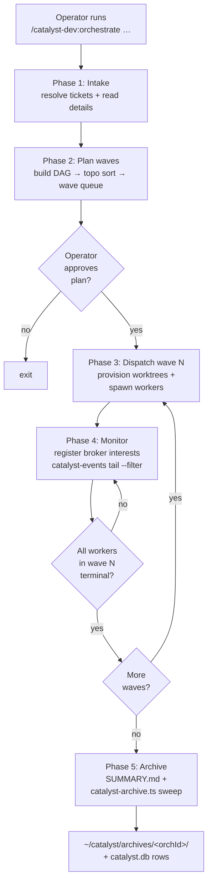
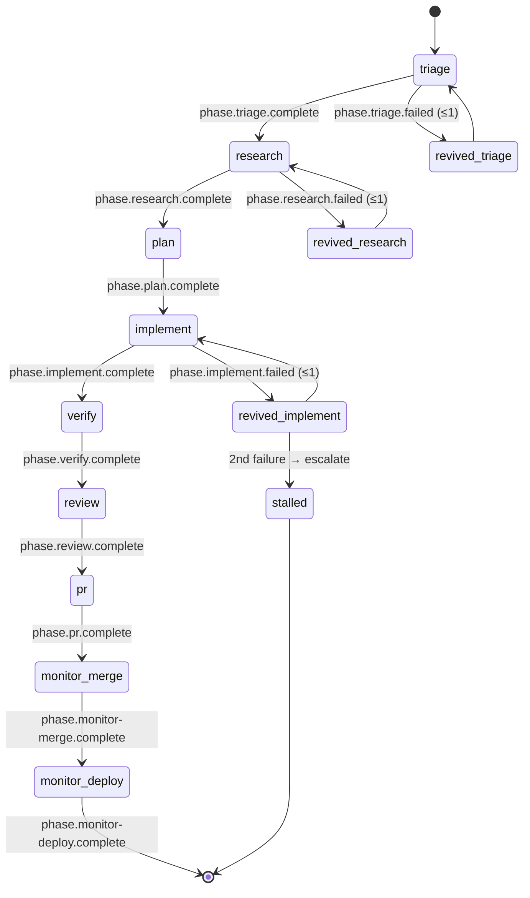
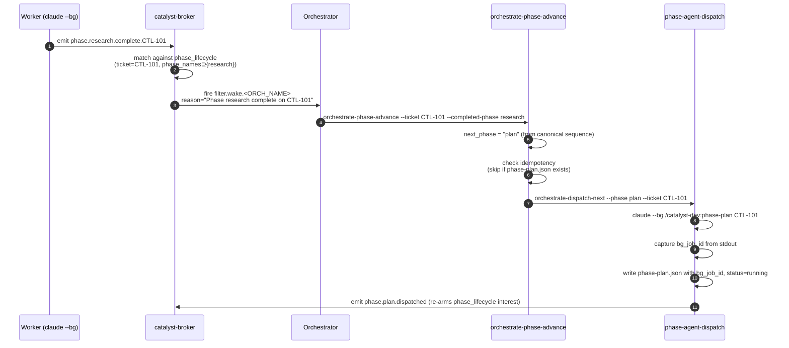
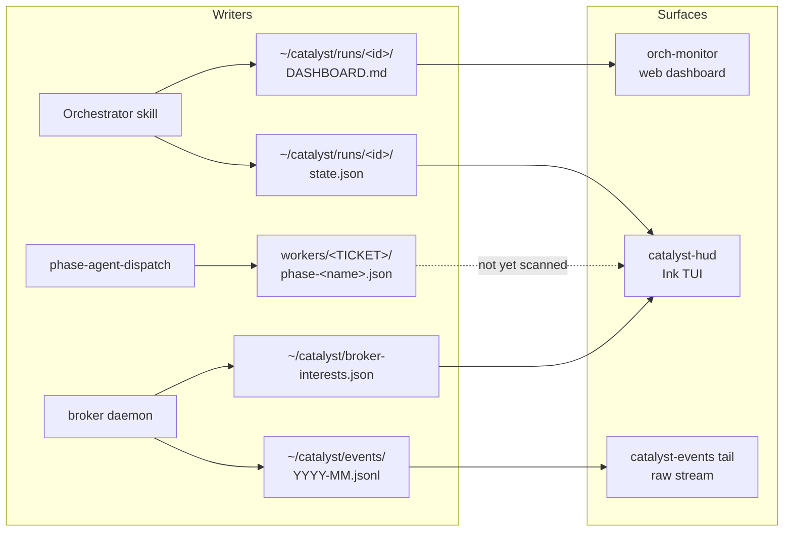

# Orchestrator Overview

How a Catalyst orchestrator runs today (post-CTL-452, post-2026-05-17 ship). This doc
describes what exists in `origin/main` — it is not a roadmap.

## TL;DR

A single operator command (`/catalyst-dev:orchestrate …`) launches an interactive
Claude Code session that schedules tickets into waves and dispatches **phase-agent
workers** (or legacy `oneshot` workers, depending on `dispatchMode`) into one git
worktree per ticket. Phase-agent workers run as `claude --bg` jobs and walk a
**9-phase pipeline** — one `--bg` job per phase — emitting `phase.<name>.complete.<TICKET>`
events the orchestrator wakes on via the broker. The orchestrator advances each
ticket through the pipeline, opens a PR, waits for CI and merge, and archives the
run.

## User flow

The orchestrator itself runs as a normal Claude Code session — there is no `--bg`
flag on the `orchestrate` skill. Only its workers are backgrounded.

## Dispatch mode

Selected by `.catalyst/config.json → catalyst.orchestration.dispatchMode`:

| Value | Worker spawn | Notes |
|---|---|---|
| `"phase-agents"` | `claude --bg --resume /catalyst-dev:phase-<name> <TICKET> --orch-dir <ORCH_DIR>` via `phase-agent-dispatch` | Template default. One `--bg` job per phase. State at `~/.claude/jobs/<bg_job_id>/state.json`. |
| `"oneshot-legacy"` | `claude -p /catalyst-dev:oneshot <TICKET> --auto-merge` (long-lived, streaming JSON) | Runtime default when key missing. Pre-CTL-452 model. |

The dispatcher reads the key at
`plugins/dev/scripts/orchestrate-dispatch-next:89-108`. Without `--config <path>`,
the dispatcher always uses `oneshot-legacy`; the `orchestrate` skill passes
`--config "${REPO_ROOT}/.catalyst/config.json"` so the project config wins.

## The 9-phase pipeline (phase-agents mode)

Canonical sequence is defined in `plugins/dev/scripts/orchestrate-phase-advance:72-83`
and surfaced in `plugins/dev/skills/orchestrate/SKILL.md:105`.

| # | Phase | Sub-skill / agent | Linear state | Signal file | Default model | Turn cap |
|---|---|---|---|---|---|---|
| 1 | `triage` | (none — inline) | `triaged` label | `triage.json` | Opus | 10 |
| 2 | `research` | `/catalyst-dev:research-codebase` | `researching` | `thoughts/shared/research/<date>-<ticket>.md` | Opus | 35 |
| 3 | `plan` | `/catalyst-dev:create-plan` | `planning` | `thoughts/shared/plans/<date>-<ticket>.md` | Opus | 25 |
| 4 | `implement` | `/catalyst-dev:implement-plan` | `inProgress` | commits + `phase-implement.json` | Opus (configurable Sonnet) | 75 |
| 5 | `verify` | code-reviewer + pr-test-analyzer + silent-failure-hunter sub-agents | `verifying` | `verify.json` | Opus | 20 |
| 6 | `review` | `/review` (gstack) | `reviewing` | `review.json` + remediation commit | Opus | 25 |
| 7 | `pr` | `/catalyst-dev:create-pr` | `inReview` | `phase-pr.json` (PR# + URL) | Opus (configurable Sonnet) | 12 |
| 8 | `monitor-merge` | `catalyst-events wait-for` loop → `gh pr merge --squash --delete-branch` | `done` | `phase-monitor-merge.json` | Opus | 50 |
| 9 | `monitor-deploy` | `/canary` (gstack) | — | `phase-monitor-deploy.json` | Haiku | 30 |

Each phase writes its signal file at
`~/catalyst/runs/<orchId>/workers/<TICKET>/phase-<name>.json`. Per-phase
turn-cap defaults are in `plugins/dev/scripts/phase-agent-dispatch:51-66`; the
prior-artifact gate logic (which file is checked before launch) is at lines 68-82.

### State machine for one worker

Revives are once-per-phase; on the second `phase.<name>.failed` for the same phase
the orchestrator marks the worker `stalled`, posts `attention`, and stops advancing.

## Phase 4 monitor — broker interests + event flow

The orchestrator registers four broker interests at Phase 4 start. All four route
back as `filter.wake.<ORCH_NAME>` so the orchestrator only watches one event stream:

| Interest | Type | Cardinality | Source |
|---|---|---|---|
| `${ORCH_NAME}-pr-lifecycle` | `pr_lifecycle` | 1 per orchestrator | always |
| `${ORCH_NAME}-ticket-lifecycle` | `ticket_lifecycle` | 1 per orchestrator | always |
| `${ORCH_NAME}-comms-lifecycle` | `comms_lifecycle` | 1 per orchestrator | always |
| `${ORCH_NAME}-phase-lifecycle-<TICKET>` | `phase_lifecycle` | 1 per ticket | only when `dispatchMode = "phase-agents"` |

The `phase_lifecycle` interest carries `{ticket, phase_names[9]}` and the broker
(`broker/index.mjs:1299-1335`) matches incoming events against
`^phase\.([^.]+)\.(complete|failed)\.([A-Za-z][A-Za-z0-9_]*-\d+)$` deterministically
(no Groq).

## Healthcheck + revive

`orchestrate-healthcheck` does two passes:

1. **Legacy PID liveness** — for `workers/*.json` at `status=dispatched`, after a
   `--grace-seconds` (default 15s) waits, checks `kill -0 $PID`. Dead PIDs →
   `status=failed` + `worker-launch-failed` event.
2. **Phase-mode --bg state-file mtime** — for each `workers/*/phase-*.json` with a
   `bg_job_id`, stats `${JOBS_ROOT}/<bg>/state.json` (where `JOBS_ROOT` defaults
   to `$HOME/.claude/jobs`). Stalled if:
   - file missing → `STALL_REASON="state-json-missing"`, OR
   - mtime older than `--stale-bg-seconds` (default 900s) AND `.state` not in
     `{done, failed, errored, stopped}` → `STALL_REASON="state-json-stale"`

Revive budget: the top-level `workers/<TICKET>.json` carries `.reviveCount`. When
`reviveCount >= MAX_REVIVES` (default 10), the worker is marked `stalled` with
`attentionReason="revive-budget-exhausted"`.

## Where you observe a running orchestration

Three surfaces, all reading from filesystem state:

| Surface | Reads | Where it lives |
|---|---|---|
| **`catalyst-hud`** (Ink TUI) | `~/catalyst/runs/<id>/{state.json,workers/*.json}` + `~/catalyst/broker-interests.json` | `plugins/dev/scripts/orch-monitor/cli/` |
| **orch-monitor web dashboard** | file-watches `DASHBOARD.md` → SSE; also `/api/archive/*` from `catalyst.db` | `plugins/dev/scripts/orch-monitor/` |
| **`catalyst-events tail --filter`** | append-only JSONL at `~/catalyst/events/YYYY-MM.jsonl` | `plugins/dev/scripts/catalyst-events` |

**Known gap (as of 2026-05-17):** `catalyst-hud` scans only flat `workers/*.json`;
per-phase `workers/<TICKET>/phase-<name>.json` files written by `phase-agent-dispatch`
are not yet surfaced. See `worker-signals-reader.ts:42` (`scanOrchestratorWorkersDir`
at ~line 125).

## On Claude Code's "agent view" / agents sidebar

Phase-agent workers run as `claude --bg` jobs and live under
`~/.claude/jobs/<bg_job_id>/`. **Catalyst does not integrate with Claude Code's
native UI surfaces.** Specifically:

- The Claude CLI **writes** `~/.claude/jobs/<id>/state.json`; Catalyst only reads
  it (for healthcheck mtime / staleness detection).
- Catalyst ships no UI that hooks into Claude Code's agents sidebar.
- Whether Claude Code's agents sidebar displays `--bg` jobs is a **Claude Code
  question**, not a Catalyst question, and is not described in any catalyst source.

If you want to monitor a running orchestration, use `catalyst-hud`, the
orch-monitor web dashboard, or `catalyst-events tail` — those are the three
surfaces Catalyst owns. If you want to see backgrounded Claude jobs directly,
consult the Claude CLI's own documentation for whatever inventory it exposes.

## Canonical artifact / state locations

| Path | Written by | Purpose |
|---|---|---|
| `~/catalyst/runs/<id>/state.json` | orchestrator + `catalyst-state.sh` | per-run state |
| `~/catalyst/runs/<id>/DASHBOARD.md` | `update-dashboard.sh` (every Phase 4 wake) | human-readable dashboard |
| `~/catalyst/runs/<id>/SUMMARY.md` | orchestrator at Phase 5 | end-of-run summary |
| `~/catalyst/runs/<id>/wave-N-briefing.md` | orchestrator before dispatching Wave N+1 | wave context |
| `~/catalyst/runs/<id>/workers/<TICKET>.json` | `orchestrate-dispatch-next` + worker | top-level worker signal |
| `~/catalyst/runs/<id>/workers/<TICKET>/phase-<name>.json` | `phase-agent-dispatch` | per-phase signal (phase-agents mode only) |
| `~/catalyst/runs/<id>/workers/output/<TICKET>-{stream.jsonl,bg-stdout.log,stderr.log}` | spawned worker | worker stdio capture |
| `~/catalyst/runs/<id>/findings.jsonl` | both | shared findings queue |
| `~/catalyst/state.json` | `catalyst-state.sh` register/update/worker/heartbeat | global active-runs registry |
| `~/catalyst/catalyst.db` | `catalyst-archive.ts sweep` + skill instrumentation | SQLite sessions + metrics + archive index |
| `~/catalyst/events/YYYY-MM.jsonl` | bash skill layer + TS webhook receiver + comms | append-only event log |
| `~/catalyst/archives/<id>/` | `catalyst-archive.ts sweep` (filesystem-first) | post-run archived artifacts |
| `~/catalyst/broker-interests.json` | broker daemon | live broker interest registry |
| `~/.claude/jobs/<bg_job_id>/state.json` | **Claude CLI** (not Catalyst) | `--bg` job liveness |
| `thoughts/shared/handoffs/<orchId>/<ts>_…-{summary,dashboard}.md` | orchestrator at Phase 5 | thoughts handoff copy |

## What changed from pre-CTL-452

| | Before | After |
|---|---|---|
| Worker spawn | one `claude -p /oneshot <TICKET>` per ticket (long-lived, streaming JSON) | nine `claude --bg /phase-<name>` jobs per ticket (short-lived) — when `dispatchMode = "phase-agents"` |
| Signal layout | flat `workers/<TICKET>.json` | flat top-level + per-phase `workers/<TICKET>/phase-<name>.json` |
| Phase advance | wait for `orchestrator.worker.status_terminal` from long oneshot | wait for `phase.<name>.complete.<TICKET>` → `orchestrate-phase-advance` walks canonical 9-step sequence |
| Broker interests | 3 (`pr_lifecycle`, `ticket_lifecycle`, `comms_lifecycle`) | 4 (above + `phase_lifecycle` per ticket — gated on `dispatchMode`) |
| Healthcheck | PID liveness only | PID liveness + `~/.claude/jobs/<bg>/state.json` mtime (`--stale-bg-seconds`, default 900s) |
| Linear states | Backlog / In Progress / In Review / Done / Canceled | + intermediate `triaged`, `researching`, `planning`, `verifying`, `reviewing`, `inReview` (CTL-454) |

Legacy `oneshot-legacy` mode is unchanged — all the above only activates when
`dispatchMode = "phase-agents"` is set in `.catalyst/config.json`.

## See also

- [`website/src/content/docs/reference/orchestration/phase-agents.md`](../website/src/content/docs/reference/orchestration/phase-agents.md) — user-facing canonical doc shipped in PR #812
- [`plugins/dev/skills/orchestrate/SKILL.md`](../plugins/dev/skills/orchestrate/SKILL.md) — orchestrator skill source of truth
- [`plugins/dev/scripts/orchestrate-phase-advance`](../plugins/dev/scripts/orchestrate-phase-advance) — wake handler (canonical phase sequence)
- [`plugins/dev/scripts/phase-agent-dispatch`](../plugins/dev/scripts/phase-agent-dispatch) — worker spawn
- [ADR-006](adrs.md) — global state JSON design
- [ADR-008](adrs.md) — SQLite session store
- [ADR-014](adrs.md) — worker owns full PR lifecycle (no more `gh pr merge --auto`)
