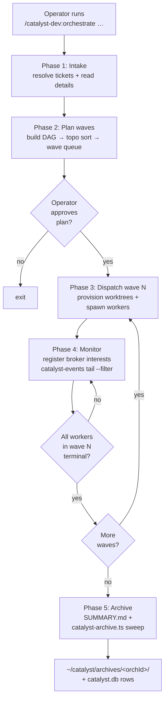
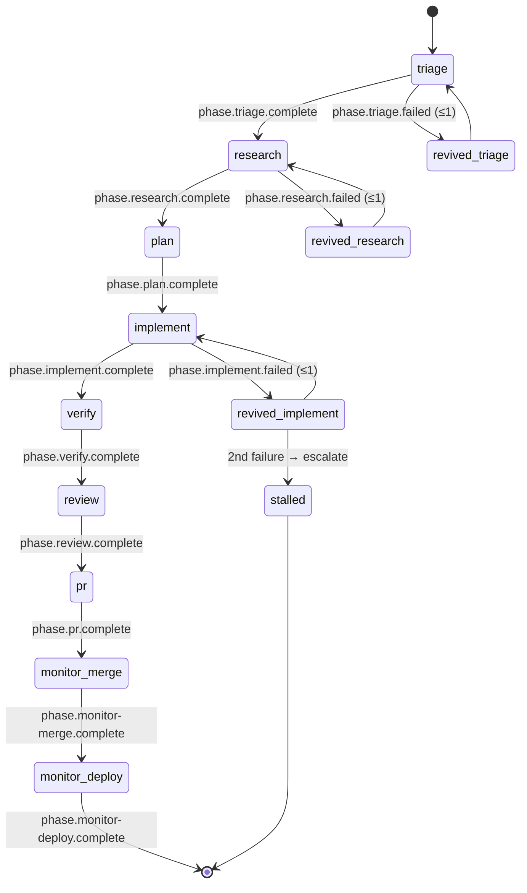
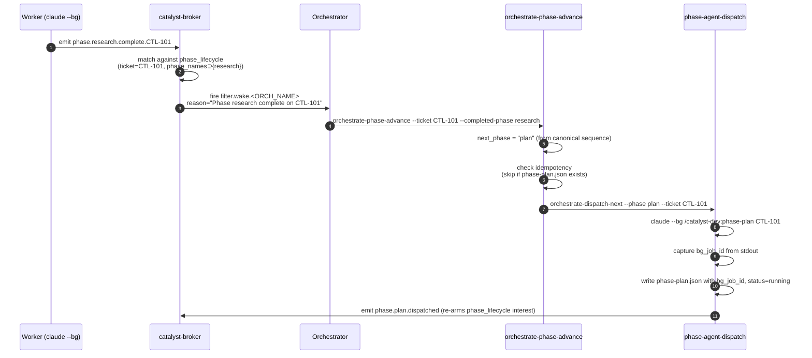
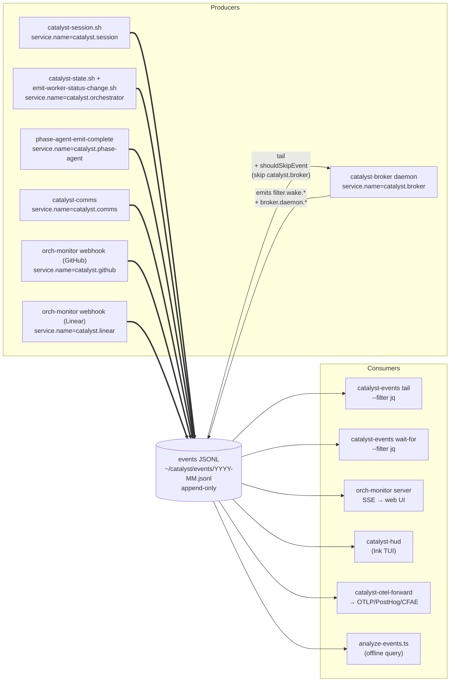

<!-- CTL tracer bullet: 2026-05-25 — verifies execution-core pickup -->
# Orchestrator Overview

How a Catalyst orchestrator runs today (post-CTL-452, post-2026-05-17 ship). This doc
describes what exists in `origin/main` — it is not a roadmap.

## Why this exists

Catalyst orchestrates AI engineering work under the constraints of LLM agents. Every
design choice — phases, background dispatch, broker interests, the immutable event
log — is in service of these:

- **Context engineering.** Per-turn cost compounds, and long contexts hit diminishing
  then negative returns as attention degrades ("context rot"). Breaking ticket-sized
  work into bounded phases (research → plan → implement → verify → review → ship)
  keeps each agent in a focused context where sharp decisions stay cheap.

- **Background continuity.** Agents should keep working while the operator is away
  from the keyboard. Phase workers run as `claude --bg` jobs and emit events when
  they finish; the orchestrator wakes on those events and dispatches the next phase
  asynchronously. Work does not stop when the human stops looking.

- **Human-in-the-loop oversight.** When something stalls, needs a design call, or
  surfaces a finding, observability — HUD, web dashboard, comms channel, event tail
  — makes worker state visible without forcing the operator to reconstruct context
  from raw logs.

- **Cost-aware parallelism.** Running tickets in parallel waves multiplies throughput,
  and it also multiplies the risk of conflicts, rework, and tokens spent on doomed
  work. Wave scheduling lets unblocked work advance independently; revive budgets,
  healthchecks, and turn caps cap the blast radius of any single stuck worker.

- **Signal-routed IPC.** Background agents share no memory. They communicate by
  appending to an immutable event log (`~/catalyst/events/YYYY-MM.jsonl`) and
  registering broker interests that describe which subset of events should wake
  them. Each agent's context loads only signals relevant to its task — no inbox
  sweeping, no low-value polling, no spam.

## TL;DR

A single operator command (`/catalyst-dev:orchestrate …`) launches an interactive
Claude Code session that schedules tickets into waves and dispatches **phase-agent
workers** (or legacy `oneshot` workers, depending on `dispatchMode`) into one git
worktree per ticket. Phase-agent workers run as `claude --bg` jobs and walk a
**9-phase pipeline** — one `--bg` job per phase — emitting `phase.<name>.complete.<TICKET>`
events the orchestrator wakes on via the broker. The orchestrator advances each
ticket through the pipeline, opens a PR, waits for CI and merge, and archives the
run.

## User flow

The orchestrator itself runs as a normal Claude Code session — there is no `--bg`
flag on the `orchestrate` skill. Only its workers are backgrounded.

## Dispatch mode

Selected by `.catalyst/config.json → catalyst.orchestration.dispatchMode`:

| Value | Worker spawn | Notes |
|---|---|---|
| `"phase-agents"` | `claude --bg --resume /catalyst-dev:phase-<name> <TICKET> --orch-dir <ORCH_DIR>` via `phase-agent-dispatch` | Template default. One `--bg` job per phase. State at `~/.claude/jobs/<bg_job_id>/state.json`. |
| `"oneshot-legacy"` | `claude -p /catalyst-dev:oneshot <TICKET> --auto-merge` (long-lived, streaming JSON) | Runtime default when key missing. Pre-CTL-452 model. |

Dispatch-mode resolution lives in `plugins/dev/scripts/orchestrate-dispatch-next`.
Without `--config <path>`, the dispatcher always uses `oneshot-legacy`; the
`orchestrate` skill passes `--config "${REPO_ROOT}/.catalyst/config.json"` so the
project config wins.

### Config drift detection (CTL-489)

When `plugins/dev/templates/config.template.json` gains a new key (e.g. CTL-452's
`orchestration.dispatchMode`), existing projects' `.catalyst/config.json` files do not
automatically receive it. To prevent the silent-fallback class of bug (CTL-487 — catalyst itself
ran in `oneshot-legacy` mode for two months because the new key was absent),
`plugins/dev/scripts/check-config-drift.sh` walks the template and emits one warning per missing
leaf key. The drift script is wired into `check-project-setup.sh`, so every workflow that runs
the prereq check (`/orchestrate`, `/oneshot`, `/research-codebase`, etc.) prints drift warnings
until the user runs `/catalyst-dev:setup-catalyst`, which offers a `jq` deep-merge that adds the
missing keys while preserving every existing user value (jq's `*` recursive merge with project
on the right). Allow-listed roots (`projectKey`, `project.ticketPrefix`, `linear.teamKey`,
`linear.stateMap`, `linear.stateIds`) are suppressed to avoid double-warning — those are already
checked individually by `check-project-setup.sh`.

### Execution-core entry triggers (two-state monitor)

In `execution-core` dispatch mode the daemon's monitor reacts to Linear
`state_changed` events:

- **`→Triage`** one-shot-dispatches the triage phase agent (the ticket is not
  scheduler-pulled).
- **`→Ready`** is the scheduler-eligible entry. New work enters the pipeline at
  the `research` phase on the contract that a Ready ticket has already been
  triaged.

A user may move a ticket **Backlog → Ready directly**, skipping `→Triage`
(an intentional human shortcut). When this happens and no `triage.json` exists
for the ticket, the monitor **auto-dispatches the triage phase agent** rather
than reconciling the ticket into the eligible set — triage then runs and its
completion advances the ticket to `research` normally. This makes "Ready" a
valid manual entry point: the system transparently runs the missing triage
instead of dead-locking the research prior-artifact gate. (CTL-625)

## The 9-phase pipeline (phase-agents mode)

Canonical sequence is defined in `plugins/dev/scripts/orchestrate-phase-advance`
and mirrored in the orchestrate skill's pipeline reference table.

| # | Phase | Sub-skill / agent | Linear state | Signal file | Default model | Turn cap |
|---|---|---|---|---|---|---|
| 1 | `triage` | (none — inline) | `triaged` label | `triage.json` | Opus | 10 |
| 2 | `research` | `/catalyst-dev:research-codebase` | `researching` | `thoughts/shared/research/<date>-<ticket>.md` | Opus | 35 |
| 3 | `plan` | `/catalyst-dev:create-plan` | `planning` | `thoughts/shared/plans/<date>-<ticket>.md` | Opus | 25 |
| 4 | `implement` | `/catalyst-dev:implement-plan` | `inProgress` | commits + `phase-implement.json` | Opus (configurable Sonnet) | 75 |
| 5 | `verify` | code-reviewer + pr-test-analyzer + silent-failure-hunter sub-agents | `verifying` | `verify.json` | Opus | 20 |
| 6 | `review` | `/review` (gstack) | `reviewing` | `review.json` + remediation commit | Opus | 25 |
| 7 | `pr` | `/catalyst-dev:create-pr` | `inReview` | `phase-pr.json` (PR# + URL) | Opus (configurable Sonnet) | 12 |
| 8 | `monitor-merge` | `catalyst-events wait-for` loop → `gh pr merge --squash --delete-branch` | `done` | `phase-monitor-merge.json` | Opus | 50 |
| 9 | `monitor-deploy` | `/canary` (gstack) | — | `phase-monitor-deploy.json` | Haiku | 30 |

Each phase writes its signal file at
`~/catalyst/runs/<orchId>/workers/<TICKET>/phase-<name>.json`. Per-phase turn-cap
defaults live in `plugins/dev/scripts/phase-agent-dispatch` (functions
`phase_default_turn_cap` and `resolve_turn_cap`, which honors a CLI flag override
and the `catalyst.orchestration.phaseAgents.turnCaps[<phase>]` config key in that
order). The prior-artifact gate — which file must already exist before a phase
launches — sits alongside in the same script.

### State machine for one worker

Revives are once-per-phase; on the second `phase.<name>.failed` for the same phase
the orchestrator marks the worker `stalled`, posts `attention`, and stops advancing.

## Phase 4 monitor — broker interests + event flow

The orchestrator registers four broker interests at Phase 4 start. All four route
back as `filter.wake.<ORCH_NAME>` so the orchestrator only watches one event stream:

| Interest | Type | Cardinality | Source |
|---|---|---|---|
| `${ORCH_NAME}-pr-lifecycle` | `pr_lifecycle` | 1 per orchestrator | always |
| `${ORCH_NAME}-ticket-lifecycle` | `ticket_lifecycle` | 1 per orchestrator | always |
| `${ORCH_NAME}-comms-lifecycle` | `comms_lifecycle` | 1 per orchestrator | always |
| `${ORCH_NAME}-phase-lifecycle-<TICKET>` | `phase_lifecycle` | 1 per ticket | only when `dispatchMode = "phase-agents"` |

The `phase_lifecycle` interest carries `{ticket, phase_names[9]}`. The broker's
`tryPhaseLifecycleRoute` function in `plugins/dev/scripts/broker/index.mjs` matches
incoming events against
`^phase\.([^.]+)\.(complete|failed)\.([A-Za-z][A-Za-z0-9_]*-\d+)$`
deterministically (no Groq).

## Healthcheck + revive

`orchestrate-healthcheck` does two passes:

1. **Legacy PID liveness** — for `workers/*.json` at `status=dispatched`, after a
   `--grace-seconds` (default 15s) wait, checks `kill -0 $PID`. Dead PIDs →
   `status=failed` + `worker-launch-failed` event.
2. **Phase-mode `--bg` state-file mtime** — for each `workers/*/phase-*.json` with a
   `bg_job_id`, stats `${JOBS_ROOT}/<bg>/state.json` (where `JOBS_ROOT` defaults
   to `$HOME/.claude/jobs`). Stalled if:
   - file missing → `STALL_REASON="state-json-missing"`, OR
   - mtime older than `--stale-bg-seconds` (default 900s) AND `.state` not in
     `{done, failed, errored, stopped}` → `STALL_REASON="state-json-stale"`

   A **git-activity liveness guard** (CTL-509) protects the `state-json-stale`
   branch: before flagging, it reads the worker worktree's most-recent commit
   timestamp and, if it is newer than `--git-activity-seconds` (defaults to
   `--stale-bg-seconds`), suppresses the stall (signal left `running`, a
   `worker-phase-stale-suppressed` event logged, `gitActiveSuppressed` bumped in
   the summary). This mirrors the execution-core `stalled-detector.mjs` guard
   (inactive in phase-agents mode) so a live worker blocked in one long tool call
   is not falsely re-dispatched. It never guards `state-json-missing` and is
   opt-out via `--no-git-guard` / `CATALYST_HEALTHCHECK_GIT_GUARD=0`.

Revive budget: the top-level `workers/<TICKET>.json` carries `.reviveCount`. When
`reviveCount >= MAX_REVIVES` (default 10), the worker is marked `stalled` with
`attentionReason="revive-budget-exhausted"`.

## The events JSONL is the unified log

Everything Catalyst does — worker dispatch, phase transitions, PR lifecycle,
GitHub/Linear webhooks, broker wakes — flows through one append-only file at
`~/catalyst/events/YYYY-MM.jsonl` (monthly rotation, canonical OTel-style envelope).
This is the single source of cross-process truth.

**The broker is both a producer and a consumer** — it tails the same log it writes
into. The `shouldSkipEvent` function (in `broker/index.mjs`) prevents the feedback
loop: events whose `resource."service.name"` equals `"catalyst.broker"` are dropped
on read (belt-and-suspenders fallback also drops names prefixed `filter.` or
`broker.daemon.`). A separate `_emittedWakeCache` (60s TTL on
`(source_event_id, interest_id)`) deduplicates wakes when `fs.watch` fires twice
on the same append.

## Where you observe a running orchestration

Four operator surfaces — three read structured state, one reads diagnostic logs:

| Surface | Reads | Where it lives | When to use |
|---|---|---|---|
| **`catalyst-hud`** (Ink TUI) | `~/catalyst/runs/<id>/{state.json,workers/*.json}` + `~/catalyst/broker-interests.json` + `broker.state.json` | `plugins/dev/scripts/orch-monitor/cli/` | Live operator dashboard — workers, interests, broker key-health |
| **orch-monitor web dashboard** | file-watches `DASHBOARD.md` → SSE; also `/api/archive/*` from `catalyst.db` | `plugins/dev/scripts/orch-monitor/` | Shareable browser view; archive replay |
| **`catalyst-events tail --filter`** | append-only JSONL at `~/catalyst/events/YYYY-MM.jsonl` | `plugins/dev/scripts/catalyst-events` | Raw semantic event stream, jq-filterable |
| **`catalyst broker logs`** | tails `~/catalyst/broker.log` (pino-structured daemon stdout) | `plugins/dev/scripts/catalyst-broker` | Broker daemon diagnostics — Groq errors, routing traces, key-missing warnings |

**Broker logs vs events JSONL — these are different things.** The events log is the
system's semantic fact record (sparse, structured, durable); `broker.log` is the
daemon's operational diary (verbose, diagnostic). A `broker.daemon.startup` event
appears in the events log specifically so orchestrators know to re-register their
interests — not for human debugging. Broker errors that surface a named event go
to both; ordinary daemon noise goes only to `broker.log`.

`catalyst-hud` surfaces both layouts: flat `workers/*.json` and per-phase
`workers/<TICKET>/phase-<name>.json`. The reader
(`worker-signals-reader.ts::scanOrchestratorWorkersDir`) descends one level into
per-ticket subdirectories, picks the most recent non-terminal phase, and overlays
its `phaseName`/`status` onto the flat signal so the PHASE column shows the live
phase (e.g. `implement`, `monitor-merge`).

## Cost capture

Both dispatch modes write the same four cost surfaces — `signal.cost`,
`state.workers[ticket].usage`, `state.usage`, and the `session_metrics` SQLite
mirror — but the USAGE source differs by mode. `orchestrate-roll-usage.sh`,
invoked by `update-dashboard.sh --roll-usage` on every monitor wake-up,
abstracts the difference.

**Legacy (`oneshot-legacy` dispatch).** Workers run as `claude -p
--output-format stream-json`. The CLI streams a final `"type":"result"` event
carrying `total_cost_usd`, `usage`, `num_turns`, and `duration_ms` into
`workers/output/<TICKET>-stream.jsonl`. roll-usage parses that event into a
USAGE record.

**Phase-agent (`phase-agents` dispatch, CTL-496).** Workers run as `claude
--bg` jobs. There is no `result` event because there is no `--output-format
stream-json` flag on the bg invocation; instead the CLI writes the full
conversation to `~/.claude/projects/<wt>/<sessionId>.jsonl`. roll-usage
resolves the JSONL path via `~/.claude/jobs/<bg_job_id>/state.json
-> linkScanPath` and shells `extract-cost-from-jsonl.sh --jsonl <path>
--pricing claude-pricing.json` to aggregate per-assistant-event `usage` by
model, split cache_creation by 5m / 1h TTL, and apply the per-model rates
from a versioned `plugins/dev/scripts/claude-pricing.json`. The four
downstream writes are then unchanged from legacy.

Phase mode aggregates `state.workers[ticket].usage` across phases (`+=`),
not overwriting, so `state.workers[T].usage.costUSD == sum(phase.cost.costUSD)`
for that ticket. The `session_metrics` mirror finds the right row via
`signal.catalystSessionId` (persisted by the phase-agent prelude) or, for
in-flight runs that predate that persistence, a DB lookup keyed on
`ticket_key + skill_name = 'phase-<name>'`.

The sweep loop in `update-dashboard.sh` iterates both layouts on every
wake-up. Killed-worker sidecars (`workers/<T>/phase-<name>.json.dead-<id>.json`)
are skipped so booked cost is never double-counted.

## On Claude Code's "agent view" / agents sidebar

Phase-agent workers run as `claude --bg` jobs and live under
`~/.claude/jobs/<bg_job_id>/`. **Catalyst does not integrate with Claude Code's
native UI surfaces.** Specifically:

- The Claude CLI **writes** `~/.claude/jobs/<id>/state.json`; Catalyst only reads
  it (for healthcheck mtime / staleness detection).
- Catalyst ships no UI that hooks into Claude Code's agents sidebar.
- Whether Claude Code's agents sidebar displays `--bg` jobs is a **Claude Code
  question**, not a Catalyst question, and is not described in any catalyst source.

If you want to monitor a running orchestration, use `catalyst-hud`, the
orch-monitor web dashboard, `catalyst-events tail`, or `catalyst broker logs` —
those are the four surfaces Catalyst owns. If you want to see backgrounded Claude
jobs directly, consult the Claude CLI's own documentation for whatever inventory
it exposes.

## Canonical artifact / state locations

| Path | Written by | Purpose |
|---|---|---|
| `~/catalyst/runs/<id>/state.json` | orchestrator + `catalyst-state.sh` | per-run state |
| `~/catalyst/runs/<id>/DASHBOARD.md` | `update-dashboard.sh` (every Phase 4 wake) | human-readable dashboard |
| `~/catalyst/runs/<id>/SUMMARY.md` | orchestrator at Phase 5 | end-of-run summary |
| `~/catalyst/runs/<id>/wave-N-briefing.md` | orchestrator before dispatching Wave N+1 | wave context |
| `~/catalyst/runs/<id>/workers/<TICKET>.json` | `orchestrate-dispatch-next` + worker | top-level worker signal |
| `~/catalyst/runs/<id>/workers/<TICKET>/phase-<name>.json` | `phase-agent-dispatch` | per-phase signal (phase-agents mode only) |
| `~/catalyst/runs/<id>/workers/output/<TICKET>-{stream.jsonl,bg-stdout.log,stderr.log}` | spawned worker | worker stdio capture |
| `~/catalyst/runs/<id>/.roll-usage.log` | `orchestrate-roll-usage.sh -v` (via `update-dashboard.sh --roll-usage`) | per-sweep audit trail of cost rollups (action codes: `wrote-cost`, `already-rolled`, `bg-state-missing`, `jsonl-missing`, `wrote-metric`, etc.) |
| `plugins/dev/scripts/claude-pricing.json` | manual edit (version-pinned, see file header) | per-model token pricing table consumed by `extract-cost-from-jsonl.sh` in phase mode |
| `~/catalyst/runs/<id>/findings.jsonl` | both | shared findings queue |
| `~/catalyst/state.json` | `catalyst-state.sh` register/update/worker/heartbeat | global active-runs registry |
| `~/catalyst/catalyst.db` | `catalyst-archive.ts sweep` + skill instrumentation | SQLite sessions + metrics + archive index |
| `~/catalyst/events/YYYY-MM.jsonl` | seven producers (see "events JSONL" section) | append-only event log |
| `~/catalyst/broker.log` | broker daemon stdout/stderr | diagnostic log (view with `catalyst broker logs`) |
| `~/catalyst/broker.state.json` | broker daemon | liveness + key-health snapshot |
| `~/catalyst/archives/<id>/` | `catalyst-archive.ts sweep` (filesystem-first) | post-run archived artifacts |
| `~/catalyst/broker-interests.json` | broker daemon | live broker interest registry |
| `~/.claude/jobs/<bg_job_id>/state.json` | **Claude CLI** (not Catalyst) | `--bg` job liveness |
| `thoughts/shared/handoffs/<orchId>/<ts>_…-{summary,dashboard}.md` | orchestrator at Phase 5 | thoughts handoff copy |

## What changed from pre-CTL-452

| | Before | After |
|---|---|---|
| Worker spawn | one `claude -p /oneshot <TICKET>` per ticket (long-lived, streaming JSON) | nine `claude --bg /phase-<name>` jobs per ticket (short-lived) — when `dispatchMode = "phase-agents"` |
| Signal layout | flat `workers/<TICKET>.json` | flat top-level + per-phase `workers/<TICKET>/phase-<name>.json` |
| Phase advance | wait for `orchestrator.worker.status_terminal` from long oneshot | wait for `phase.<name>.complete.<TICKET>` → `orchestrate-phase-advance` walks canonical 9-step sequence |
| Broker interests | 3 (`pr_lifecycle`, `ticket_lifecycle`, `comms_lifecycle`) | 4 (above + `phase_lifecycle` per ticket — gated on `dispatchMode`) |
| Healthcheck | PID liveness only | PID liveness + `~/.claude/jobs/<bg>/state.json` mtime (`--stale-bg-seconds`, default 900s) |
| Linear states | Backlog / In Progress / In Review / Done / Canceled | + intermediate `triaged`, `researching`, `planning`, `verifying`, `reviewing`, `inReview` (CTL-454) |

Legacy `oneshot-legacy` mode is unchanged — all the above only activates when
`dispatchMode = "phase-agents"` is set in `.catalyst/config.json`.

## See also

- [`website/src/content/docs/reference/orchestration/phase-agents.md`](../website/src/content/docs/reference/orchestration/phase-agents.md) — user-facing canonical doc shipped in PR #812
- [`plugins/dev/skills/orchestrate/SKILL.md`](../plugins/dev/skills/orchestrate/SKILL.md) — orchestrator skill source of truth
- [`plugins/dev/scripts/orchestrate-phase-advance`](../plugins/dev/scripts/orchestrate-phase-advance) — wake handler (canonical phase sequence)
- [`plugins/dev/scripts/phase-agent-dispatch`](../plugins/dev/scripts/phase-agent-dispatch) — worker spawn + turn-cap resolution
- [`plugins/dev/scripts/broker/index.mjs`](../plugins/dev/scripts/broker/index.mjs) — broker daemon (`tryPhaseLifecycleRoute`, `shouldSkipEvent`)
- [`plugins/dev/scripts/catalyst-events`](../plugins/dev/scripts/catalyst-events) — events CLI (tail, wait-for, query)
- [ADR-006](adrs.md) — global state JSON design
- [ADR-008](adrs.md) — SQLite session store
- [ADR-014](adrs.md) — worker owns full PR lifecycle (no more `gh pr merge --auto`)
