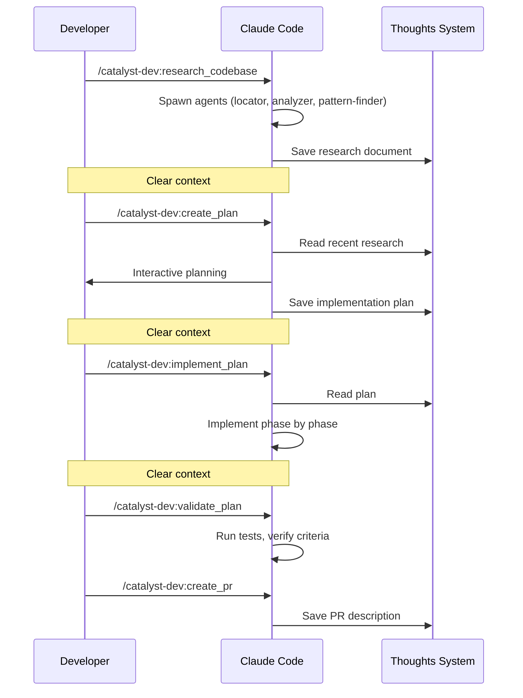

Catalyst provides a structured development workflow that chains together: **research, plan, implement, validate, and ship**. Each phase produces a persistent artifact that feeds into the next.

## The Core Workflow



## 1. Research Phase

Start by understanding the codebase:

```
/catalyst-dev:research_codebase
```

Follow the prompts to describe what you want to research. Catalyst will:

- Spawn parallel research agents (locator, analyzer, pattern-finder)
- Document what exists in the codebase (not critique it)
- Save findings to `thoughts/shared/research/`

## 2. Planning Phase

Create an implementation plan from your research:

```
/catalyst-dev:create_plan
```

Catalyst auto-discovers your most recent research and:

- Reads research documents
- Interactively builds a plan with you
- Includes automated AND manual success criteria
- Saves to `thoughts/shared/plans/YYYY-MM-DD-TICKET-description.md`

If revisions are needed before implementation:

```
/catalyst-dev:iterate_plan
```

## 3. Implementation Phase

Execute the approved plan:

```
/catalyst-dev:implement_plan
```

Omit the path — Catalyst auto-finds your most recent plan. It will:

- Read the plan fully
- Implement each phase sequentially
- Run automated verification after each phase
- Update checkboxes as work completes

## 4. Validation Phase

Verify the implementation:

```
/catalyst-dev:validate_plan
```

Catalyst will:

- Verify all success criteria
- Run automated test suites
- Document any deviations
- Provide a manual testing checklist

## 5. Ship It

Create a PR:

```
/catalyst-dev:create_pr
```

This automatically creates a pull request with a comprehensive description generated from your research and plan.

## One-Shot Alternative

For straightforward tasks, chain the entire workflow:

```
/catalyst-dev:oneshot PROJ-123
```

This runs research, planning, and implementation in a single invocation with context isolation between phases.

## Context Persistence

Save context between sessions with handoffs:

```bash
# Save context at any point
/catalyst-dev:create_handoff

# Resume in a new session
/catalyst-dev:resume_handoff
```

## Workflow Auto-Discovery

Catalyst tracks your workflow via `.claude/.workflow-context.json`:

- `/catalyst-dev:research_codebase` saves research — `/catalyst-dev:create_plan` auto-references it
- `/catalyst-dev:create_plan` saves plan — `/catalyst-dev:implement_plan` auto-finds it
- `/catalyst-dev:create_handoff` saves handoff — `/catalyst-dev:resume_handoff` auto-finds it

You don't need to specify file paths — commands remember your work.
