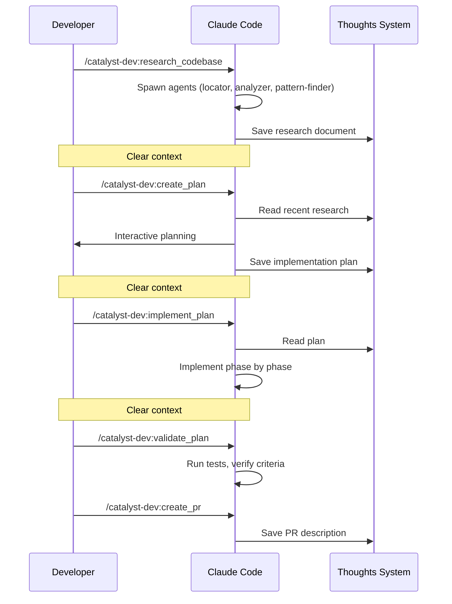

Catalyst's development workflow chains together: **research, plan, implement, validate, and ship**. Each phase produces a persistent artifact that feeds the next, with clean context handoffs in between.

## The Core Workflow



## 1. Research

```
/catalyst-dev:research_codebase
```

Describe what you want to understand. Catalyst will:

- Spawn parallel research agents (locator, analyzer, pattern-finder)
- Document what exists in the codebase (not critique it)
- Save findings to `thoughts/shared/research/`

Clear context after research completes. The research document persists — the next command will find it automatically.

## 2. Plan

```
/catalyst-dev:create_plan
```

Catalyst auto-discovers your most recent research and:

- Reads the research documents
- Interactively builds a plan with you
- Includes automated AND manual success criteria
- Saves to `thoughts/shared/plans/`

If revisions are needed: `/catalyst-dev:iterate_plan`.

Clear context after the plan is approved.

## 3. Implement

```
/catalyst-dev:implement_plan
```

Catalyst auto-finds your most recent plan. It will:

- Read the full plan
- Implement each phase sequentially
- Run automated verification after each phase
- Update checkboxes as work completes

## 4. Validate

```
/catalyst-dev:validate_plan
```

- Verify all success criteria
- Run automated test suites
- Document any deviations
- Provide a manual testing checklist

## 5. Ship

```
/catalyst-dev:create_pr
```

Creates a pull request with a description generated from your research and plan, linked to the relevant ticket.

## Handoffs Between Phases

You'll notice each phase ends with "clear context." That's intentional — long sessions are where AI loses the thread.

If you need to pause mid-workflow (end of day, context getting long, waiting on something), create a handoff:

```
/catalyst-dev:create_handoff
```

This compresses the current session into a persistent document: what was done, what's left, decisions made, and file references. Resume later with:

```
/catalyst-dev:resume_handoff
```

Handoffs are cheap (under a minute) and you should use them liberally. Better to create too many than to lose context.

## Common Patterns

### Quick Feature

The standard flow for a well-scoped ticket:

```bash
/catalyst-dev:research_codebase          # Research
# Clear context
/catalyst-dev:create_plan                # Plan
# Clear context
/catalyst-dev:implement_plan             # Implement
# Clear context
/catalyst-dev:commit && /catalyst-dev:create_pr  # Ship
```

### Multi-Day Feature

For larger work that spans sessions:

```bash
# Day 1
/catalyst-dev:research_codebase
/catalyst-dev:create_handoff
# Day 2
/catalyst-dev:resume_handoff
/catalyst-dev:create_plan
/catalyst-dev:create_handoff
# Day 3
/catalyst-dev:resume_handoff
/catalyst-dev:implement_plan             # Phases 1-2
/catalyst-dev:create_handoff
# Day 4
/catalyst-dev:resume_handoff
/catalyst-dev:implement_plan             # Phases 3-4
/catalyst-dev:validate_plan
/catalyst-dev:commit && /catalyst-dev:create_pr
```

### One-Shot

For straightforward tasks, chain the entire workflow:

```
/catalyst-dev:oneshot PROJ-123
```

This runs research, planning, and implementation in a single invocation with context isolation between phases.

## Auto-Discovery

You don't need to specify file paths between commands. Catalyst tracks your workflow automatically:

- `/research_codebase` saves research → `/create_plan` auto-references it
- `/create_plan` saves plan → `/implement_plan` auto-finds it
- `/create_handoff` saves handoff → `/resume_handoff` auto-finds it
