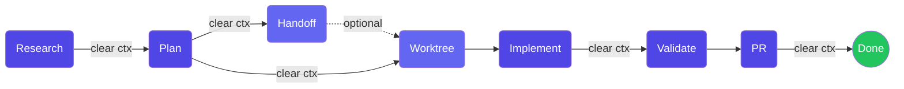

Catalyst's core workflow is built on one principle: **frequent intentional compaction** — design the entire development cycle around context management, keeping context utilization in the 40-60% range.

## Phase Overview



| Phase | Command |
|-------|---------|
| Research | `/catalyst-dev:research_codebase` |
| Plan | `/catalyst-dev:create_plan` |
| Handoff | `/catalyst-dev:create_handoff` |
| Worktree | `/catalyst-dev:create_worktree` |
| Implement | `/catalyst-dev:implement_plan` |
| Validate | `/catalyst-dev:validate_plan` |
| PR | `/catalyst-dev:create_pr` |

Clear context between every phase for optimal performance.

## Phase 1: Research

**When**: Ticket requires codebase understanding before planning.

```
/catalyst-dev:research_codebase
```

Catalyst spawns parallel sub-agents (locator, analyzer, pattern-finder), documents what exists, and saves findings to `thoughts/shared/research/`.

**Output**: `thoughts/shared/research/YYYY-MM-DD-PROJ-XXXX-description.md`

Clear context after research is saved. Research loads many files; compacting keeps the next phase efficient.

## Phase 2: Planning

**When**: After research, or directly from a ticket if the codebase is well-understood.

```
/catalyst-dev:create_plan
```

References your research automatically and creates a detailed plan interactively with you. If revisions are needed: `/catalyst-dev:iterate_plan`.

**Output**: `thoughts/shared/plans/YYYY-MM-DD-PROJ-XXXX-description.md`

Clear context after the plan is approved.

## Phase 3: Handoff (Optional)

**When**: Pausing work, transferring to another session, switching machines, or context exceeding 60%.

```
/catalyst-dev:create_handoff
```

**Output**: `thoughts/shared/handoffs/PROJ-XXXX/YYYY-MM-DD_HH-MM-SS_description.md`

Handoffs capture current state, action items, critical file references, and learnings. Resume with `/catalyst-dev:resume_handoff`.

## Phase 4: Worktree Creation

**When**: Ready to implement after plan approval.

```
/catalyst-dev:create_worktree PROJ-123 feature-name
```

Creates a git worktree at `~/wt/{project}/{ticket-feature}` with `.claude/` copied, dependencies installed, and thoughts shared via symlink.

## Phase 5: Implementation

**When**: In a worktree with an approved plan.

```
/catalyst-dev:implement_plan
```

Reads the complete plan, implements each phase sequentially, runs automated verification, and updates checkboxes.

May clear context between phases if context fills above 60%.

## Phase 6: Validation

```
/catalyst-dev:validate_plan
```

Runs all automated tests, verifies success criteria, performs manual testing steps, and documents deviations.

## Phase 7: PR Creation

```bash
/catalyst-dev:commit         # Create commit
/catalyst-dev:create_pr      # Create PR with description
```

## Common Patterns

### Quick Feature

```bash
/catalyst-dev:research_codebase          # Research
# Clear context
/catalyst-dev:create_plan                # Plan
# Clear context
/catalyst-dev:create_worktree PROJ-123 feature
/catalyst-dev:implement_plan             # Implement
# Clear context
/catalyst-dev:commit && /catalyst-dev:create_pr       # Ship
```

### Multi-Day Feature

```bash
# Day 1
/catalyst-dev:research_codebase
/catalyst-dev:create_handoff
# Day 2
/catalyst-dev:resume_handoff PROJ-123
/catalyst-dev:create_plan
/catalyst-dev:create_handoff
# Day 3
/catalyst-dev:resume_handoff PROJ-123
/catalyst-dev:implement_plan             # Phases 1-2
/catalyst-dev:create_handoff
# Day 4
/catalyst-dev:resume_handoff PROJ-123
/catalyst-dev:implement_plan             # Phases 3-4
/catalyst-dev:validate_plan
/catalyst-dev:commit && /catalyst-dev:create_pr
```

### One-Shot

For straightforward tasks, chain everything:

```
/catalyst-dev:oneshot PROJ-123
```
