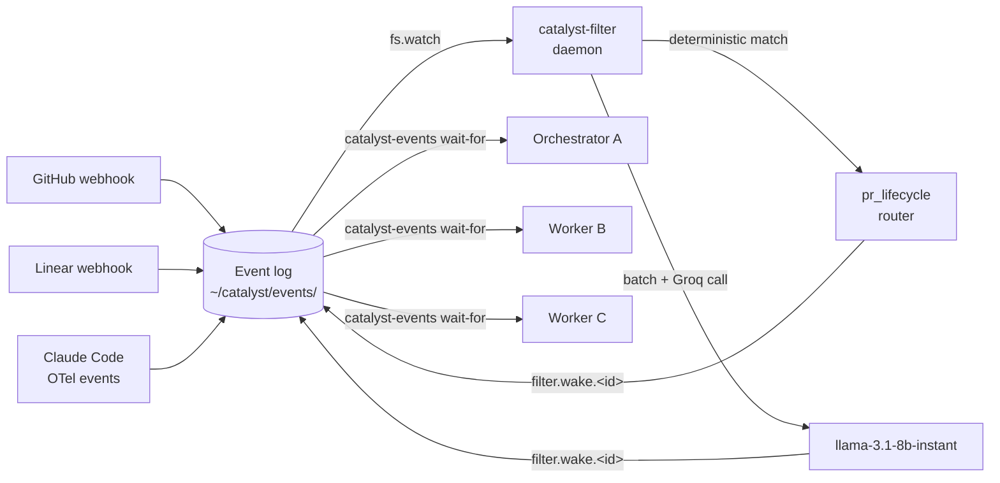

`catalyst-filter` is a long-running daemon that subscribes to the global event log
(`~/catalyst/events/YYYY-MM.jsonl`) and delivers targeted wake events to the right orchestrators
and workers. Instead of writing a jq predicate for every event type you care about, you register
a natural-language intent once and the daemon handles the matching.

The daemon supports two routing paths:

- **Deterministic (`pr_lifecycle`)** — pure field comparison for PR/CI/review/BEHIND events. No
  Groq call, no latency beyond local I/O.
- **Prose (Groq-backed)** — a natural-language `prompt` you write; evaluated by
  `llama-3.1-8b-instant` in a single batched API call covering all registered interests.

Both paths produce the same output: a `filter.wake.<id>` event in the log that your
`catalyst-events wait-for` call is already watching for.

## Architecture



The daemon is a fan-out multiplexer: one event in the log can produce multiple independent wakes
if multiple interests match. Each caller receives only the wake for its own `interest_id`.

## Quick Start

```bash
# 1. Add your Groq API key (see Credential Setup below)
# 2. Start the daemon
catalyst-filter start

# 3. Confirm it's running
catalyst-filter status
# → running (pid 12345)

# 4. Watch the log (in a separate terminal)
catalyst-filter logs
```

Once running, any orchestrator or worker that emits `filter.register` to the event log will
have its interests tracked automatically.

## Installation

`catalyst-filter` is installed with the rest of the Catalyst CLIs when you run `setup-catalyst`.
The [setup health check](./setup/) verifies the symlink resolves correctly. To install or
re-install manually:

```bash
bash plugins/dev/scripts/install-cli.sh
```

This creates `~/.catalyst/bin/catalyst-filter` (and sibling CLIs). Make sure `~/.catalyst/bin`
is on your `PATH`:

```bash
export PATH="$HOME/.catalyst/bin:$PATH"
```

## Starting and Stopping

```bash
catalyst-filter start    # background process, writes ~/catalyst/filter.pid
catalyst-filter stop     # SIGTERM, then SIGKILL after 3 s if still alive
catalyst-filter restart  # stop followed by start
catalyst-filter status   # prints "running (pid N)" or "stopped"
catalyst-filter logs     # tail -f ~/catalyst/filter.log
catalyst-filter run      # foreground mode (useful for debugging)
```

The daemon writes its PID to `~/catalyst/filter.pid` and logs to `~/catalyst/filter.log`.
It persists registered interests to `~/catalyst/filter-interests.json` so they survive a restart.

The runtime prefers `bun` and falls back to `node`. Node.js ≥ 21 or Bun is required.

## Credential Setup

The daemon needs a Groq API key to evaluate prose interests. `pr_lifecycle` interests route
deterministically and work without a key.

**Option 1 — environment variable** (simplest):

```bash
export GROQ_API_KEY="gsk_..."
catalyst-filter start
```

**Option 2 — Layer 2 config file** (persists across shells):

```json
// ~/.config/catalyst/config-{projectKey}.json  (never committed)
{
  "groq": {
    "apiKey": "gsk_..."
  }
}
```

The daemon resolves the key in that order: environment variable first, config file second. If
neither is present it logs a warning and continues running — `pr_lifecycle` interests still work.

Get a Groq API key at [console.groq.com](https://console.groq.com).

## Protocol Reference

Interests are registered by writing structured events to the global event log — the same log
that carries GitHub, Linear, and Claude Code events. Any agent that can append to the log (via
`catalyst-state.sh event ...` or by appending JSONL directly) can register an interest.

### Registering an Interest

The `filter.register` event has two forms depending on `interest_type`.

#### pr_lifecycle — deterministic routing

Use this when you need CI, PR merge, review, and BEHIND events for known PR numbers:

```json
{
  "ts": "2026-05-08T07:00:00Z",
  "event": "filter.register",
  "orchestrator": "orch-ctl-api-2026-05-08",
  "worker": null,
  "detail": {
    "interest_id": "sess_20260508_abc123",
    "session_id": "sess_20260508_abc123",
    "interest_type": "pr_lifecycle",
    "notify_event": "filter.wake.sess_20260508_abc123",
    "persistent": true,
    "pr_numbers": [445, 446],
    "repo": "coalesce-labs/catalyst",
    "base_branches": [
      {"pr": 445, "base": "main"},
      {"pr": 446, "base": "main"}
    ]
  }
}
```

`pr_lifecycle` interests produce a wake when:
- A check suite completes on any of the listed PRs
- A PR is merged, closed, or receives a review
- The base branch receives a push (BEHIND state)

No Groq API key is needed for this path.

#### prose — Groq-backed semantic routing

Use this for conditions that don't map to known PR numbers, such as Linear ticket status changes
or comms messages addressed to your orchestrator:

```json
{
  "ts": "2026-05-08T07:00:00Z",
  "event": "filter.register",
  "orchestrator": "orch-ctl-api-2026-05-08",
  "worker": null,
  "detail": {
    "interest_id": "orch-ctl-api-2026-05-08",
    "session_id": "sess_20260508_abc123",
    "notify_event": "filter.wake.orch-ctl-api-2026-05-08",
    "prompt": "Wake me when: any of my workers posts a comms message of type attention to me; or one of my Linear tickets changes status",
    "persistent": true,
    "context": {
      "pr_numbers": [445, 446],
      "tickets": ["CTL-253", "CTL-254"],
      "branches": ["orch-ctl-api-2026-05-08-CTL-253"],
      "workers": ["sess_20260508_abc123"]
    }
  }
}
```

The `context` object is included in the Groq prompt alongside the intent so the LLM knows which
PR numbers and tickets belong to this interest.

### filter.wake

When the daemon finds a match, it appends a `filter.wake.<id>` event to the log:

```json
{
  "ts": "2026-05-08T07:01:23Z",
  "event": "filter.wake.orch-ctl-api-2026-05-08",
  "orchestrator": "orch-ctl-api-2026-05-08",
  "worker": null,
  "detail": {
    "reason": "PR #445 check suite completed with conclusion 'success'",
    "source_event_ids": ["evt_abc123"],
    "interest_id": "orch-ctl-api-2026-05-08"
  }
}
```

Your `catalyst-events wait-for` call matches on the OTel envelope:

```bash
catalyst-events wait-for \
  --filter ".attributes.\"event.name\" == \"filter.wake\" and \
            .attributes.\"event.label\" == \"${ORCH_ID}\"" \
  --timeout 7200
```

The `reason` field is informational only. After waking, always perform an authoritative REST
check (`gh api repos/{repo}/pulls/{number}`) to confirm the actual PR state before acting.

### filter.deregister

Emit this event when you no longer need the interest (e.g., at workflow exit or after merge):

```json
{
  "ts": "2026-05-08T07:05:00Z",
  "event": "filter.deregister",
  "orchestrator": null,
  "worker": null,
  "detail": {"interest_id": "orch-ctl-api-2026-05-08"}
}
```

The daemon also auto-deregisters interests when:

- `orchestrator-completed` or `orchestrator-failed` events arrive with a matching orchestrator ID
- A `session_id` has not produced a heartbeat for more than 3 minutes (watchdog cleanup)
- `persistent: false` is set and the first wake has fired

## Writing Effective Intent Prompts

Prose interests are evaluated by `llama-3.1-8b-instant`. Good prompts are specific and
condition-based:

```
# Good — names conditions directly
Wake me when: any of my workers posts a comms message of type attention to me;
or one of my Linear tickets changes status
```

```
# Good — CI and review coverage
Wake me when: CI passes or fails on PR 445; PR 445 receives a review or
changes-requested; I receive a comms message addressed to CTL-253
```

```
# Bad — too vague, produces false positives
Watch for things that might be relevant to my orchestrator
```

```
# Bad — uses raw field names (the LLM knows the event taxonomy, not the JSONL schema)
Match events where detail.prNumbers contains 445
```

Guidelines:
- Keep prompts to 50–100 words
- Register all your conditions in a single `filter.register` call, not multiple
- For PR/CI/review/BEHIND, use `pr_lifecycle` instead — it's more reliable and cheaper
- Prose is best for cross-concern conditions: Linear changes, comms messages, deployment status

## Multi-Tenant Behavior

All active interests from all orchestrators and workers share one daemon process. This has two
implications:

**Single Groq call per batch.** Every batch of incoming events triggers at most one API call,
regardless of how many orchestrators are registered. A 10-orchestrator wave with 30 prose
interests produces the same number of Groq calls as a single orchestrator with 1 prose interest.

**Isolated wakes.** The daemon emits each wake to the `notify_event` stored with that specific
interest. Orchestrator A's wake never fires for orchestrator B's `wait-for`. The `interest_id`
is the routing key — use a value that is globally unique (e.g., `$CATALYST_SESSION_ID`).

Two registrations with the same `interest_id` are treated as an idempotent update — the second
overwrites the first.

## Performance and Cost

| Path | Latency | Groq calls |
|---|---|---|
| `pr_lifecycle` (deterministic) | < 10 ms | 0 |
| Prose (Groq) | ~300–600 ms | 1 per batch (all interests combined) |

The default model `llama-3.1-8b-instant` is Groq's fastest and cheapest tier. At typical
orchestration scale (5–15 workers, one batch every few minutes) the cost is negligible.

To use a different model:

```bash
export FILTER_GROQ_MODEL="llama-3.3-70b-versatile"
catalyst-filter restart
```

## Configuration Reference

All settings are environment variables. They can also be set in your shell profile before
starting the daemon.

| Variable | Default | Effect |
|---|---|---|
| `GROQ_API_KEY` | — | Groq API key for prose interest evaluation |
| `FILTER_GROQ_MODEL` | `llama-3.1-8b-instant` | Groq model override |
| `FILTER_DEBOUNCE_MS` | `100` | How long to wait for more events before flushing a batch |
| `FILTER_HARD_CAP_MS` | `500` | Maximum batch hold time before forced flush |
| `FILTER_BATCH_SIZE` | `20` | Flush immediately when this many events accumulate |
| `FILTER_WATCHDOG_INTERVAL_MS` | `60000` | How often the watchdog checks for stale sessions |
| `FILTER_HEARTBEAT_STALE_MS` | `180000` | Session idle timeout before interest auto-deregistration |
| `CATALYST_DIR` | `~/catalyst` | Directory for PID file, log, interests file, and SQLite DB |

## Relationship to catalyst-events wait-for

`catalyst-filter` is the **preferred path** for event-driven workflows. The direct
`catalyst-events wait-for` pattern with hand-crafted jq predicates remains available as a
fallback when the daemon is not running.

**Before catalyst-filter** (direct pattern, still valid as fallback):

```bash
catalyst-events wait-for \
  --filter "
    (.attributes.\"vcs.pr.number\" == 445 or
     (.body.payload.prNumbers // [] | contains([445]))) and
    (.attributes.\"event.name\" == \"github.pr.merged\" or
     .attributes.\"event.name\" == \"github.check_suite.completed\" or
     (.attributes.\"event.name\" | startswith(\"github.pr_review\")))
  " \
  --timeout 7200
```

**With catalyst-filter** (preferred):

```bash
# After emitting filter.register once, wait on a single narrow filter:
catalyst-events wait-for \
  --filter ".attributes.\"event.name\" == \"filter.wake\" and \
            .attributes.\"event.label\" == \"${SESSION_ID}\"" \
  --timeout 7200
```

The filter-backed approach:
- Is shorter and less error-prone (no event-type enumeration)
- Scales to new event types without changing the wait-for call
- Handles comms messages, Linear events, and deployment status in the same registration
- Degrades gracefully — if the daemon is not running, fall back to the direct pattern

To check whether the daemon is running before deciding which path to use:

```bash
if catalyst-filter status 2>/dev/null | grep -q "^running"; then
  USE_FILTER_DAEMON=true
else
  USE_FILTER_DAEMON=false
fi
```

## Related

- [Event Architecture](./events/) — the global event log and `catalyst-events` CLI that
  `catalyst-filter` reads and writes.
- [GitHub Webhooks](./webhooks/) — how raw GitHub events enter the event log.
- [Orchestration](../reference/orchestration/) — how orchestrators register prose interests to
  monitor their entire worker wave.
- [Workers](../reference/orchestration/workers/) — how individual workers register `pr_lifecycle`
  interests in the Phase 5 listen loop.

## Source

- CLI: [`plugins/dev/scripts/catalyst-filter`](https://github.com/coalesce-labs/catalyst/blob/main/plugins/dev/scripts/catalyst-filter)
- Daemon: [`plugins/dev/scripts/filter-daemon/index.mjs`](https://github.com/coalesce-labs/catalyst/blob/main/plugins/dev/scripts/filter-daemon/index.mjs)
- Skill (agent-facing): [`plugins/dev/skills/catalyst-filter/SKILL.md`](https://github.com/coalesce-labs/catalyst/blob/main/plugins/dev/skills/catalyst-filter/SKILL.md)
