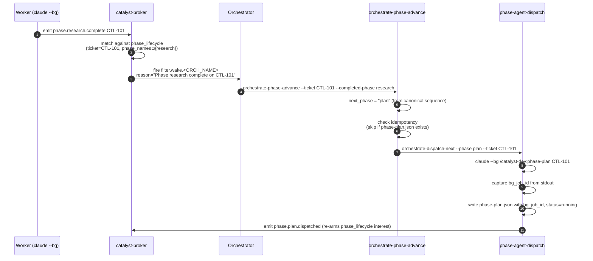

When a Catalyst worker calls `catalyst-events wait-for`, it blocks until a specific event appears
in the unified log at `~/catalyst/events/YYYY-MM.jsonl`. This page explains exactly how an event
gets from GitHub (or Linear) to that log so the waiting process wakes up.

## The paths in and out of the event log

```
┌─────────────┐
│   GitHub    │ ──webhook──> smee.io ──SSE──> orch-monitor POST /api/webhook
└─────────────┘                                     │
                                              HMAC verify
                                                    │
                                             event-log append
                                        ~/catalyst/events/YYYY-MM.jsonl
                                                    │
                                         catalyst-events wait-for ──> worker wakes
```

```
┌─────────────┐
│   Linear    │ ──webhook──> smee.io (separate channel)
└─────────────┘                     │
                          orch-monitor POST /api/webhook/linear
                                    │
                             HMAC verify + Linear-specific parsing
                                    │
                             event-log append (same file)
                        ~/catalyst/events/YYYY-MM.jsonl
```

```
┌──────────────────┐
│  bash skill      │ ──catalyst-state.sh event '{"event":"worker-done",...}'──>
│  (v1 writer)     │        event-log append
└──────────────────┘   ~/catalyst/events/YYYY-MM.jsonl
```

```
┌──────────────────┐
│ catalyst-broker  │ ──fs.watch on event log──> deterministic + Groq routing
│ (CTL-303 daemon) │ ──filter.wake.<id> append──>
└──────────────────┘   ~/catalyst/events/YYYY-MM.jsonl
                                    │
                       catalyst-events wait-for ──> registered agent wakes
```

```
┌────────────────────────┐
│ catalyst-otel-forward  │ ──byte-offset tail──>
│ (CTL-306 daemon)       │   ~/catalyst/events/YYYY-MM.jsonl
└────────────────────────┘
            │
            ├──> OTLP/HTTP collector
            ├──> PostHog
            └──> Cloudflare Analytics Engine
```

```
┌──────────────────────────┐
│ execution-core daemon     │ ──boot-replay + fs.watch byte-cursor tail──>
│ reaper (CTL-649)          │   ~/catalyst/events/YYYY-MM.jsonl
└──────────────────────────┘     (reads *.reap-requested / *.cleanup-requested)
            │
            ├──> claude stop / git worktree remove / git branch -D
            └──> appends *.reap-complete / *.reap-failed echoes
                 ~/catalyst/events/YYYY-MM.jsonl   (same file)
```

All inbound paths converge on the same monthly JSONL file. The broker daemon is both a
**reader** (tails the log via `fs.watch`) and a **writer** (appends `filter.wake.<id>` events
when a registered interest matches). The execution-core daemon reaper (CTL-649) is the second
**reader-and-writer**: it tails the log (boot-replay of unmatched intents, then an `fs.watch` +
byte-cursor live tail) to consume `*.reap-requested` / `pr.merged.cleanup-requested` lines, runs
the matching executor (`claude stop`, `git worktree remove`, `git branch -D`), and appends
`*.reap-complete` / `*.reap-failed` echoes back into the same file. The forwarder is a pure
outbound consumer — it never writes back. Workers using `catalyst-events wait-for` monitor that
file regardless of which path produced the event.

## Step-by-step: a GitHub PR merge

1. **PR is merged on GitHub.** GitHub fires a `pull_request` webhook payload with `action: "closed"` and `merged: true`.

2. **GitHub delivers the payload to smee.io.** The smee channel URL was registered as the webhook target for the repo (either by `setup-webhooks.sh` at setup time, or lazily when the monitor first saw a worker referencing that repo).

3. **smee.io forwards the payload to orch-monitor.** The orch-monitor daemon keeps an outbound EventSource connection open to `https://smee.io/<channel-id>`. Deliveries arrive over this connection — no inbound port needed.

4. **orch-monitor verifies the HMAC signature.** Each delivery is signed by GitHub using the shared secret configured in the env var named by `catalyst.monitor.github.webhookSecretEnv` (default: `CATALYST_WEBHOOK_SECRET`). Deliveries that fail HMAC verification are dropped.

5. **orch-monitor normalizes the event.** The webhook handler maps the raw GitHub payload to the
   canonical OTel-shaped envelope (CTL-300). Filters use `.attributes."event.name"` — the
   bare `.event` shorthand is absent. As of CTL-310, webhook-emitted events also carry a
   top-level `traceId` so cross-service correlation against OTel traces is possible:
   ```json
   {
     "ts": "2026-05-01T14:22:01Z",
     "severityText": "INFO",
     "severityNumber": 9,
     "traceId": "a1b2c3d4e5f6…",
     "spanId": "1122334455667788",
     "attributes": {
       "event.name": "github.pr.merged",
       "event.entity": "pr",
       "event.action": "merged",
       "vcs.pr.number": 87,
       "vcs.revision": "abc123def"
     },
     "body": { "payload": { "...full webhook payload..." } },
     "resource": {
       "service.name": "orch-monitor",
       "service.namespace": "catalyst",
       "service.version": "8.1.0"
     }
   }
   ```

6. **orch-monitor appends the event to the log.** The normalized envelope is appended to `~/catalyst/events/YYYY-MM.jsonl` using a POSIX atomic append (small writes are atomic under POSIX).

7. **`catalyst-events wait-for` sees the new line.** The waiting worker has an open `tail -f` on the current month's log file. The new line appears, the jq filter matches, and `wait-for` prints the event and exits with code 0.

8. **The worker acts.** With the PR confirmed merged, the worker records `pr.mergedAt`, transitions the Linear ticket to Done, and writes `status: "done"` to its signal file.

## Step-by-step: a phase-agent wake (CTL-452)

When `dispatchMode = "phase-agents"`, the orchestrator dispatches one short-lived
`claude --bg` job per phase. Each phase emits a `phase.<name>.complete.<TICKET>`
event that wakes the orchestrator via the broker's `phase_lifecycle` interest, and
the orchestrator dispatches the next phase. The wake chain is deterministic — no
Groq call, no prose evaluation.



The broker matches incoming events against the regex
`^phase\.([^.]+)\.(complete|failed)\.([A-Za-z][A-Za-z0-9_]*-\d+)$` and routes
them to the registered `phase_lifecycle` interest by ticket. The orchestrator
registers exactly one `phase_lifecycle` interest per ticket at Phase 4 start;
all four broker interests (`pr_lifecycle`, `ticket_lifecycle`, `comms_lifecycle`,
`phase_lifecycle`) route back as the same `filter.wake.<ORCH_NAME>` so the
orchestrator only watches one event stream.

1. **Phase agent completes its one job.** Reads the prior phase's artifact, does
   the work (research a topic, draft a plan, implement a diff, etc.), writes its
   own `phase-<name>.json` to `${ORCH_DIR}/workers/<TICKET>/`, and emits
   `phase.<name>.complete.<TICKET>` via `catalyst-state.sh event`.
2. **Broker matches the deterministic interest.** No LLM call — the broker's
   `phase_lifecycle` matcher reads the registered `(ticket, phase_names)` tuple
   and confirms the event is in scope.
3. **Broker fires the wake.** Appends `filter.wake.<ORCH_NAME>` to the event log
   with `payload.reason = "Phase <name> complete on <TICKET>"`.
4. **Orchestrator sees the wake.** Its `catalyst-events wait-for` returns; it
   calls `orchestrate-phase-advance --completed-phase <name> --ticket <TICKET>`.
5. **Advance computes the next phase.** From the canonical 9-phase sequence
   (`triage → research → plan → implement → verify → review → pr → monitor-merge →
   monitor-deploy`). Skipped if the next phase's signal file already exists
   (idempotency).
6. **Dispatch the next phase.** `phase-agent-dispatch` launches a fresh
   `claude --bg /catalyst-dev:phase-<next> <TICKET>` job, captures the `bg_job_id`,
   writes `phase-<next>.json`, and emits `phase.<next>.dispatched.<TICKET>` to
   re-arm the broker interest for the next completion.

See [Phase agents](/reference/orchestration/phase-agents/) for the per-phase
artifact contract and turn caps.

## What happens without webhooks

If the smee tunnel is not configured, step 2 never happens. The orch-monitor falls back to polling GitHub's REST API every **10 minutes** and appending `github.*` events from poll results. `catalyst-events wait-for` will wake, but with up to 600s latency instead of ~1s.

Skills detect this automatically: the oneshot Phase 5 listen loop checks tunnel status before entering the event-driven path and switches to the REST fallback if the tunnel is not running.

See [Setting up the webhook tunnel](./setup/#7-set-up-the-webhook-tunnel) to configure near-real-time delivery.

## Linear webhook path

Linear webhooks follow the same pattern with two differences:

- A **separate smee channel** is used (one channel per source — GitHub and Linear cannot share a channel because their payload shapes differ).
- The orch-monitor listens on `POST /api/webhook/linear` and applies Linear-specific HMAC verification using the secret named by `catalyst.monitor.linear.webhookSecretEnv`.
- Topics are namespaced `linear.*` (e.g., `linear.issue.state_changed`, `linear.comment.created`).

```bash
# Watch Linear events in real time
catalyst-events tail --filter '.attributes."event.name" | startswith("linear.")'
```

## Skill-writer path (v1 envelopes)

Bash skills write events directly via `catalyst-state.sh event`, bypassing the webhook path entirely:

```bash
catalyst-state.sh event "$(jq -nc \
  --arg ts "$(date -u +%Y-%m-%dT%H:%M:%SZ)" \
  --arg orch "$ORCH_ID" --arg w "$TICKET_ID" \
  '{ts: $ts, event: "worker-done", orchestrator: $orch, worker: $w, detail: null}')"
```

These produce v1 envelopes (`.event` top-level field, no `.attributes`). `catalyst-events wait-for`
handles both v1 and canonical shapes — the jq filter sees the raw line, so write filters that
match the actual field location:

```bash
# Match v1 worker-done (legacy)
--filter '.event == "worker-done" and .worker == "CTL-48"'

# Match canonical github.pr.merged (CTL-300)
--filter '.attributes."event.name" == "github.pr.merged"'
```

## Canonical envelopes (CTL-300)

All new emitters write the canonical shape — the webhook receiver
(`lib/webhook-events.ts`), `catalyst-comms send`, `catalyst-broker`, `catalyst-session.sh`,
and the OTel emit scripts under `plugins/dev/scripts/orch-monitor/lib/`. The shape mirrors
OTel `LogRecord` so downstream forwarders can transcode to OTLP without translation:

```json
{
  "ts": "2026-05-01T14:22:01Z",
  "observedTs": "2026-05-01T14:22:01Z",
  "severityText": "INFO",
  "severityNumber": 9,
  "traceId": "a1b2c3d4e5f6a1b2c3d4e5f6a1b2c3d4",
  "spanId": "1122334455667788",
  "parentSpanId": null,
  "resource": {
    "service.name": "orch-monitor",
    "service.namespace": "catalyst",
    "service.version": "8.1.0"
  },
  "attributes": {
    "event.name": "github.pr.merged",
    "event.entity": "pr",
    "event.action": "merged",
    "vcs.pr.number": 87,
    "vcs.revision": "abc123def"
  },
  "body": {
    "message": "PR #87 merged",
    "payload": { "...full webhook payload..." }
  }
}
```

Top-level fields: `ts`, `observedTs`, `severityText`, `severityNumber`, `traceId`, `spanId`,
`parentSpanId`, `resource`, `attributes`, `body`. The `.event` shorthand is absent — use
`.attributes."event.name"`. The `traceId` is populated by webhook emitters as of CTL-310 and
is derived deterministically from orchestrator/worker identifiers so any producer can compute
the same ID without coordination.

## Replay on monitor startup

When the orch-monitor starts (or restarts after a crash), it replays the last **1 hour** of
webhook deliveries from GitHub's delivery history API. This reconciles any events that arrived
while the daemon was down, without operator action.

The replay uses the same handler as live deliveries (including HMAC verification with a
synthetic signature — the orch-monitor owns the secret it uses to re-sign). Replayed events
are appended to the log only if they're not already present (deduplication by delivery ID).

## Yield tombstones

When a phase agent detects that its `bg_job_id` is no longer the canonical
worker for a ticket (the orphan-bg pattern, CTL-649), it gracefully yields
instead of editing the worker tree. The yield is recorded two ways:

1. **Hidden sidecar**: `workers/<TICKET>/.phase-<phase>-yield` — written by
   `phase-agent-yield-check.sh`. No `.json` extension, leading dot, no
   timestamp. Used by phase-agent prelude code for the inverse-yield detection
   pattern.
2. **Visible tombstone**: `workers/<TICKET>/phase-<phase>-yield-<timestamp>.json` —
   audit trail of the yield event. Status is `null`, phase is `null`, no
   `bg_job_id`. **These are read-only audit files.** The scheduler explicitly
   skips any filename matching `phase-*-yield-*.json` in both
   `signal-reader.mjs:isPhaseSignalFile` and `scheduler.mjs:readPhaseSignals`
   (CTL-702). Treating one as a live signal extracts an invalid phase name and
   crashes the supersede guard.

Operators investigating a yield-storm can grep for
`phase.scheduler.yield-file-skip.<TICKET>` events in the unified event log —
one such event is emitted per tombstone per daemon lifetime (CTL-702).

## Priority preemption (CTL-705)

When `maxParallel` slots are saturated and a higher-priority queued ticket
out-ranks the lowest-ranked in-flight worker, the scheduler stops that worker
and parks it so the Urgent ticket can claim a slot. Two events mark this lifecycle:

### `phase.<phase>.preempted.<TICKET>`

Emitted when the scheduler stops a lower-priority in-flight worker to free a slot.

| Payload field | Description |
|---|---|
| `phase` | Pipeline phase being preempted (e.g. `research`) |
| `preempted_by` | Identifier of the higher-priority queued ticket |
| `bg_job_id` | bg job ID of the stopped worker |

The worker's phase signal is rewritten to `status: "preempted"` with
`parkedFrom: <phase>` and `attentionReason: "preempted-by-priority"`.

**Safety guards** prevent preemption from firing prematurely:
- Non-preemptable phases: `triage`, `monitor-deploy` are never stopped.
- Min-runtime floor: the worker must have been running ≥60s.
- Implement quiet-window: `phase-implement.json` mtime must be >10s old (worker not actively committing).
- Hysteresis: the queued ticket must out-rank the candidate for ≥30s across two ticks.

### `phase.<phase>.resumed-after-preemption.<TICKET>`

Emitted when a preempted worker is re-dispatched at its `parkedFrom` phase.

| Payload field | Description |
|---|---|
| `phase` | Phase the worker resumes at (= `parkedFrom`) |
| `resume_session` | Claude `--resume` UUID used for the re-dispatch, or `null` if cold |

Preemption→resume is inherently multi-tick: `claude stop` may not deregister
within the same tick's `liveBackgroundCount()`, so the freed slot fills on the
next tick. The resume sweep runs **before** new-work pull, so a preempted ticket
always reclaims its slot ahead of brand-new work.

## Related

- [catalyst-events CLI](./catalyst-events/) — command reference and jq filter cookbook
- [Event architecture](./events/) — signal files, global state, and SSE stream overview
- [GitHub webhooks for orch-monitor](./webhooks/) — full webhook setup guide
