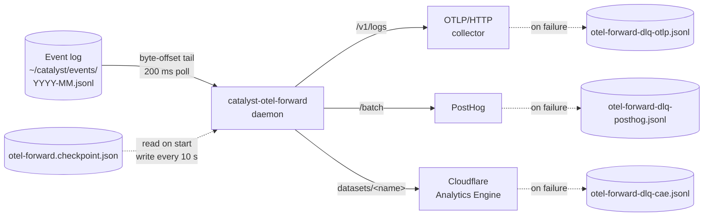

`catalyst-otel-forward` is a long-running daemon that tails the canonical Catalyst event log
(`~/catalyst/events/YYYY-MM.jsonl`) and fans events out to up to three independent
destinations — an OTLP/HTTP endpoint, PostHog, and Cloudflare Analytics Engine — so the same
event stream that drives `catalyst-broker` and `catalyst-hud` also lands in your existing
observability and product-analytics stack.

## Architecture



The three senders are independent — one destination failing never blocks the others, and each
has its own dead-letter queue that auto-replays on the next successful flush.

Only canonical events (lines with a top-level `attributes` key, per CTL-300) are forwarded.
Legacy format lines are counted as `skipped` and dropped.

## Quick Start

```bash
# 1. Add destination credentials to ~/.config/catalyst/config-{projectKey}.json
#    (see Configuration below — all forwarders are disabled by default)

# 2. Start the daemon in the background
catalyst-monitor.sh forward-start

# 3. Confirm it's running
catalyst-monitor.sh forward-status
# → running (pid 12345)

# 4. Tail logs
tail -f ~/catalyst/otel-forward.log
```

## Configuration

Config lives in `~/.config/catalyst/config-{projectKey}.json` under
`catalyst.observability.forwarders`. All forwarders are disabled by default.

### OTLP

```json
{
  "catalyst": {
    "observability": {
      "forwarders": {
        "otlp": {
          "enabled": true,
          "endpoint": "http://localhost:4318",
          "batchSize": 100,
          "flushIntervalMs": 5000
        }
      }
    }
  }
}
```

The `OTEL_EXPORTER_OTLP_ENDPOINT` environment variable overrides `endpoint` (port 4317 is
automatically rewritten to 4318 for HTTP).

### PostHog

```json
{
  "catalyst": {
    "observability": {
      "forwarders": {
        "posthog": {
          "enabled": true,
          "apiKey": "phc_YOUR_API_KEY",
          "host": "https://us.i.posthog.com",
          "batchSize": 50,
          "flushIntervalMs": 10000
        }
      }
    }
  }
}
```

### Cloudflare Analytics Engine

```json
{
  "catalyst": {
    "observability": {
      "forwarders": {
        "cloudflareAE": {
          "enabled": true,
          "accountId": "YOUR_CF_ACCOUNT_ID",
          "apiToken": "YOUR_CF_API_TOKEN",
          "dataset": "catalyst_events",
          "batchSize": 100,
          "flushIntervalMs": 5000
        }
      }
    }
  }
}
```

## Lifecycle

```bash
# Start daemon in background
catalyst-monitor.sh forward-start

# Check status
catalyst-monitor.sh forward-status

# Stop daemon
catalyst-monitor.sh forward-stop

# Foreground mode (useful for debugging)
catalyst-otel-forward
```

The lifecycle subcommands write a PID file and log path under `~/catalyst/`. The direct
`catalyst-otel-forward` entry runs in the foreground and exits cleanly on `SIGTERM` or `SIGINT`,
flushing any buffered batches before stopping.

## Checkpoint Behavior

The daemon persists its read position to `~/catalyst/otel-forward.checkpoint.json` every
10 seconds. On restart it resumes from the last checkpoint, which means up to 10 seconds of
events may be re-delivered after a crash or restart — destinations are expected to be
idempotent.

To reset and reprocess from the beginning of the current month:

```bash
rm ~/catalyst/otel-forward.checkpoint.json
```

## Dead-Letter Queues

When a destination fails after all retry attempts, events are appended to a per-destination
DLQ file:

- `~/catalyst/otel-forward-dlq-otlp.jsonl`
- `~/catalyst/otel-forward-dlq-posthog.jsonl`
- `~/catalyst/otel-forward-dlq-cae.jsonl`

Pending DLQ batches are automatically replayed on the next successful flush to that destination.
A failure on OTLP never affects PostHog or Cloudflare AE — each sender owns its own DLQ.

To discard a DLQ without replaying:

```bash
rm ~/catalyst/otel-forward-dlq-otlp.jsonl
```

## Logging

The daemon writes pino-structured JSON logs to stderr (CTL-314). Set the verbosity with the
`LOG_LEVEL` environment variable before starting:

```bash
LOG_LEVEL=debug catalyst-monitor.sh forward-start
```

Valid levels are pino's standard set — `trace`, `debug`, `info` (default), `warn`, `error`,
`fatal`. Each log entry carries a `name: "forwarder"` field, and per-destination senders add
a `destination` child binding (`otlp`, `posthog`, or `cae`) so you can filter by sender:

```bash
tail -f ~/catalyst/otel-forward.log | jq 'select(.destination == "otlp")'
```

## Debugging

```bash
# Tail daemon logs
tail -f ~/catalyst/otel-forward.log

# Verify OTLP connectivity (requires a running collector on :4318)
curl -s http://localhost:4318/v1/logs \
  -H "Content-Type: application/json" \
  -d '{"resourceLogs":[]}' | jq .

# Count events in current log
wc -l ~/catalyst/events/$(date +%Y-%m).jsonl

# Count canonical vs legacy
grep -c '"attributes"' ~/catalyst/events/$(date +%Y-%m).jsonl || true
```

## Validation Queries

### PostHog

In the PostHog UI, filter by event name `session.heartbeat` or build a funnel:

```
Source: session.heartbeat
→ worker.done (where distinct_id matches)
```

### Cloudflare Analytics Engine

```sql
SELECT
  blob1 as event_json,
  index1 as event_name,
  index2 as service_name,
  count() as total
FROM catalyst_events
WHERE timestamp > NOW() - INTERVAL '1' HOUR
GROUP BY event_name, service_name
ORDER BY total DESC
LIMIT 20
```

## Source

- CLI wrapper: [`plugins/dev/scripts/catalyst-otel-forward`](https://github.com/coalesce-labs/catalyst/blob/main/plugins/dev/scripts/catalyst-otel-forward)
- Daemon entry: [`plugins/dev/scripts/otel-forward/index.ts`](https://github.com/coalesce-labs/catalyst/blob/main/plugins/dev/scripts/otel-forward/index.ts)
- Config loader: [`plugins/dev/scripts/otel-forward/lib/config.ts`](https://github.com/coalesce-labs/catalyst/blob/main/plugins/dev/scripts/otel-forward/lib/config.ts)
- OTLP sender: [`plugins/dev/scripts/otel-forward/lib/destinations/otlp.ts`](https://github.com/coalesce-labs/catalyst/blob/main/plugins/dev/scripts/otel-forward/lib/destinations/otlp.ts)
- PostHog sender: [`plugins/dev/scripts/otel-forward/lib/destinations/posthog.ts`](https://github.com/coalesce-labs/catalyst/blob/main/plugins/dev/scripts/otel-forward/lib/destinations/posthog.ts)
- Cloudflare AE sender: [`plugins/dev/scripts/otel-forward/lib/destinations/cloudflare-ae.ts`](https://github.com/coalesce-labs/catalyst/blob/main/plugins/dev/scripts/otel-forward/lib/destinations/cloudflare-ae.ts)

## Related

- [Event Architecture](./events/) — the global event log this daemon tails.
- [catalyst-broker](./catalyst-broker/) — sibling daemon that routes events to orchestrators
  and workers via semantic matching.
- [Configuration → Forwarders](../reference/configuration/) — full key reference and Layer-2
  secret storage.
- [GitHub Webhooks](./webhooks/) — how raw GitHub events enter the event log upstream of
  the forwarder.
