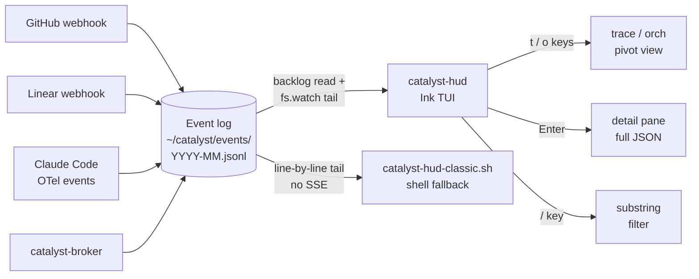

`catalyst-hud` is a full-screen React TUI built on [Ink](https://github.com/vadimdemedes/ink)
that tails the canonical Catalyst event log directly from disk and lets you scroll, filter,
inspect, and pivot on the live event stream. Unlike the [web monitor](./monitor/) — which
subscribes to an SSE feed of orchestrator state — `catalyst-hud` reads
`~/catalyst/events/YYYY-MM.jsonl` line-by-line, so it shows every canonical event in the system
(GitHub, Linear, broker, comms, sessions) and works in a plain terminal with no HTTP server.

## Architecture



Both `catalyst-hud` (Ink) and `catalyst-hud-classic.sh` (shell) read the same JSONL log; they
do not depend on the web monitor's HTTP server. Each canonical event is rendered as one row;
the Ink build adds scrollback, a detail pane, and pivots that the classic shell renderer does
not have.

## Launching

```bash
# Ink TUI (preferred)
catalyst-hud

# Optional flags
catalyst-hud --repo coalesce-labs/catalyst   # filter to one repo
catalyst-hud --since 30m                     # only show events from last 30 min
catalyst-hud --filter '.attributes."event.name" | startswith("github.")'

# Classic shell fallback (minimal deps, no Bun required)
catalyst-hud-classic
```

The Ink entry is a one-line `bun run` wrapper around `orch-monitor/cli/hud.tsx`. Bun is
required for the Ink build; the classic shell version runs on bash alone.

## Keybindings

| Key | Action |
|-----|--------|
| `j` / `↓` | Move selection down one row |
| `k` / `↑` | Move selection up one row |
| `PageDown` | Scroll down one page |
| `PageUp` | Scroll up one page |
| `G` | Jump to bottom (latest event) |
| `/` | Focus the filter input |
| `Enter` | Toggle the detail pane for the selected event |
| `t` | Pivot to the `traceId` of the selected event (CTL-310) |
| `o` | Pivot to the `catalyst.orchestrator.id` of the selected event |
| `r` | Reset all pivots, return to live tail |
| `Esc` | Close detail pane, clear filter, clear pivot |
| `q` / `Ctrl-C` | Exit |

## Columns

Each row renders six columns aligned to fixed widths (CTL-308 / CTL-311):

| Column | Width | Source attribute |
|--------|-------|------------------|
| `TIME` | 8 | `ts` formatted as `HH:MM:SS` |
| `REPO` | 12 | `vcs.repository.name` (last segment) |
| `SOURCE` | 20 | `event.name` prefix (`github`, `linear`, `comms`, `filter`) — falls back to `catalyst.orchestrator.id[/worker.ticket]` for orchestrator events |
| `EVENT` | 14 | Friendly label for `event.name` (e.g. `github.pr.merged` → `merged`, `github.check_suite.completed` → `ci pass`/`ci fail`); truncated to fit |
| `REF` | 14 | First non-empty of `vcs.pr.number` (`#445`), `linear.issue.identifier` (`CTL-316`), or `vcs.ref.name` (`→branch`) |
| `DETAILS` | flex | `body.payload.title`, `body.payload.body`, or `body.message` (truncated to remaining width) |

Row colors are derived from event severity and source, and the selected row is highlighted with
a blue background.

A handful of high-volume events are filtered out before rendering by `shouldSkipEvent`:
`session.heartbeat`, `orchestrator.archived`, `session.started`, `session.ended`, successful
`github.check_run.completed` results, and `filter.wake` events whose payload reason is
`"No matching events found"`.

## Filtering and Pivots

The `/` key focuses the filter input at the bottom of the screen. As you type, every visible
column is joined into a single string and substring-matched (case-insensitive) against your
input. Filtering is purely client-side and applied on top of any active pivot.

Two pivots are available:

- **Trace pivot (`t`)** — narrows the list to every event sharing the selected row's
  `traceId`. Useful for following a single ticket end-to-end across orchestrator/worker/PR
  boundaries.
- **Orchestrator pivot (`o`)** — narrows the list to events with the selected row's
  `catalyst.orchestrator.id`. Useful when one wave is running alongside other work in the
  same log.

Both pivots are exclusive — only one is active at a time. The current pivot is shown above the
filter input as `[trace:abc123…]` or `[orch:orch-2026-05-08…]`. Press `r` to reset the pivot
and return to the full live tail, or `Esc` to clear pivot, filter, and detail pane in one
keystroke.

## Classic Shell Fallback

`catalyst-hud-classic.sh` is the original bash renderer, kept as a minimal-deps fallback for
environments where the Ink build cannot run:

- SSH-from-iPad sessions (Blink, Termius) where Bun isn't installed
- Small VMs or container shells with no Node/Bun runtime
- Quick "is the wave still moving?" checks on a remote host

The classic version uses ANSI escapes, the same color coding, and the same column layout, but
it does **not** include scrollback, the detail pane, the trace/orch pivots, or the substring
filter input — it is a streaming append-only renderer. See [Terminal UI](./terminal/) for the
classic renderer's full feature set and limitations.

## Source

- CLI wrapper (Ink): [`plugins/dev/scripts/catalyst-hud`](https://github.com/coalesce-labs/catalyst/blob/main/plugins/dev/scripts/catalyst-hud)
- Main: [`plugins/dev/scripts/orch-monitor/cli/hud.tsx`](https://github.com/coalesce-labs/catalyst/blob/main/plugins/dev/scripts/orch-monitor/cli/hud.tsx)
- Components: [`plugins/dev/scripts/orch-monitor/cli/components/`](https://github.com/coalesce-labs/catalyst/blob/main/plugins/dev/scripts/orch-monitor/cli/components/) (`Header.tsx`, `EventList.tsx`, `EventRow.tsx`, `FilterInput.tsx`, `DetailPane.tsx`)
- Hooks: [`plugins/dev/scripts/orch-monitor/cli/hooks/`](https://github.com/coalesce-labs/catalyst/blob/main/plugins/dev/scripts/orch-monitor/cli/hooks/) (`useEventLog.ts`, `useFilter.ts`, `useSelection.ts`)
- Classic shell fallback: [`plugins/dev/scripts/catalyst-hud-classic.sh`](https://github.com/coalesce-labs/catalyst/blob/main/plugins/dev/scripts/catalyst-hud-classic.sh)

## Related

- [Web Monitor](./monitor/) — browser-based wave dashboard backed by SSE.
- [Terminal UI](./terminal/) — classic shell renderer details and limitations.
- [catalyst-broker](./catalyst-broker/) — semantic event router that produces many of the
  `filter.wake` events visible in the HUD.
- [Event Forwarder](./forwarder/) — sibling daemon that ships the same event stream to OTLP,
  PostHog, and Cloudflare Analytics Engine.
- [Event Architecture](./events/) — canonical OTel envelope, attribute schema, and CLI.
