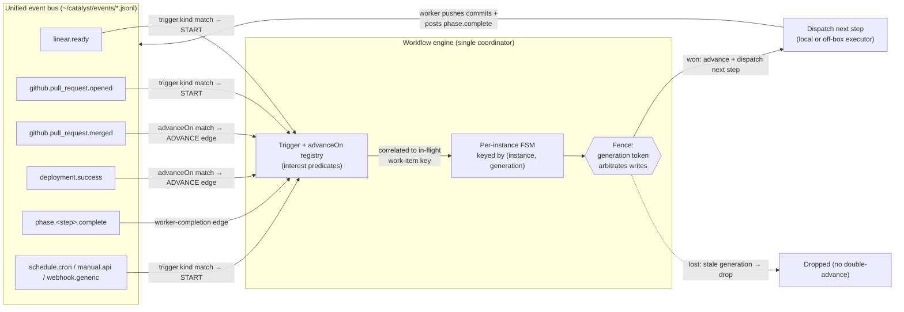

:::caution[This is a roadmap page, not a shipped feature]
Everything below describes **design intent and reserved seams** for a future `workflow/v2` — it
is **not** what Catalyst does today. The shipped pipeline is documented in
[Workflow descriptors](/reference/orchestration/workflows/) and
[Phase agents](/reference/orchestration/phase-agents/).

The binding invariant for v1 is: **no off-box and no off-Linear behavior is *reachable* before
v2.0.** v1 reserves the *shape* of these seams, never their *behavior*. Where this page says
"v2," read "designed, not built." Where it says "reserved," read "the schema accepts the field but
restricts it to a single safe value." Concrete provider endpoints, SDK surfaces, and TTL constants
are deliberately out of scope here — they live in the v2 design doc, not in any shipped schema.
:::

Catalyst's pipeline is a fixed list of phase agents driven by Linear, all running on one box.
That is a deliberate v1 floor, not a ceiling. This page documents the three directions v2 is
designed to grow — **non-Linear triggers**, **off-box executors**, and **event-driven state
transitions** — the one load-bearing primitive that already makes them reachable, and the honest
list of hard problems that gate them.

## The load-bearing insight: the fence is already a distributed token

The single fact that makes off-box and off-Linear work *reachable* (rather than a rewrite) is that
Catalyst's exclusive-claim fence is already a **distributed fencing token**.

Each dispatch persists a monotonic `generation` integer. A worker carries its `CATALYST_GENERATION`;
when it tries to complete, the engine compares the worker's integer against the signal's `generation`
and rejects any stale-generation write. This is a textbook Lamport / Kleppmann fencing token: it
compares **two persisted integers with zero local-process, pid, or host dependency.** The exact same
check that rejects a local false-dead duplicate also rejects a stale completion arriving over a
network.

That means the **at-most-one-*write*** guarantee generalizes off-box **for free**. What does *not*
generalize:

- The local mutual-exclusion *primitive* — `openSync(path, "wx")` (`O_EXCL`) only fences callers that
  share one filesystem.
- Local liveness — `claude agents --json` only sees processes on this box.

So an off-box executor doesn't need a new claim protocol. It needs only to (1) relocate the *claim
caller* to a coordinator, (2) add a *lease + heartbeat* for liveness, and (3) add an *authenticated
bus-ingest* for completion. The fence stays exactly as it is.

:::note[Honest limit, stated up front]
"Needs only a lease, not a new claim" is true **for a single coordinator**. The `O_EXCL` claim
fences only callers sharing one filesystem, so **single-coordinator-instance is a hard v2
invariant.** True HA / failover (two schedulers on one queue) needs a **network-atomic
compare-and-set** backend — S3 `If-None-Match`, Postgres `ON CONFLICT`, Redis `SET NX`, or a Durable
Object. That is genuinely unsolved, and **v1 reserves nothing for it.**
:::

## Direction 1 — Non-Linear triggers

Today a Linear poll is the only thing that can start (or advance) a workflow. The v2 design turns the
monitor into a **registry of trigger adapters** — `registerTriggerAdapter(kind, { onEvent, poll })`
— where the Linear poll is simply the *first* registration, wrapping today's exact handlers with
zero behavior change.

The key enabler already exists: **GitHub envelopes are already on the event bus.** The webhook
receiver appends `github.*` events; the monitor just drops them today. A `bus-event` adapter lets
those same envelopes enter the **same** scheduler — no second pipeline.

A trigger is identified by a `<source>.<entity>.<action>` discriminant, matched 1:1 against the
`event.name` attribute the receiver already writes onto every bus envelope:

| `trigger.kind`               | Meaning                      | Status                            |
| ---------------------------- | ---------------------------- | --------------------------------- |
| `linear.ready`               | Linear ticket moved to Ready | **v1 (the only reachable value)** |
| `github.pull_request.opened` | A PR was opened              | v2                                |
| `github.push`                | A push landed                | v2                                |
| `schedule.cron`              | A cron tick fired            | v2                                |
| `manual.api`                 | An operator hit an API       | v2                                |
| `webhook.generic`            | An arbitrary inbound webhook | v2                                |

Two things make this structural rather than a rewrite:

- **The work-item stays a bare string.** The deepest Linear assumption in the codebase is a single
  regex that interprets a work-item key as `^<PREFIX>-<n>$`. The fix is to route *all* work-item →
  repo-root resolution through the existing `resolveProject` seam; the Linear regex becomes *one*
  implementation (the `source: linear` branch), and the registry owns the mapping (a GitHub item
  resolves its repo root by repo). `workItem.source` is **doc-reserved only** in v1 — there is no
  second computable value today, so a real field would be dead config.
- **Conditions are source-scoped, with no new DSL.** A GitHub PR exposes `pr_*` fields, not
  `estimate`/`scope`; a `when.field` referencing a field the source doesn't expose is a **validation
  error**. That same closed `{field, op, value}` vocabulary also serves a v2 `trigger.match`
  predicate — Catalyst never introduces a second condition language.

**Linear mirror becomes optional per descriptor.** `workflow.linearMirror` (const `true` in v1) gates
the Linear write-back. A v2 non-Linear descriptor sets it `false` and posts verdicts to its native
system (e.g. a GitHub PR comment); steps with no state-map entry simply advance silently, exactly how
the `remediate` step already behaves.

:::caution[Flipping `linearMirror` to `false` is gated on a kill switch]
Today the human-override / kill path is **Linear-state-driven** (a ticket dragged to a specific
state stops the work). A non-Linear workflow has *no* equivalent "stop this work-item" switch until
v2 adds a `manual.api` / `webhook` cancel intent. The mirror flag cannot go `false` before that
channel exists.
:::

## Direction 2 — Off-box executors

The executor is **already one injectable function** — the single shell-out to `phase-agent-dispatch`,
with a `lib/executor.sh` that owns `claude --bg` + `claude stop` behind one file (its header literally
calls itself "the single executor seam"). v2 turns that into a name → impl **executor registry**
behind a small, transport-agnostic adapter — the verbs the engine *already* calls:

```text
ExecutorAdapter (v2):
  dispatch(stepCtx) -> handle      // local: defaultDispatch; remote: provider POST /sessions
  claim(key, gen)   -> won | lost  // local: O_EXCL file; remote: coordinator-owned CAS (v2 backend)
  liveness(handle)  -> busy | idle | absent | unknown
                                   // local: claude agents; remote: lease + provider status
  stop(handle)                     // local: claude stop; remote: provider cancel (best-effort)

  // completion is a CONTRACT, not a verb:
  //   the worker pushes commits to origin/<branch> and posts a
  //   phase.<step>.complete event carrying its `generation`
  //   to the authenticated bus ingest.
```

This is what lets phase work run on **Claude-managed agents** or an **external harness** (Codex cloud
tasks, Devin sessions) instead of a local `claude --bg` job. Crucially, off-box dispatch is **three
coordinator steps, not "relocate the caller"**:

1. `claim` runs **on the coordinator** *before* the provider call — the fence still arbitrates.
2. The returned **handle persists to the signal *before* the provider create returns** — otherwise a
   coordinator crash orphans an uncancellable remote session.
3. There is **no `bg_job_id`-from-stdout analogue** off-box, so the **provider session id *is* the
   handle.**

The signal stays **coordinator-owned**: a remote worker never writes the local signal file. The
coordinator flips it on a *fenced* completion event, preserving the "the signal is the source of
truth" recovery invariant.

The closest prior art is **AWS Step Functions Activities** — an opaque task token, a worker that
polls, and a `SendTaskSuccess` / `SendTaskHeartbeat` report-back over an arbitrary channel. That's
exactly the event-bus model here (and a better fit than GitHub Actions' runner registration or
Temporal's held-TCP long-poll, both wrong for ephemeral ~30-minute agent sessions). The synthesis
Catalyst adopts: **a Temporal-style lease heartbeat on the bus + a Kleppmann fencing token at the
coordinator + a thin per-harness adapter.** Agent-as-a-service providers are poll-based today (none
offer outbound completion webhooks), so polling lives behind the adapter's `dispatch` / `liveness`
verbs.

## The v1 reserved-seam discipline

The rule that reconciles "ship a tight, safe v1" with "don't paint v2 into a corner":

> A **reserved seam is schema-*valid* but value-*restricted*.** It fails as a *known-key bad-value*
> error (`executor: "cloud"` → "must be `local`"). An **unimplemented behavior key fails loud** as an
> *unknown-key* error, because every object level is `additionalProperties: false`.

The consequence is that **a valid v1 file is a valid v2 file by construction**, yet **no v2 behavior
is expressible in it.**

| Reserved field                         | v1 form                                                                     | v2 widening                                                    | Real or doc-only?          |
| -------------------------------------- | --------------------------------------------------------------------------- | -------------------------------------------------------------- | -------------------------- |
| `step.executor`                        | `const "local"` (no `executorConfig` key)                                   | enum widens; `executorConfig` added in the `workflow/v2` schema | reserved (live seam)       |
| `workflow.trigger.kind`                | `const "linear.ready"`; trigger object accepts only `{ kind, linearMirror }` | enum widens to the six kinds                                   | reserved (live seam)       |
| `workflow.linearMirror`                | `const true`                                                                | `false` allowed (gated on a kill channel)                     | reserved (live seam)       |
| `schemaVersion`                        | `"workflow/v1"` selects the frozen v1 validator                             | `"workflow/v2"` = a second, widen-only schema; unknown ⇒ hard-fail | enforced today          |
| `signal.generation`                    | already written every dispatch                                              | reused as the off-box fence token                             | **present today**          |
| `step.claimBackend`, `workItem.source` | **not in the schema** (rejected)                                            | added in `workflow/v2`                                        | doc-reserved only          |

Deliberately **rejected from v1**, so a v1 file can never degenerate into a half-formed v2 file: an
open-string `executor` with a populated `executorConfig`; a pre-widened `trigger.kind` enum;
`workItem.kind` / `registryKey` schema fields; and a `gitRef` input source (a reserved-but-unhandled
value would just be dead config).

## Direction 3 — Event-driven state transitions

The cleanest unifying idea came *after* v1 was framed: **a trigger that *starts* a workflow and an
event that *advances* it are the same primitive** — a registered bus event causing a workflow state
change. The descriptor becomes a true event-driven state machine on the bus that already exists.

There are two kinds of edge:

- **Worker-completion edge** (the v1 default): a step advances when its worker emits
  `phase.<step>.complete.<ticket>`.
- **Event-gated edge** (v2): a step advances when an **arbitrary registered bus event** matches —
  e.g. `monitor-merge` advances on `github.pull_request.merged`, `monitor-deploy` on a
  `deployment.success`.

The second kind **already happens today — but imperatively, hardcoded inside the
`phase-monitor-merge` / `phase-monitor-deploy` skills.** They block on `catalyst-events wait-for`,
then emit their own completion. v2 lifts that into the descriptor as data:

```json
{
  "id": "monitor-merge",
  "linearKey": "inReview",
  "advanceOn": { "event": "github.pull_request.merged", "to": "monitor-deploy" }
}
```

A pure event-wait step can then be **workerless** — the engine just waits for the event and advances,
which *removes* the wait-loops rather than reimplementing them.



The mechanism reuses the existing substrate and adds nothing structurally new: the bus, the broker
(routes by interest), `catalyst-events wait-for` (blocks on predicates), and the monitor's tailer all
exist. The engine registers each `advanceOn` as an interest; on a matching event **correlated to the
in-flight instance** (the envelope already stamps the work-item key), it advances the FSM and
dispatches the next step. The same closed `{field, op, value}` vocabulary serves `advanceOn`, so
"advance on `github.pull_request.merged` **where** `pr.base == main`" needs no new DSL.

Three correctness properties hold the design together:

- **Timeouts.** An event-gated edge is asynchronous — the event may never come. Every such edge needs
  a **timeout → escalate/skip**, exactly like `monitor-deploy`'s `skipped` path today.
- **Completeness gate.** Every step must have **either** a work-done probe (worker edge) **or** an
  `advanceOn` event (event edge). A step with neither is a validation error.
- **Idempotency via the fence.** The generation token still arbitrates: an external event arriving
  twice advances the instance **once** (keyed by `(instance, generation)`); a late event for a
  superseded generation is dropped by the very same fence that drops a stale worker completion.

**v1 reservation here is essentially none** — `advanceOn` is a purely additive key in `workflow/v2`,
rejected in v1 by `additionalProperties: false`, so no v1 field is spent. The one thing worth
reserving now is a `workflowId` / `instanceId` namespace on signals and events, for when
multi-workflow lands.

## Named / multi-workflow

The descriptor already carries an `id` (`"default"`) and a `schemaVersion`, so multi-workflow is
**just an id-keyed registry** — a built-in `default` alongside user-named descriptors like
`pr-review` or `hotfix`. A trigger event would select *which* workflow to instantiate: each
descriptor declares its `trigger` with an optional `match` predicate (the same `{field, op, value}`),
and the engine instantiates the **first match** (ambiguity → an explicit `priority`). An instance is
keyed by `(workflowId, workItemId)` so a ticket pipeline and a PR-review pipeline can touch related
work items without signal collision.

**v1 ships the single, unnamed `default`.** Naming is a v2 authoring nicety (a future
`catalyst-workflow` CLI), not needed for v1 — and the `id` / `schemaVersion` / `trigger` shape
already reserves it.

## The honest hard problems v2 must solve

These are named, not waved away. They are the reason off-box and off-Linear are *reserved* rather
than *shipped*:

- **Distributed claim.** Multi-coordinator HA needs a network-atomic CAS backend. v1 reserves nothing
  for it; single-coordinator is a hard v2 invariant.
- **Probe portability — v2-blocking.** The work-done probes read git **of the local worktree**.
  Off-box, there is no local worktree, so every probe returns false and **the reclaim safety net
  vanishes.** v2 must give the coordinator a **mirror clone** (fetching `origin/<branch>`) or a shared
  store before any off-box step can run. This is a blocker, not a seam.
- **Off-box artifact handoff.** The `thoughts/*` research/plan docs and the prior-artifact gate must
  be read from `origin/<branch>`, or a mixed local/off-box pipeline **strands** at "prior artifact
  missing." This is why v1 keeps `input` strictly `null | {signal} | {glob}` and refuses a `gitRef`
  source.
- **Ingest as new code and a new SPOF.** The agent-completion ingest needs a **fence-on-ingest** check
  that **fails CLOSED** — locally the fence fails *open* on a missing/non-numeric generation (fine for
  legacy local emits), but over the network a dropped or garbled generation must be rejected `4xx`,
  never accepted — plus a **fsync-before-`2xx`** exactly-once contract. The host-independent
  commits-ahead reclaim probe (via the mirror clone) is the safety net for a dropped completion POST.
- **Lease-TTL false-death.** A legitimate long sub-agent fan-out can outrun a naive lease and look
  dead — the same false-positive trap that already bites local workers, re-derived off-box.
- **Branch push-races.** A false-dead `gen-N` and its `gen-N+1` revive can *both* push before the
  signal fence rejects the loser. This needs **git-ref fencing** — force-reset to `origin/main` on
  revive, or generation-namespaced refs the coordinator promotes.
- **Network-partition-vs-death.** The fence keeps the *write* correct, but a partition still wastes a
  paid duplicate session.
- **Heterogeneous cost attribution.** Devin / Codex emit no Claude OTEL, so cost telemetry has no
  common substrate.
- **The non-Linear kill switch.** Until a `manual.api` / `webhook` cancel intent exists, a non-Linear
  workflow has no operator stop control.

## The phase ladder

The order in which these become reachable. Each rung is gated on the one before it.

```text
CTL-736 Ph1     DONE        exclusive claim + fence merged          ┐ stabilization
CTL-736 Ph2-3   in flight   state.json trigger, probe               ┘ (must close first)
        │
v1.0    descriptor PROVENANCE SWAP — collapse the ~10 hardcoded sites behind one
        │   descriptor; drift-guard against today's literals. ZERO new value reachable.  (DONE)
v1.1    conditions + effort/model/preamble levers wired into dispatch.                    (DONE)
        │
v1.2    data-driven verify → remediate edge (the lone branch expressed as data).          (roadmap)
        │
v2.0    workflow/v2 schema — executor + trigger adapters widen the enums; off-box and
            non-Linear become reachable. Gated on the hard problems above.                (roadmap)
```

## What this means for you today

The descriptor that ships today (`plugins/dev/scripts/lib/workflow.default.json`) is **v1**:
`executor` is implicitly `local`, `trigger.kind` is `"linear.ready"`, `linearMirror` is `true`, and
`schemaVersion` is `"workflow/v1"`. Any other value is rejected by the schema — on purpose. When v2
lands, a v1 file keeps working untouched, because a valid v1 file is a valid v2 file by construction.
Nothing on this page changes how the shipped pipeline behaves; it documents the seams that were
deliberately left reachable so that it *can* change later without a rewrite.

See [Workflow descriptors](/reference/orchestration/workflows/) and
[Phase agents](/reference/orchestration/phase-agents/) for what Catalyst actually does today.
