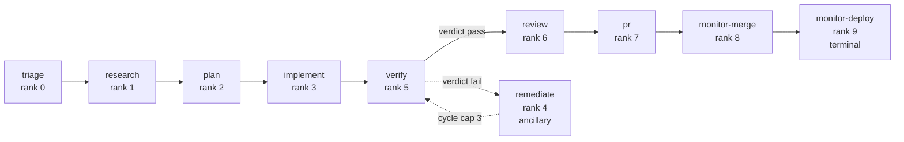

A **workflow descriptor** is the orchestrator's ticket pipeline expressed as **data** instead of
code. The ordered list of phases and every per-phase attribute (successor edge, Linear state key,
preemption rank, input artifact, completion probe) used to be re-encoded across **~10 hardcoded
sites** kept in lockstep by hand. The descriptor collapses them into a single JSON file —
`plugins/dev/scripts/lib/workflow.default.json` — that is the one source of truth.

:::caution[Not the manual dev cycle]
This page is about the **orchestration descriptor** — the machine-readable definition of the
autonomous phase-agent pipeline. It is **different** from
[Workflows](/reference/workflows/), which documents the **Level-2 manual** research → plan →
implement → validate → ship cycle a human drives interactively. This page is "how is the
orchestrator's pipeline encoded so it can be edited as config."
:::

:::note[Implementation status]
**v1 ships in two merged slices.** The *provenance swap* (`workflow.default.json` +
`workflow-descriptor.mjs`) makes the JSON the single source of truth with **zero behavior change** —
drift-guarded to deep-equal the historical constants. The per-step **`model` / `effort` / preamble
levers and the conditional rules engine are wired into dispatch**: the flagship `plan` rule below
fires for `large`/`epic` tickets today (a real worker launches with `--effort max --model opusplan`
plus a `/workflows` postamble).

Designed but **not yet shipped** (marked **(roadmap)** below): the data-driven `next` edge (the
`verify → remediate` branch is still hardcoded), per-ticket override files + the layered
merge/pin, a user-facing `.catalyst/workflows/` location, bash codegen (the node-free recovery
mirror is still hand-maintained + drift-guarded), and the **(v2)** reserved seams (off-box
executors, non-Linear triggers — see [Extensibility &
roadmap](/reference/orchestration/extensibility/)).
:::

## Why descriptors exist: one pipeline, ten copies

The same ordered phase list and its per-phase attributes were duplicated across roughly ten places
that had to move together:

| Site                                                     | What it encodes                                   |
| -------------------------------------------------------- | ------------------------------------------------- |
| `lib/phase-fsm.mjs` `PHASES`                             | the ordered phase list (canonical)                |
| `lib/phase-fsm.mjs` `NEXT_PHASE`                         | happy-path successor edges                        |
| `lib/phase-fsm.mjs` `PHASE_LINEAR_KEY`                   | phase → Linear stateMap key                       |
| `execution-core/scheduler.mjs` `STAGE_RANK`              | per-phase preemption rank (non-dense)             |
| `execution-core/scheduler.mjs`                           | `TERMINAL_PHASE`, `NEW_WORK_ENTRY_PHASE`, …       |
| `phase-agent-dispatch` `prior_artifact_for_phase()`      | each step's input artifact                        |
| `phase-agent-dispatch` `phase_default_turn_cap()`        | each step's default turn cap                      |
| `execution-core/work-done-probes.mjs` `WORK_DONE_PROBES` | per-step completion probe                         |
| `lib/phase-sequence.sh` `PHASES` (bash)                  | bash mirror (node-free recovery path)             |
| `orchestrate-phase-advance`                              | `phase_next()` + `linear_key_for_phase()` mirrors |

Adding, removing, or reordering a step meant editing all of these and trusting a byte-identical
drift-guard to catch divergence. The pipeline was also **singular** — no way to express a second
workflow without forking the engine. The descriptor extracts the *definition* into data without
rebuilding the substrate (dispatch, claim/fencing, the event bus, recovery, concurrency are already
general).

## Format: canonical JSON

The descriptor is **JSON**, validated by a versioned JSON Schema (`schemaVersion: "workflow/v1"`).
The choice is over-determined by the existing system:

- **The engine is already all-JSON with no non-stdlib parsers in the core.** `phase-fsm.mjs` imports
  nothing; every signal, the registry, and config are `JSON.parse`d. The **bash recovery path is
  deliberately node-free** and reads JSON via `jq` — there is no bash YAML reader.
- **The primary author is a headless agent.** LLMs emit valid JSON natively and self-correct against
  a schema error deterministically; whitespace-significant YAML is a top LLM failure mode (and Linear
  ids like `CTL-736` plus `#` comments collide with YAML syntax).
- **The orch-monitor UI round-trips JSON losslessly** via `JSON.stringify(obj, null, 2)` + atomic
  `tmp+rename` — there is no comment/format to destroy on a form save.

| Format       | Verdict                                                                                      |
| ------------ | -------------------------------------------------------------------------------------------- |
| **JSON**     | ✅ Canonical. Zero new deps; agent-emittable; lossless UI round-trip; JSON-Schema-validatable. |
| YAML         | ❌ Agent-authorability + node-free bash; UI edits would invalidate a YAML source.              |
| TOML         | ❌ Array-of-tables unreadable for nested step objects; no round-trip-with-comments JS lib.     |
| JS/TS module | ❌ Executing agent-authored code is an RCE problem; can't render as a UI form.                 |

JSON's two warts are recovered without a second format: **multi-line prompts**
(`preamble`/`postamble`) are stored as **arrays of lines**, joined with `\n` at load (clean diffs,
editable as a UI textarea); **comments** are first-class `$comment` / `description` *data* fields
that survive UI form saves because they are real data, not lexical trivia.

## The default pipeline descriptor

This is the real shipped `plugins/dev/scripts/lib/workflow.default.json`:

```json
{
  "$comment": "Default ticket pipeline — the single source of truth for the phase-list constants that were duplicated across phase-fsm.mjs and scheduler.mjs.",
  "schemaVersion": "workflow/v1",
  "id": "default",
  "trigger": { "kind": "linear.ready" },
  "linearMirror": true,
  "entryStep": "research",
  "terminalStep": "monitor-deploy",
  "steps": [
    { "id": "triage",         "rank": 0, "preemptable": false, "linearKey": null,          "next": "research" },
    { "id": "research",       "rank": 1, "linearKey": "research",   "next": "plan" },
    { "id": "plan",           "rank": 2, "linearKey": "planning",   "next": "implement",
      "effort": "high",
      "rules": [
        { "when": { "field": "ticket.scope", "op": "in", "value": ["large", "epic"] },
          "set": { "effort": "max", "model": "opusplan" },
          "appendPostamble": [
            "This is a large ticket (scope: ${ticket.scope}, ~${ticket.estimate} pts).",
            "Use the /workflows Workflow tool to decompose the plan into parallel sub-steps before writing the final plan document."
          ] }
      ] },
    { "id": "implement",      "rank": 3, "linearKey": "inProgress", "next": "verify" },
    { "id": "verify",         "rank": 5, "linearKey": "verifying",  "next": "review" },
    { "id": "review",         "rank": 6, "linearKey": "reviewing",  "next": "pr" },
    { "id": "pr",             "rank": 7, "linearKey": "inReview",   "next": "monitor-merge" },
    { "id": "monitor-merge",  "rank": 8, "linearKey": "inReview",   "next": "monitor-deploy" },
    { "id": "monitor-deploy", "rank": 9, "preemptable": false, "linearKey": "inReview", "next": null }
  ],
  "ancillarySteps": [
    { "id": "remediate", "rank": 4, "linearKey": "remediating", "cycleWith": "verify" }
  ],
  "cycles": [
    {
      "id": "verify-remediate",
      "members": ["verify", "remediate"],
      "cap": 3,
      "countBy": "event",
      "reset": { "signals": ["phase-verify.json", "phase-remediate.json", "verify.json"], "releaseClaims": true }
    }
  ]
}
```



| Field                 | Type           | Default | Description                                                                                                                             |
| --------------------- | -------------- | ------- | --------------------------------------------------------------------------------------------------------------------------------------- |
| `schemaVersion`       | string         | —       | Selects the frozen validator. `"workflow/v1"` is the only legal value today.                                                            |
| `id`                  | string         | —       | Descriptor id. v1 ships the single `"default"`; an id-keyed registry of named workflows is **(v2)**.                                     |
| `trigger.kind`        | string         | —       | What starts a run. `const "linear.ready"` in v1; the enum widens **(v2)**.                                                               |
| `linearMirror`        | boolean        | —       | Gates the per-step Linear state write-back. `const true` in v1; `false` for a non-Linear workflow **(v2)**.                              |
| `entryStep`           | string         | —       | The step new work enters at (`research`). Mirrors `NEW_WORK_ENTRY_PHASE`.                                                                |
| `terminalStep`        | string         | —       | The terminal step (`monitor-deploy`). Mirrors `TERMINAL_PHASE`.                                                                          |
| `steps[]`             | array          | —       | The ordered happy-path pipeline. Merged **by `id`**, never by array index.                                                              |
| `steps[].rank`        | number         | —       | **Explicit** preemption rank — not array-index-derived. Mirrors the non-dense `STAGE_RANK`.                                              |
| `steps[].preemptable` | boolean        | `true`  | Whether the scheduler may preempt this step. `triage` and `monitor-deploy` set `false`.                                                 |
| `steps[].linearKey`   | string \| null | —       | The `stateMap` key written to Linear when this step starts. `null` = no transition (e.g. `triage`).                                      |
| `steps[].next`        | string \| null | —       | Successor step id; `null` on the terminal step. In v1 every `next` is a bare string and the lone branch (`verify → remediate`) is still hardcoded; expressing it as data is **(roadmap)**. |
| `steps[].effort`      | string         | —       | Reasoning lever (see below). Only `plan` carries one today (`"high"`).                                                                   |
| `steps[].rules[]`     | array          | —       | Conditional lever patches (see [The conditional rules engine](#the-conditional-rules-engine)).                                           |
| `ancillarySteps[]`    | array          | —       | Off-the-happy-path steps (e.g. `remediate`). Carry an **explicit `rank`** to preserve `STAGE_RANK`'s `Object.keys` order.                |
| `cycles[]`            | array          | —       | Named, durable cycle definitions (see below).                                                                                            |

**Why `remediate` lives in `ancillarySteps[]`, not `steps[]`:** it has an explicit `rank: 4` (not
array-index-derived). This preserves the non-dense `STAGE_RANK` whose `Object.keys` order is
`[...PHASES, "remediate"]` — which both the preemption logic and the drift-guard depend on.

**Why `countBy: "event"` is load-bearing:** the cycle cap is counted from the immutable event log,
which **survives** the signal deletion the reset performs. Re-deriving the cap from signal files
(which the reset deletes) would reset it to 0 each cycle → an infinite remediate loop. The reset's
**`releaseClaims: true`** is the declarative form of a real fix — under CTL-736 generation fencing
the cycle reset must also glob-unlink the `*.claim.<gen>` tombstones, or the second `verify` loses
its claim and never dispatches. (See [GATE-0](https://github.com/coalesce-labs/catalyst/blob/main/docs/workflow-descriptors-design.md) in the design doc.)

## Per-step execution levers — three orthogonal axes

A step controls *how* its worker runs through **three independent levers**. Keeping them separate is
deliberate; a single rule can set all three, and all thread to native `claude` CLI flags.

| Lever                  | Field                  | Threads to                      | What it changes                                |
| ---------------------- | ---------------------- | ------------------------------- | ---------------------------------------------- |
| **Model**              | `model`                | `claude --model <v>`            | *which* model runs                             |
| **Effort (reasoning)** | `effort`               | `claude --effort <v>`           | *how hard* it reasons                          |
| **Prompt directives**  | `preamble`/`postamble` | `claude --append-system-prompt` | *what the worker does* (e.g. use `/workflows`) |

1. **`model` — which model.** Accepts a latest-model alias (`opus`, `sonnet`, `haiku`), a full id
   (`claude-opus-4-8`), **or a Claude Code model alias** — including **`opusplan`** ("Opus Plan
   Mode": Opus for plan-mode reasoning, Sonnet for execution). So `"model": "opusplan"` is a valid,
   first-class step value — a model-selection lever, **unrelated** to the `/workflows` keyword.
2. **`effort` — how hard it reasons.** `claude` exposes a **native** `--effort <low|medium|high|xhigh|max>`
   flag; the descriptor `effort` enum mirrors it exactly (plus omitting the flag). It is independent
   of `model`: combine `model: opusplan` + `effort: max` freely.
3. **`preamble` / `postamble` — prompt directives.** The *"`workflows` keyword in a prompt"*
   mechanism — it changes **what the worker does**, not which model or how hard it thinks. Dispatch
   composes `preamble` + `postamble` + any rule `append*` lines into a single
   `--append-system-prompt` block.

:::note[`/effort ultracode` is bundled — the descriptor keeps levers unbundled]
The interactive `/effort ultracode` convenience *bundles* high effort **plus** auto-`/workflows`
orchestration — levers 2 **and** 3 together. The descriptor keeps them unbundled so authors opt into
each independently; to reproduce "ultracode," set a high `effort` **and** add the `/workflows`
postamble.
:::

## The conditional rules engine

Every condition uses **one structured predicate shape** — not a string DSL, not JS `eval`:

```json
{ "field": "ticket.scope", "op": "in", "value": ["large", "epic"] }
```

- **v1 ops: `{ eq, gte, lt, in }`** — a deliberately small set. `matches`/regex is excluded (ReDoS
  surface). `allOf`/`anyOf`/`not` composition is **(v2)**.
- **Why structured, not a string:** the object binds 1:1 to UI form controls (field/op/value), is
  statically validatable, and is structurally incapable of arbitrary code execution.
- **`rules[]` shape:** `{ when, set: {…fields to patch…}, appendPreamble: [...], appendPostamble: [...] }`.
  Resolution is a pure function `resolveStep(baseStep, context) → effectiveStep`: matching rules patch
  in array order (last-match-wins for `set`; `append*` accumulate), emitting an `_applied` audit
  trail so the HUD can show *why* a step resolved as it did.

### The flagship example: large / epic → max effort + opusplan + `/workflows`

The `plan` step carries the marquee rule. For a `large` or `epic` ticket it switches the planner to
**`effort: max`** and the **`opusplan`** model and appends a postamble telling the worker to
decompose via the `/workflows` tool — all three levers fired by one rule. A normal-scope ticket
keeps the baseline `effort: high` and the default model; only `large` / `epic` escalate. This is
live in dispatch today.

### The frozen context contract

A `when.field` may only reference a documented context path; an **unknown path is a validation
error**, not silent-false — otherwise an agent can't tell "my rule is wrong" from "my rule didn't
match." The v1 context:

| Path                                              | Source                                                    | Notes                                                  |
| ------------------------------------------------- | --------------------------------------------------------- | ------------------------------------------------------ |
| `ticket.scope`                                    | `triage.json.estimated_scope`                             | `small`\|`medium`\|`large`\|`epic`                     |
| `ticket.estimate`                                 | `scope→points` map `{small:1, medium:3, large:8, epic:13}` | the numeric binding the flagship example needs         |
| `ticket.priority`, `ticket.labels`, `ticket.team` | Linear projection                                         | —                                                      |

:::caution[The flagship rule must actually fire]
An earlier design predicated on `estimate >= 5 → ultra thinking`, but `triage.json` writes
`estimated_scope` as a *word*, not a numeric points field — that rule would ship **dead** (silently
false). v1 therefore ships the `scope→points` map as a real context binding, and the example
predicates on `ticket.scope in [large, epic]` — a field that exists today.
:::

## How it is consumed

`lib/workflow-descriptor.mjs` loads `lib/workflow.default.json` and **re-exports the identical
constant names** the engine already imports — `PHASES`, `NEXT_PHASE`, `PHASE_LINEAR_KEY`,
`STAGE_RANK` (including `Object.keys` order), `TERMINAL_PHASE`, `NEW_WORK_ENTRY_PHASE`,
`NON_PREEMPTABLE_PHASES`, `ANCILLARY_PHASES`, `REMEDIATE_PHASE`. `phase-fsm.mjs` and `scheduler.mjs`
re-source them, so the swap changes their *source*, not their *interface*.

The provenance swap is proven, not asserted: a **drift-guard test** (`workflow-descriptor.test.mjs`)
asserts the descriptor-derived constants **deep-equal the frozen historical literals** — including
`Object.keys(STAGE_RANK)` *order* — before any consumer switched source. The node-free bash recovery
path (`phase-sequence.sh`, `orchestrate-phase-advance`) is still **hand-maintained and
drift-guarded** in v1; generating it from the descriptor is **(roadmap)**.

Dispatch resolves a ticket's levers with one **fail-open** `bun` call that reads only the descriptor
JSON, **hoisted before the CTL-736 claim window** — two concurrent `node` launches would race the
execution-core lockfile and reopen the double-spawn bug CTL-736 just closed, so the resolve must
touch no lockfile.

## How it layers (roadmap)

Today the engine resolves each ticket's `rules` against its triage scope at dispatch time; there is
a single `workflow.default.json`. The **layered override model** below is designed but **not yet
shipped**:

```text
effective = merge(
  engine-default descriptor,                   // shipped today = the pipeline
  .catalyst/workflows/default.json,            // global, committable  (roadmap)
  workers/<ticket>/workflow-override.json )    // per-ticket merge patch (roadmap)
```

- **Per-ticket overrides** would be restricted to **leaf fields** (`model`, `effort`, `preamble`,
  `postamble`, `rules`); routing / `next` overrides stay forbidden so a one-off patch can never
  construct an unreachable or cyclic graph.
- **No mid-flight surprises:** at first dispatch the engine would stamp a frozen
  `resolved-workflow.json`; every later dispatch reads the **pin**, not the live global — applying
  CTL-736's "no mid-flight surprises" fencing discipline so a global edit can never mutate an
  in-flight run.

## Roadmap

Beyond the layering above, the **(v2)** direction — **off-box executors** (Devin / Codex / Claude
Managed Agents) and **non-Linear triggers** (GitHub PRs, cron, webhooks) — is built on one insight:
CTL-736's generation token is **already a distributed fencing token** (two persisted integers, no
pid/host dependency), so the *at-most-one-write* guarantee generalizes off-box for free. The schema
reserves these seams as **value-restricted** (e.g. `trigger.kind` is `const "linear.ready"` in v1),
so a v1 file is a valid v2 file by construction yet expresses no v2 behavior. See
[Extensibility & roadmap](/reference/orchestration/extensibility/) for the full picture.

## Related

- [Phase agents](/reference/orchestration/phase-agents/) — the phase skills the descriptor's steps dispatch
- [Scheduler](/reference/orchestration/scheduler/) — stage-rank + preemption, sourced from the descriptor
- [Extensibility & roadmap](/reference/orchestration/extensibility/) — non-Linear triggers + off-box executors (v2)
- [Workflows](/reference/workflows/) — the **manual** Level-2 dev cycle (distinct from this page)
- [Configuration](/reference/configuration/) — full config reference
