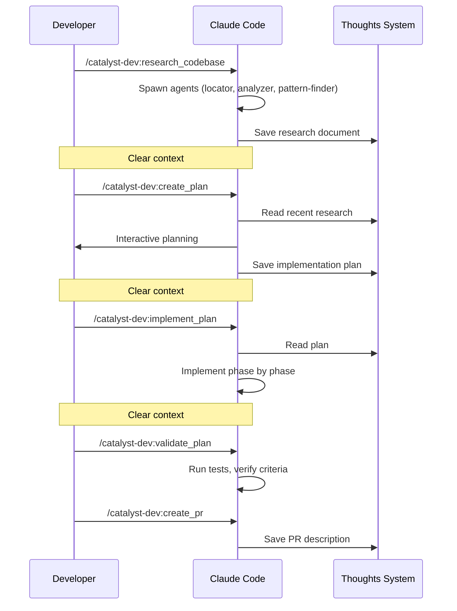

Catalyst's development workflow chains together: **research, plan, implement, validate, and ship**. Each phase produces a persistent artifact that feeds the next, with clean context handoffs in between.

## Development Workflow



### 1. Research

```
/catalyst-dev:research_codebase
```

Describe what you want to understand. Catalyst spawns parallel research agents (locator, analyzer, pattern-finder), documents what exists in the codebase, and saves findings to `thoughts/shared/research/`.

Clear context after research completes. The research document persists — the next skill finds it automatically.

### 2. Plan

```
/catalyst-dev:create_plan
```

Catalyst auto-discovers your most recent research, reads it, and interactively builds a plan with you — including automated AND manual success criteria. Saved to `thoughts/shared/plans/`.

If revisions are needed: `/catalyst-dev:iterate_plan`.

Clear context after the plan is approved.

### 3. Implement

```
/catalyst-dev:implement_plan
```

Catalyst auto-finds your most recent plan, reads it fully, and implements each phase sequentially with automated verification after each phase. Checkboxes update as work completes.

### 4. Validate

```
/catalyst-dev:validate_plan
```

Verifies all success criteria, runs automated test suites, documents deviations, and provides a manual testing checklist.

### 5. Ship

```
/catalyst-dev:create_pr
```

Creates a pull request with a description generated from your research and plan, linked to the relevant ticket.

## Workflow Patterns

### Quick Feature

The standard flow for a well-scoped ticket:

```bash
/catalyst-dev:research_codebase          # Research
# Clear context
/catalyst-dev:create_plan                # Plan
# Clear context
/catalyst-dev:implement_plan             # Implement
# Clear context
/catalyst-dev:commit && /catalyst-dev:create_pr  # Ship
```

### Multi-Day Feature

For larger work that spans sessions:

```bash
# Day 1
/catalyst-dev:research_codebase
/catalyst-dev:create_handoff
# Day 2
/catalyst-dev:resume_handoff
/catalyst-dev:create_plan
/catalyst-dev:create_handoff
# Day 3
/catalyst-dev:resume_handoff
/catalyst-dev:implement_plan             # Phases 1-2
/catalyst-dev:create_handoff
# Day 4
/catalyst-dev:resume_handoff
/catalyst-dev:implement_plan             # Phases 3-4
/catalyst-dev:validate_plan
/catalyst-dev:commit && /catalyst-dev:create_pr
```

### One-Shot

For straightforward tasks, chain the entire workflow:

```
/catalyst-dev:oneshot PROJ-123
```

Runs research, planning, and implementation in a single invocation with context isolation between phases.

## Handoffs

Each phase ends with "clear context" — that's intentional. Long sessions are where AI loses the thread.

If you need to pause mid-workflow (end of day, context getting long, waiting on something), create a handoff:

```
/catalyst-dev:create_handoff
```

This compresses the current session into a persistent document: what was done, what's left, decisions made, and file references. Resume later with:

```
/catalyst-dev:resume_handoff
```

Handoffs are cheap (under a minute) and you should use them liberally.

## Auto-Discovery

You don't need to specify file paths between skills. Catalyst tracks your workflow automatically:

- `research_codebase` saves research → `create_plan` auto-references it
- `create_plan` saves plan → `implement_plan` auto-finds it
- `create_handoff` saves handoff → `resume_handoff` auto-finds it

## Parallel Development with Worktrees

Git worktrees let you work on multiple features simultaneously, each in its own directory with shared context through the thoughts system.

### When to Use Worktrees

**Use worktrees for**: large features, parallel work on multiple tickets, keeping the main branch clean, isolated testing environments.

**Skip worktrees for**: small fixes, single features, short-lived branches.

### Creating a Worktree

```
/catalyst-dev:create_worktree PROJ-123 feature-name
```

This creates a git worktree at `~/wt/{project}/{PROJ-123-feature-name}/` with a new branch, `.claude/` copied over, dependencies installed, and `thoughts/` shared via symlink.

### Parallel Sessions

Run separate Claude Code sessions in different worktrees:

```bash
# Terminal 1 — Feature A
cd ~/wt/api/PROJ-123-feature-a && claude
/catalyst-dev:implement_plan

# Terminal 2 — Feature B
cd ~/wt/api/PROJ-456-feature-b && claude
/catalyst-dev:implement_plan

# Terminal 3 — Research (main repo)
cd ~/projects/api && claude
/catalyst-dev:research_codebase
```

All worktrees share the same thoughts directory via symlink. Plans created in one worktree are visible in all others.

### Managing Worktrees

```bash
git worktree list                                          # List all
git worktree remove ~/wt/my-project/PROJ-123-feature       # Remove after merge
git worktree prune                                         # Clean stale references
```

The worktree location defaults to `~/wt/{repo}` but can be customized with `GITHUB_SOURCE_ROOT`.

## Best Practices

### Context Management

Context is the most important resource. Keep utilization between 40-60% of the window (check with `/context`).

Clear context between workflow phases, when context reaches 60%, or when the AI starts repeating errors or forgetting earlier decisions.

**Why subagents matter**: Each agent gets its own context window, works its specific task, and returns only a summary. Three agents in parallel use far less main context than doing the same work inline.

### Planning

Always include in plans:
1. **Overview** — What and why
2. **Current state** — What exists now
3. **Desired end state** — Clear success definition
4. **What we're NOT doing** — Explicit scope control
5. **Phases** — Logical, incremental steps
6. **Success criteria** — Separated into automated and manual

Resolve all decisions during planning — no open questions in final plans.

### Implementation

Follow the plan's intent, not its letter. When reality differs — a file moved, a better pattern found — adapt and document the deviation. If the core approach is invalid, stop and ask before proceeding.

Verify incrementally: implement → test → fix → mark complete for each phase.

### Anti-Patterns

| Anti-Pattern | Better Approach |
|-------------|-----------------|
| Loading entire codebase upfront | Progressive discovery with agents |
| Monolithic research requests | Parallel focused agents |
| Vague success criteria | Separated automated/manual checks |
| Implementing without planning | Research → plan → implement |
| Losing context between sessions | Persist to thoughts, use handoffs |
| Scope creep in plans | Explicit "what we're NOT doing" |
