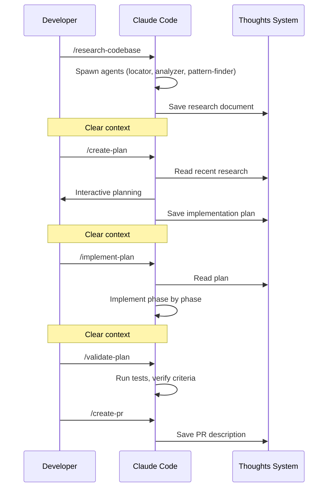

Catalyst's development workflow chains together: **research, plan, implement, validate, and ship**. Each phase produces a persistent artifact that feeds the next, with clean context handoffs in between.

## In Plain English

The intended development cycle is:

1. You point Catalyst at a ticket or goal.
2. Catalyst researches the existing code and writes down what it found.
3. Catalyst turns that into an implementation plan with clear success criteria.
4. Catalyst makes the changes in small steps and verifies each step as it goes.
5. Catalyst opens a PR, waits for CI and automated reviewers, fixes actionable feedback, and keeps checking until the PR is either clean or clearly blocked on a human decision.
6. Once the PR is clean, Catalyst can merge it and update the linked Linear ticket.

The important mindset is that "opened a PR" is not the finish line. The finish line is one of:

- the PR is clean and ready to merge
- the PR has merged successfully
- Catalyst can point to a real human-only blocker, such as "needs approval from a reviewer"

## What Catalyst Should Do

- Read the existing codebase before making broad changes.
- Save research, plans, PR descriptions, and handoffs so later steps do not depend on chat memory.
- Keep the branch up to date with `main` before asking to merge.
- Run local verification before shipping when the project defines a test command.
- Wait for CI checks and automated review comments after opening a PR.
- Fix actionable review comments and re-poll the merge state instead of stopping at "PR created."
- Update Linear states as work moves from implementation to review to done.
- Stop and report clearly when the remaining blocker is genuinely human-owned.

## What Catalyst Should Not Do

- It should not merge with known failing checks.
- It should not bypass GitHub protections with `--admin`, force pushes to protected branches, or other shortcuts.
- It should not treat unresolved review comments as "someone else will handle this."
- It should not tell you a PR is done just because the PR exists.
- It should not silently change scope after planning. If the plan is wrong, it should stop and say so.
- It should not assume GitHub is enforcing review rules that have not actually been configured in the repository.

## Development Workflow



### 1. Research

```
/research-codebase
```

Describe what you want to understand. Catalyst spawns parallel research agents (locator, analyzer, pattern-finder), documents what exists in the codebase, and saves findings to `thoughts/shared/research/`.

Clear context after research completes. The research document persists — the next skill finds it automatically.

### 2. Plan

```
/create-plan
```

Catalyst auto-discovers your most recent research, reads it, and interactively builds a plan with you — including automated AND manual success criteria. Saved to `thoughts/shared/plans/`.

If revisions are needed: `/iterate-plan`.

Clear context after the plan is approved.

### 3. Implement

```
/implement-plan
```

Catalyst auto-finds your most recent plan, reads it fully, and implements each phase sequentially with automated verification after each phase. Checkboxes update as work completes.

### 4. Validate

```
/validate-plan
```

Verifies all success criteria, runs automated test suites, documents deviations, and provides a manual testing checklist.

### 5. Ship

```
/create-pr
```

Creates a pull request with a description generated from your research and plan, linked to the relevant ticket.

In Catalyst's intended flow, shipping has two distinct stages:

1. `/create-pr` gets the branch into review and works the PR until it is clean or clearly blocked.
2. `/merge-pr` performs the final verification and squash merge once the PR is ready.

### Shipping Loop

After a PR is opened, Catalyst should continue through this loop instead of stopping immediately:

1. Wait for CI checks, preview deploys, and automated reviewers to report back.
2. Read review comments and group them by actual issue, not by comment count.
3. Fix actionable feedback in code.
4. Resolve review threads when the feedback has been addressed.
5. Re-run local verification as needed.
6. Re-check GitHub merge state.
7. Repeat until the PR is clean or the only remaining blocker is a human gate.

Typical human gates are:

- an approval that a repository rule requires
- a design or product decision
- a merge conflict that needs a human judgment call

Typical non-human blockers that Catalyst should usually handle itself are:

- branch is behind `main`
- CI is failing because of code issues
- review comments from automated tools
- draft PR state
- unresolved review threads

### GitHub Gates vs Catalyst Behavior

Catalyst can behave as though reviews and checks matter, but GitHub only blocks merges based on the
rules configured in the repository.

That means there are two separate layers:

- **Catalyst behavior**: what the skills try to do before merging
- **GitHub enforcement**: what the repository rules or rulesets actually require

If you want merges to be blocked until checks, approvals, or resolved threads are complete, that
must be configured in GitHub. Catalyst should honor those rules, but it does not create them by
itself.

## Workflow Patterns

### Quick Feature

The standard flow for a well-scoped ticket:

```bash
/research-codebase          # Research
# Clear context
/create-plan                # Plan
# Clear context
/implement-plan             # Implement
# Clear context
/commit && /create-pr  # Ship
```

### Multi-Day Feature

For larger work that spans sessions:

```bash
# Day 1
/research-codebase
/create-handoff
# Day 2
/resume-handoff
/create-plan
/create-handoff
# Day 3
/resume-handoff
/implement-plan             # Phases 1-2
/create-handoff
# Day 4
/resume-handoff
/implement-plan             # Phases 3-4
/validate-plan
/commit && /create-pr
```

### One-Shot

For straightforward tasks, chain the entire workflow:

```
/oneshot PROJ-123
```

Runs research, planning, and implementation in a single invocation with context isolation between phases.

When `/oneshot` is used for shipping work, the expected behavior is still the same: do the work,
open the PR, wait for review signals, address fixable feedback, and only stop when the PR is truly
ready or genuinely blocked.

## Handoffs

Each phase ends with "clear context" — that's intentional. Long sessions are where AI loses the thread.

If you need to pause mid-workflow (end of day, context getting long, waiting on something), create a handoff:

```
/create-handoff
```

This compresses the current session into a persistent document: what was done, what's left, decisions made, and file references. Resume later with:

```
/resume-handoff
```

Handoffs are cheap (under a minute) and you should use them liberally.

## Auto-Discovery

You don't need to specify file paths between skills. Catalyst tracks your workflow automatically:

- `research-codebase` saves research → `create-plan` auto-references it
- `create-plan` saves plan → `implement-plan` auto-finds it
- `create-handoff` saves handoff → `resume-handoff` auto-finds it

## Parallel Development with Worktrees

Git worktrees let you work on multiple features simultaneously, each in its own directory with shared context through the thoughts system.

### When to Use Worktrees

**Use worktrees for**: large features, parallel work on multiple tickets, keeping the main branch clean, isolated testing environments.

**Skip worktrees for**: small fixes, single features, short-lived branches.

### Creating a Worktree

```
/create-worktree PROJ-123 feature-name
```

This creates a git worktree at `~/catalyst/wt/{projectKey}/{PROJ-123-feature-name}/` with a new branch, `.claude/` and `.catalyst/` copied over, workflow context initialized with the ticket, `.envrc` generated for OTEL telemetry, dependencies installed, and `thoughts/` shared via symlink.

### Parallel Sessions

Run separate Claude Code sessions in different worktrees:

```bash
# Terminal 1 — Feature A
cd ~/catalyst/wt/acme/ACME-123-feature-a && claude
/implement-plan

# Terminal 2 — Feature B
cd ~/catalyst/wt/acme/ACME-456-feature-b && claude
/implement-plan

# Terminal 3 — Research (main repo)
cd ~/projects/api && claude
/research-codebase
```

All worktrees share the same thoughts directory via symlink. Plans created in one worktree are visible in all others.

### Managing Worktrees

```bash
git worktree list                                          # List all
git worktree remove ~/catalyst/wt/acme/ACME-123-feature    # Remove after merge
git worktree prune                                         # Clean stale references
```

The worktree location defaults to `~/catalyst/wt/{projectKey}` (reads `catalyst.projectKey` from config). Override with `catalyst.orchestration.worktreeDir` in config.

### AI-Coordinated Parallel Work

For coordinating multiple tickets with automated dispatch and verification, see [Orchestration](/reference/orchestration/).

## Best Practices

### Context Management

Context is the most important resource. Keep utilization between 40-60% of the window (check with `/context`).

Clear context between workflow phases, when context reaches 60%, or when the AI starts repeating errors or forgetting earlier decisions.

**Why subagents matter**: Each agent gets its own context window, works its specific task, and returns only a summary. Three agents in parallel use far less main context than doing the same work inline.

### Planning

Always include in plans:
1. **Overview** — What and why
2. **Current state** — What exists now
3. **Desired end state** — Clear success definition
4. **What we're NOT doing** — Explicit scope control
5. **Phases** — Logical, incremental steps
6. **Success criteria** — Separated into automated and manual

Resolve all decisions during planning — no open questions in final plans.

### Implementation

Follow the plan's intent, not its letter. When reality differs — a file moved, a better pattern found — adapt and document the deviation. If the core approach is invalid, stop and ask before proceeding.

Verify incrementally: implement → test → fix → mark complete for each phase.

### Linear Updates

Catalyst can also keep Linear in sync with the workflow:

- `research-codebase` can move work into the configured research state
- `create-plan` can move work into the configured planning state
- `implement-plan` can move work into the configured in-progress state
- `create-pr` and `describe-pr` can move work into the configured in-review state
- `merge-pr` can move work into the configured done state

The exact state names come from `catalyst.linear.stateMap` in the project config.

### Anti-Patterns

| Anti-Pattern | Better Approach |
|-------------|-----------------|
| Loading entire codebase upfront | Progressive discovery with agents |
| Monolithic research requests | Parallel focused agents |
| Vague success criteria | Separated automated/manual checks |
| Implementing without planning | Research → plan → implement |
| Losing context between sessions | Persist to thoughts, use handoffs |
| Scope creep in plans | Explicit "what we're NOT doing" |
